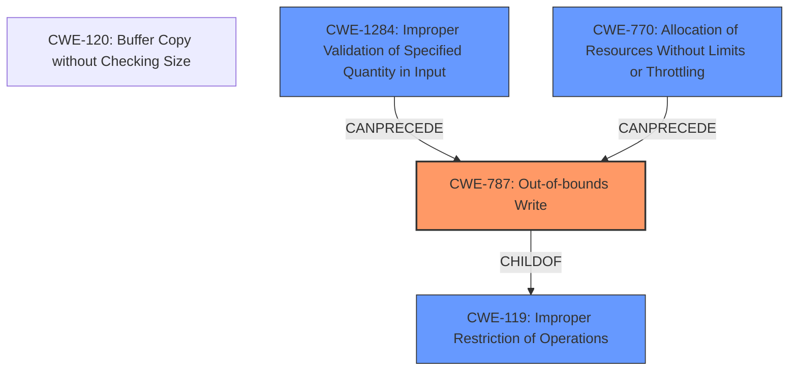

# Analysis Report for CVE-2024-50151

# Vulnerability Analysis Report: CVE-2024-50151

## Description

In the Linux kernel, the following vulnerability has been resolved smb client fix OOBs when building SMB2_IOCTL request When using encryption, either enforced by the server or when using seal mount option, the client will squash all compound request buffers down for encryption into a single iov in smb2_set_next_command(). SMB2_ioctl_init() allocates a small buffer (448 bytes) to hold the SMB2_IOCTL request in the first iov, **and if the user passes an input buffer that is greater than 328 bytes**, **smb2_set_next_command() will end up writing off the end of @rqst->iov[0].iov_base** as shown below mount.cifs //srv/share /mnt -o ...,seal ln -s $(perl -e print(a)for 1..1024) /mnt/link BUG KASAN **slab-out-of-bounds** in smb2_set_next_command.cold+0x1d6/0x24c [cifs] Write of size 4116 at addr ffff8881148fcab8 by task ln/859 CPU 1 UID 0 PID 859 Comm ln Not tainted 6.12.0-rc3 #1 Hardware name QEMU Standard PC (Q35 + ICH9, 2009), BIOS 1.16.3-2.fc40 04/01/2014 Call Trace dump_stack_lvl+0x5d/0x80 ? smb2_set_next_command.cold+0x1d6/0x24c [cifs] print_report+0x156/0x4d9 ? smb2_set_next_command.cold+0x1d6/0x24c [cifs] ? __virt_addr_valid+0x145/0x310 ? __phys_addr+0x46/0x90 ? smb2_set_next_command.cold+0x1d6/0x24c [cifs] kasan_report+0xda/0x110 ? smb2_set_next_command.cold+0x1d6/0x24c [cifs] kasan_check_range+0x10f/0x1f0 __asan_memcpy+0x3c/0x60 smb2_set_next_command.cold+0x1d6/0x24c [cifs] smb2_compound_op+0x238c/0x3840 [cifs] ? kasan_save_track+0x14/0x30 ? kasan_save_free_info+0x3b/0x70 ? vfs_symlink+0x1a1/0x2c0 ? do_symlinkat+0x108/0x1c0 ? __pfx_smb2_compound_op+0x10/0x10 [cifs] ? kmem_cache_free+0x118/0x3e0 ? cifs_get_writable_path+0xeb/0x1a0 [cifs] smb2_get_reparse_inode+0x423/0x540 [cifs] ? __pfx_smb2_get_reparse_inode+0x10/0x10 [cifs] ? rcu_is_watching+0x20/0x50 ? __kmalloc_noprof+0x37c/0x480 ? smb2_create_reparse_symlink+0x257/0x490 [cifs] ? smb2_create_reparse_symlink+0x38f/0x490 [cifs] smb2_create_reparse_symlink+0x38f/0x490 [cifs] ? __pfx_smb2_create_reparse_symlink+0x10/0x10 [cifs] ? find_held_lock+0x8a/0xa0 ? hlock_class+0x32/0xb0 ? __build_path_from_dentry_optional_prefix+0x19d/0x2e0 [cifs] cifs_symlink+0x24f/0x960 [cifs] ? __pfx_make_vfsuid+0x10/0x10 ? __pfx_cifs_symlink+0x10/0x10 [cifs] ? make_vfsgid+0x6b/0xc0 ? generic_permission+0x96/0x2d0 vfs_symlink+0x1a1/0x2c0 do_symlinkat+0x108/0x1c0 ? __pfx_do_symlinkat+0x10/0x10 ? strncpy_from_user+0xaa/0x160 __x64_sys_symlinkat+0xb9/0xf0 do_syscall_64+0xbb/0x1d0 entry_SYSCALL_64_after_hwframe+0x77/0x7f RIP 00330x7f08d75c13bb

## Vulnerability Description Key Phrases

- **Rootcause:** ['The client will squash all compound request buffers down for encryption into a single iov in smb2_set_next_command(). SMB2_ioctl_init() allocates a small buffer (448 bytes) to hold the SMB2_IOCTL request in the first iov', 'and if the user passes an input buffer that is greater than 328 bytes', 'smb2_set_next_command() will end up writing off the end of @rqst->iov[0].iov_base']
- **Weakness:** ['Out-of-bounds write vulnerability in smb2_set_next_command function', 'slab-out-of-bounds']
- **Impact:** ['Kernel memory corruption', 'potentially leading to system crash or arbitrary code execution']
- **Vector:** Mounting a CIFS share with seal option and creating a symbolic link with a large target
- **Attacker:** Local user
- **Product:** Linux Kernel
- **Version:** 6.12.0-rc3
- **Component:** cifs

## Analysis (with Relationship Data)

# Summary
| CWE ID    | CWE Name                                                                      | Confidence | CWE Abstraction Level | CWE Vulnerability Mapping Label | CWE-Vulnerability Mapping Notes |
| :---------- | :---------------------------------------------------------------------------- | :--------- | :---------------------- | :------------------------------ | :------------------------------ |
| CWE-787   | Out-of-bounds Write                                                           | 0.9        | Base                    | Primary                         | Allowed                       |
| CWE-119   | Improper Restriction of Operations within the Bounds of a Memory Buffer | 0.7        | Class                   | Secondary                       | Discouraged                   |
| CWE-770   | Allocation of Resources Without Limits or Throttling                      | 0.6        | Base                    | Secondary                       | Allowed                       |
| CWE-1284  | Improper Validation of Specified Quantity in Input                        | 0.5        | Base                    | Secondary                       | Allowed                       |

## Evidence and Confidence

*   **Confidence Score:** 0.8
*   **Evidence Strength:** HIGH

## Relationship Analysis
The primary weakness is CWE-787 (Out-of-bounds Write), a base-level CWE that directly describes the **writing off the end of a buffer**. This is a child of CWE-119 (Improper Restriction of Operations within the Bounds of a Memory Buffer), a more general class-level CWE. CWE-1284 (Improper Validation of Specified Quantity in Input) can precede CWE-787, as **missing input validation** could lead to an out-of-bounds write. CWE-770 (Allocation of Resources Without Limits or Throttling) is relevant because the initial buffer allocation is too small, and there are no checks to prevent writing beyond its boundaries when handling large user inputs.



## Vulnerability Chain
1.  The CIFS client allocates a fixed-size buffer (448 bytes) for SMB2 IOCTL requests (**ROOT CAUSE**).
2.  The user provides an input buffer larger than 328 bytes (**ROOT CAUSE**).
3.  The `smb2_set_next_command()` function **writes data beyond the allocated buffer**, resulting in an **out-of-bounds write** (CWE-787).
4.  This leads to **memory corruption** and potentially a **system crash or arbitrary code execution**.

## Summary of Analysis
The analysis identifies CWE-787 (Out-of-bounds Write) as the primary weakness because the core issue is the **writing of data beyond the allocated buffer**. The evidence clearly states that "smb2_set_next_command() will end up writing off the end of @rqst->iov[0].iov_base." This aligns directly with the definition of an out-of-bounds write. While CWE-119 (Improper Restriction of Operations within the Bounds of a Memory Buffer) is related, it's a broader category. CWE-787 is more specific and therefore a better fit.

CWE-1284 (Improper Validation of Specified Quantity in Input) is considered since the **user-provided input size isn't validated** against the buffer's capacity. This missing validation directly contributes to the out-of-bounds write. CWE-770 (Allocation of Resources Without Limits or Throttling) is also relevant because the code **allocates a small buffer without proper size checks**, leading to the overflow.

The retriever results, particularly the keyphrase analysis, supports the selection of CWE-787, CWE-119, CWE-1284 and CWE-770. The graph relationships further clarify how these CWEs are interconnected, with CWE-787 being a specific case of CWE-119, and CWE-1284/CWE-770 potentially preceding it.

CWE-125 (Out-of-bounds Read) was considered, but the vulnerability description explicitly mentions a **write**, not a read. Other CWEs like CWE-266, CWE-532, and CWE-88 are not directly related to the **memory corruption** aspect of this vulnerability.

The chosen CWEs are at the optimal level of specificity because they accurately reflect the root cause (**out-of-bounds write**), the contributing factor (**lack of input validation**), and the memory allocation issue, providing a comprehensive understanding of the vulnerability.


## CWE Relationship Analysis

Current CWEs represent these abstraction levels: .


### Vulnerability Chain Analysis

**Chain starting from CWE-1284:**
- 1284 (Improper Validation of Specified Quantity in Input) - ROOT


**Chain starting from CWE-770:**
- 770 (Allocation of Resources Without Limits or Throttling) - ROOT


### CWE Relationship Diagram

```mermaid
graph TD
    classDef primary fill:#f96,stroke:#333,stroke-width:2px
    classDef secondary fill:#69f,stroke:#333
    classDef tertiary fill:#9e9,stroke:#333
```


*Report generated on 2025-07-13 19:54:48*
