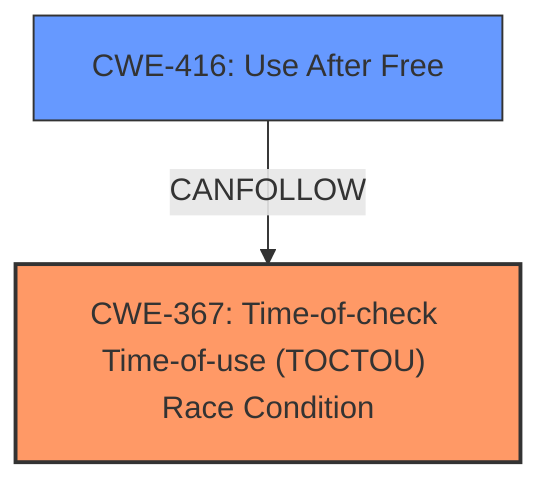

# Analysis Report for CVE-2024-50154

# Vulnerability Analysis Report: CVE-2024-50154

## Description

In the Linux kernel, the following vulnerability has been resolved tcp/dccp Dont use timer_pending() in reqsk_queue_unlink(). Martin KaFai Lau reported use-after-free [0] in reqsk_timer_handler(). We are seeing a use-after-free from a bpf prog attached to trace_tcp_retransmit_synack. The program passes the req->sk to the bpf_sk_storage_get_tracing kernel helper which does check for null before using it. The commit 83fccfc3940c (inet fix potential deadlock in reqsk_queue_unlink()) added timer_pending() in reqsk_queue_unlink() not to call del_timer_sync() from reqsk_timer_handler(), but it introduced a small race window. Before the timer is called, expire_timers() calls detach_timer(timer, true) to clear timer->entry.pprev and marks it as not pending. If reqsk_queue_unlink() checks timer_pending() just after expire_timers() calls detach_timer(), TCP will miss del_timer_sync() the reqsk timer will continue running and send multiple SYN+ACKs until it expires. The reported UAF could happen if req->sk is close()d earlier than the timer expiration, which is 63s by default. The scenario would be 1. inet_csk_complete_hashdance() calls inet_csk_reqsk_queue_drop(), but del_timer_sync() is missed 2. reqsk timer is executed and scheduled again 3. req->sk is accept()ed and reqsk_put() decrements rsk_refcnt, but reqsk timer still has another one, and inet_csk_accept() does not clear req->sk for non-TFO sockets 4. sk is close()d 5. reqsk timer is executed again, and BPF touches req->sk Lets not use timer_pending() by passing the caller context to __inet_csk_reqsk_queue_drop(). Note that reqsk timer is pinned, so the issue does not happen in most use cases. [1] [0] BUG KFENCE use-after-free read in bpf_sk_storage_get_tracing+0x2e/0x1b0 Use-after-free read at 0x00000000a891fb3a (in kfence-#1) bpf_sk_storage_get_tracing+0x2e/0x1b0 bpf_prog_5ea3e95db6da0438_tcp_retransmit_synack+0x1d20/0x1dda bpf_trace_run2+0x4c/0xc0 tcp_rtx_synack+0xf9/0x100 reqsk_timer_handler+0xda/0x3d0 run_timer_softirq+0x292/0x8a0 irq_exit_rcu+0xf5/0x320 sysvec_apic_timer_interrupt+0x6d/0x80 asm_sysvec_apic_timer_interrupt+0x16/0x20 intel_idle_irq+0x5a/0xa0 cpuidle_enter_state+0x94/0x273 cpu_startup_entry+0x15e/0x260 start_secondary+0x8a/0x90 secondary_startup_64_no_verify+0xfa/0xfb kfence-#1 0x00000000a72cc7b6-0x00000000d97616d9, size=2376, cache=TCPv6 allocated by task 0 on cpu 9 at 260507.901592s sk_prot_alloc+0x35/0x140 sk_clone_lock+0x1f/0x3f0 inet_csk_clone_lock+0x15/0x160 tcp_create_openreq_child+0x1f/0x410 tcp_v6_syn_recv_sock+0x1da/0x700 tcp_check_req+0x1fb/0x510 tcp_v6_rcv+0x98b/0x1420 ipv6_list_rcv+0x2258/0x26e0 napi_complete_done+0x5b1/0x2990 mlx5e_napi_poll+0x2ae/0x8d0 net_rx_action+0x13e/0x590 irq_exit_rcu+0xf5/0x320 common_interrupt+0x80/0x90 asm_common_interrupt+0x22/0x40 cpuidle_enter_state+0xfb/0x273 cpu_startup_entry+0x15e/0x260 start_secondary+0x8a/0x90 secondary_startup_64_no_verify+0xfa/0xfb freed by task 0 on cpu 9 at 260507.927527s rcu_core_si+0x4ff/0xf10 irq_exit_rcu+0xf5/0x320 sysvec_apic_timer_interrupt+0x6d/0x80 asm_sysvec_apic_timer_interrupt+0x16/0x20 cpuidle_enter_state+0xfb/0x273 cpu_startup_entry+0x15e/0x260 start_secondary+0x8a/0x90 secondary_startup_64_no_verify+0xfa/0xfb

## Vulnerability Description Key Phrases

- **Rootcause:** The commit 83fccfc3940c introduced a race condition by using timer_pending() in reqsk_queue_unlink(), which could lead to missing del_timer_sync() calls, and subsequently, a use-after-free.
- **Weakness:** Race condition in timer handling within reqsk_queue_unlink(). The check for timer_pending() can return an incorrect value if it happens immediately after detach_timer(), leading to the timer not being properly cancelled. The use of a bpf prog attached to trace_tcp_retransmit_synack triggers the bug.
- **Impact:** Use-after-free vulnerability, which could lead to system instability or crash. The vulnerability is triggered if the req->sk is close()d before the timer expires, causing the BPF program to access the freed memory.
- **Vector:** The vulnerability is triggered through the TCP stack when a connection is established using SYN cookies (TFO sockets may not clear req->sk). Specifically, during retransmission of SYN+ACK when a bpf program is attached to trace_tcp_retransmit_synack.
- **Attacker:** An attacker could trigger the vulnerability by establishing multiple TCP connections and forcing retransmissions of SYN-ACKs, eventually triggering the race condition which leads to the UAF.
- **Product:** Linux Kernel
- **Version:** Likely present in versions with commit 83fccfc3940c and before the fix
- **Component:** TCP/IP Stack, specifically the reqsk timer and related functions (reqsk_queue_unlink, reqsk_timer_handler, inet_csk_complete_hashdance, inet_csk_reqsk_queue_drop, etc)

## Analysis (with Relationship Data)

# Summary
| CWE ID | CWE Name | Confidence | CWE Abstraction Level | CWE Vulnerability Mapping Label | CWE-Vulnerability Mapping Notes |
|---|---|---|---|---|---|
| CWE-367 | Time-of-check Time-of-use (TOCTOU) Race Condition | 0.9 | Base | Primary | Allowed |
| CWE-416 | Use After Free | 0.8 | Variant | Secondary | Allowed |

## Evidence and Confidence

*   **Confidence Score:** 0.85
*   **Evidence Strength:** HIGH

## Relationship Analysis
The primary weakness is a **Time-of-check Time-of-use (TOCTOU) Race Condition (CWE-367)**. The race condition is between the timer being detached and the check to see if the timer is pending. This leads to the timer potentially not being deleted and eventually accessing the memory after it has been freed. The **Use After Free (CWE-416)** is a consequence of the race condition.



## Vulnerability Chain
The vulnerability chain starts with a race condition when checking if the timer is pending.
1.  Race condition in timer handling (`reqsk_queue_unlink()`) - **CWE-367**
2.  Timer is not properly cancelled because of the race condition
3.  Socket is closed
4.  Timer expires and accesses freed memory, resulting in a use-after-free - **CWE-416**

## Summary of Analysis
The initial assessment identified a **race condition** as the root cause, leading to a **use-after-free**. The evidence strongly supports these findings.

The vulnerability description explicitly states: "**The commit 83fccfc3940c introduced a race condition by using timer_pending() in reqsk_queue_unlink(), which could lead to missing del_timer_sync() calls, and subsequently, a use-after-free.**"

The **CVE Reference Links Content Summary** further reinforces this: "The vulnerability stems from a race condition introduced by the commit `83fccfc3940c`... This commit added a check using `timer_pending()`... However, a race window exists where `reqsk_queue_unlink()` might check `timer_pending()` immediately after `expire_timers()` calls `detach_timer()`... causing `del_timer_sync()` to be skipped." and "Exploitation results in a use-after-free condition when a BPF program attached to `trace_tcp_retransmit_synack` tries to access the freed socket via `req->sk`.".

The graph relationships and retriever results helped to narrow down the specific type of race condition and confirm the **use-after-free** as a consequence.

CWE-367 is the most specific and appropriate representation of the race condition, and CWE-416 accurately describes the resulting use-after-free.

Relevant CWE Information:

# Enhanced Context (25 CWEs)
The following CWEs were identified as potentially relevant to this vulnerability:

## CWE-362: Concurrent Execution using Shared Resource with Improper Synchronization ('Race Condition')
**Abstraction Level**: Class
**Similarity Score**: 0.77
**Source**: dense

**Description**:
The product contains a concurrent code sequence that requires temporary, exclusive access to a shared resource, but a timing window exists in which the shared resource can be modified by another code sequence operating concurrently.

**Mapping Guidance**:
- Usage: Allowed-with-Review
- Rationale: This CWE entry is a Class and might have Base-level children that would be more appropriate

## CWE-367: Time-of-check Time-of-use (TOCTOU) Race Condition
**Abstraction Level**: Base
**Similarity Score**: 0.76
**Source**: dense

**Description**:
The product checks the state of a resource before using that resource, but the resource's state can change between the check and the use in a way that invalidates the results of the check. This can cause the product to perform invalid actions when the resource is in an unexpected state.

**Mapping Guidance**:
- Usage: Allowed
- Rationale: This CWE entry is at the Base level of abstraction, which is a preferred level of abstraction for mapping to the root causes of vulnerabilities.

## CWE-366: Race Condition within a Thread
**Abstraction Level**: Base
**Similarity Score**: 0.75
**Source**: dense

**Description**:
If two threads of execution use a resource simultaneously, there exists the possibility that resources may be used while invalid, in turn making the state of execution undefined.

**Mapping Guidance**:
- Usage: Allowed
- Rationale: This CWE entry is at the Base level of abstraction, which is a preferred level of abstraction for mapping to the root causes of vulnerabilities.

## CWE-667: Improper Locking
**Abstraction Level**: Class
**Similarity Score**: 0.73
**Source**: dense

**Description**:
The product does not properly acquire or release a lock on a resource, leading to unexpected resource state changes and behaviors.

**Mapping Guidance**:
- Usage: Allowed-with-Review
- Rationale: This CWE entry is a Class and might have Base-level children that would be more appropriate

## CWE-755: Improper Handling of Exceptional Conditions
**Abstraction Level**: Class
**Similarity Score**: 0.72
**Source**: dense

**Description**:
The product does not handle or incorrectly handles an exceptional condition.

**Mapping Guidance**:
- Usage: Discouraged
- Rationale: This CWE entry is a level-1 Class (i.e., a child of a Pillar). It might have lower-level children that would be more appropriate

## CWE-824: Access of Uninitialized Pointer
**Abstraction Level**: Base
**Similarity Score**: 0.72
**Source**: dense

**Description**:
The product accesses or uses a pointer that has not been initialized.

**Mapping Guidance**:
- Usage: Allowed
- Rationale: This CWE entry is at the Base level of abstraction, which is a preferred level of abstraction for mapping to the root causes of vulnerabilities.

## CWE-617: Reachable Assertion
**Abstraction Level**: Base
**Similarity Score**: 0.71
**Source**: dense

**Description**:
The product contains an assert() or similar statement that can be triggered by an attacker, which leads to an application exit or other behavior that is more severe than necessary.

**Mapping Guidance**:
- Usage: Allowed
- Rationale: This CWE entry is at the Base level of abstraction, which is a preferred level of abstraction for mapping to the root causes of vulnerabilities.

## CWE-754: Improper Check for Unusual or Exceptional Conditions
**Abstraction Level**: Class
**Similarity Score**: 0.70
**Source**: dense

**Description**:
The product does not check or incorrectly checks for unusual or exceptional conditions that are not expected to occur frequently during day to day operation of the product.

**Mapping Guidance**:
- Usage: Allowed-with-Review
- Rationale: This CWE entry is a Class and might have Base-level children that would be more appropriate

## CWE-909: Missing Initialization of Resource
**Abstraction Level**: Class
**Similarity Score**: 0.70
**Source**: dense

**Description**:
The product does not initialize a critical resource.

**Mapping Guidance**:
- Usage: Allowed-with-Review
- Rationale: This CWE entry is a Class and might have Base-level children that would be more appropriate

## CWE-401: Missing Release of Memory after Effective Lifetime
**Abstraction Level**: Variant
**Similarity Score**: 0.70
**Source**: dense

**Description**:
The product does not sufficiently track and release allocated memory after it has been used, which slowly consumes remaining memory.

**Mapping Guidance**:
- Usage: Allowed
- Rationale: This CWE entry is at the Variant level of abstraction, which is a preferred level of abstraction for mapping to the root causes of vulnerabilities.

## CWE-362: Concurrent Execution using Shared Resource with Improper Synchronization ('Race Condition')
**Abstraction Level**: Class
**Similarity Score**: 1786.90
**Source**: sparse

**Description**:
The product contains a concurrent code sequence that requires temporary, exclusive access to a shared resource, but a timing window exists in which the shared resource can be modified by another code sequence operating concurrently.

**Mapping Guidance**:
- Usage: Allowed-with-Review
- Rationale: This CWE entry is a Class and might have Base-level children that would be more appropriate

## CWE-667: Improper Locking
**Abstraction Level**: Class
**Similarity Score**: 1749.19
**Source**: sparse

**Description**:
The product does not properly acquire or release


## CWE Relationship Analysis

Current CWEs represent these abstraction levels: .


### Vulnerability Chain Analysis

**Chain starting from CWE-416:**
- 416 (Use After Free) - ROOT


**Chain starting from CWE-667:**
- 667 (Improper Locking) - ROOT


### CWE Relationship Diagram

```mermaid
graph TD
    classDef primary fill:#f96,stroke:#333,stroke-width:2px
    classDef secondary fill:#69f,stroke:#333
    classDef tertiary fill:#9e9,stroke:#333
```


*Report generated on 2025-07-13 19:55:11*
