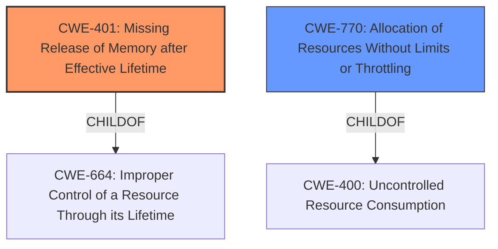

# Analysis Report for CVE-2024-50252

# Vulnerability Analysis Report: CVE-2024-50252

## Description

In the Linux kernel, the following vulnerability has been resolved mlxsw spectrum_ipip Fix **memory leak** when changing remote IPv6 address The device stores IPv6 addresses that are used for encapsulation in linear memory that is managed by the driver. Changing the remote address of an ip6gre net device never worked properly, but since cited commit the following reproducer [1] would result in a warning [2] and a **memory leak** [3]. The problem is that the new remote address is never added by the driver to its hash table (and therefore the device) and the old address is never removed from it. Fix by programming the new address when the configuration of the ip6gre net device changes and removing the old one. If the address did not change, then the above would result in increasing the reference count of the address and then decreasing it. [1] # ip link add name bla up type ip6gre local 2001db811 remote 2001db821 tos inherit ttl inherit # ip link set dev bla type ip6gre remote 2001db831 # ip link del dev bla # devlink dev reload pci/00000100.0 [2] WARNING CPU 0 PID 1682 at drivers/net/ethernet/mellanox/mlxsw/spectrum.c3002 mlxsw_sp_ipv6_addr_put+0x140/0x1d0 Modules linked in CPU 0 UID 0 PID 1682 Comm ip Not tainted 6.12.0-rc3-custom-g86b5b55bc835 #151 Hardware name Nvidia SN5600/VMOD0013, BIOS 5.13 05/31/2023 RIP 0010mlxsw_sp_ipv6_addr_put+0x140/0x1d0 [...] Call Trace mlxsw_sp_router_netdevice_event+0x55f/0x1240 notifier_call_chain+0x5a/0xd0 call_netdevice_notifiers_info+0x39/0x90 unregister_netdevice_many_notify+0x63e/0x9d0 rtnl_dellink+0x16b/0x3a0 rtnetlink_rcv_msg+0x142/0x3f0 netlink_rcv_skb+0x50/0x100 netlink_unicast+0x242/0x390 netlink_sendmsg+0x1de/0x420 ____sys_sendmsg+0x2bd/0x320 ___sys_sendmsg+0x9a/0xe0 __sys_sendmsg+0x7a/0xd0 do_syscall_64+0x9e/0x1a0 entry_SYSCALL_64_after_hwframe+0x77/0x7f [3] unreferenced object 0xffff898081f597a0 (size 32) comm ip, pid 1626, jiffies 4294719324 hex dump (first 32 bytes) 20 01 0d b8 00 02 00 00 00 00 00 00 00 00 00 01 ............... 21 49 61 83 80 89 ff ff 00 00 00 00 01 00 00 00 !Ia............. backtrace (crc fd9be911) [] __kmalloc_cache_noprof+0x1da/0x260 [] mlxsw_sp_ipv6_addr_kvdl_index_get+0x281/0x340 [] mlxsw_sp_router_netdevice_event+0x47b/0x1240 [] notifier_call_chain+0x5a/0xd0 [] call_netdevice_notifiers_info+0x39/0x90 [] register_netdevice+0x5f7/0x7a0 [] ip6gre_newlink_common.isra.0+0x65/0x130 [] ip6gre_newlink+0x72/0x120 [] rtnl_newlink+0x471/0xa20 [] rtnetlink_rcv_msg+0x142/0x3f0 [] netlink_rcv_skb+0x50/0x100 [] netlink_unicast+0x242/0x390 [] netlink_sendmsg+0x1de/0x420 [] ____sys_sendmsg+0x2bd/0x320 [] ___sys_sendmsg+0x9a/0xe0 [] __sys_sendmsg+0x7a/0xd0

## Vulnerability Description Key Phrases

- **Rootcause:** ['The driver does not correctly manage IPv6 addresses used for encapsulation when changing the remote address of an ip6gre net device. The old address is not removed from the hash table', 'and the new address is not added', 'leading to a memory leak.']
- **Weakness:** ['Improper management of dynamically allocated memory for IPv6 addresses during network device configuration changes.', 'memory leak']
- **Impact:** ['Memory leak', 'which can eventually lead to system instability or denial of service.']
- **Vector:** Changing the remote IPv6 address of an ip6gre network device through the ip link command.
- **Attacker:** A local user with the capability to configure network devices can trigger the vulnerability.
- **Product:** Linux Kernel
- **Version:** 6.12.0-rc3 and potentially earlier versions
- **Component:** mlxsw spectrum driver

## Analysis (with Relationship Data)

# Summary
| CWE ID | CWE Name | Confidence | CWE Abstraction Level | CWE Vulnerability Mapping Label | CWE-Vulnerability Mapping Notes |
|---|---|---|---|---|---|
| CWE-401 | Missing Release of Memory after Effective Lifetime | 0.9 | Base | Primary | Allowed |
| CWE-770 | Allocation of Resources Without Limits or Throttling | 0.7 | Base | Secondary | Allowed |

## Evidence and Confidence

*   **Confidence Score:** 0.8
*   **Evidence Strength:** HIGH

## Relationship Analysis
The primary weakness is **CWE-401: Missing Release of Memory after Effective Lifetime**, which directly relates to the reported **memory leak**. **CWE-770: Allocation of Resources Without Limits or Throttling** is also relevant because the **driver allocates memory for IPv6 addresses without properly managing their release**, which can lead to excessive resource consumption.
**CWE-401** is a child of **CWE-664: Improper Control of a Resource Through its Lifetime**, indicating a more specific case of resource management failure. **CWE-770** is a child of **CWE-400: Uncontrolled Resource Consumption**. This parent-child structure guides the selection towards the more descriptive base-level CWEs.



## Vulnerability Chain
The vulnerability chain starts with the **improper management of IPv6 addresses** when the remote address of an ip6gre net device is changed. The old address is not removed from the hash table, and the new address is not added, which leads to a **memory leak**. This **memory leak** is a direct result of failing to release the **allocated memory**, and eventually, this can cause system instability or a denial of service.

## Summary of Analysis
The primary weakness is the **failure to release memory**, which directly corresponds to **CWE-401**. The analysis considered the **allocation of resources without limits or throttling (CWE-770)**. The retriever identified several potential CWEs, but the memory leak and resource management context made **CWE-401** and **CWE-770** the most fitting.
The relationships between CWEs guided the selection toward base-level weaknesses that are more descriptive. The evidence clearly points to a **memory leak** due to the failure to release **allocated memory**, justifying the selection of **CWE-401** as the primary CWE. The allocation of resources without proper limits contributed to the **memory leak**, so **CWE-770** is a secondary CWE.

Relevant CWE Information:

# Enhanced Context (25 CWEs)
The following CWEs were identified as potentially relevant to this vulnerability:

## CWE-696: Incorrect Behavior Order
**Abstraction Level**: Class
**Similarity Score**: 0.76
**Source**: dense

**Description**:
The product performs multiple related behaviors, but the behaviors are performed in the wrong order in ways which may produce resultant weaknesses.

**Mapping Guidance**:
- Usage: Allowed-with-Review
- Rationale: This CWE entry is a Class and might have Base-level children that would be more appropriate

## CWE-755: Improper Handling of Exceptional Conditions
**Abstraction Level**: Class
**Similarity Score**: 0.76
**Source**: dense

**Description**:
The product does not handle or incorrectly handles an exceptional condition.

**Mapping Guidance**:
- Usage: Discouraged
- Rationale: This CWE entry is a level-1 Class (i.e., a child of a Pillar). It might have lower-level children that would be more appropriate

## CWE-824: Access of Uninitialized Pointer
**Abstraction Level**: Base
**Similarity Score**: 0.75
**Source**: dense

**Description**:
The product accesses or uses a pointer that has not been initialized.

**Mapping Guidance**:
- Usage: Allowed
- Rationale: This CWE entry is at the Base level of abstraction, which is a preferred level of abstraction for mapping to the root causes of vulnerabilities.

## CWE-1285: Improper Validation of Specified Index, Position, or Offset in Input
**Abstraction Level**: Base
**Similarity Score**: 0.74
**Source**: dense

**Description**:
The product receives input that is expected to specify an index, position, or offset into an indexable resource such as a buffer or file, but it does not validate or incorrectly validates that the specified index/position/offset has the required properties.

**Mapping Guidance**:
- Usage: Allowed
- Rationale: This CWE entry is at the Base level of abstraction, which is a preferred level of abstraction for mapping to the root causes of vulnerabilities.

## CWE-1391: Use of Weak Credentials
**Abstraction Level**: Class
**Similarity Score**: 0.74
**Source**: dense

**Description**:
The product uses weak credentials (such as a default key or hard-coded password) that can be calculated, derived, reused, or guessed by an attacker.

**Mapping Guidance**:
- Usage: Allowed-with-Review
- Rationale: This CWE entry is a Class and might have Base-level children that would be more appropriate

## CWE-667: Improper Locking
**Abstraction Level**: Class
**Similarity Score**: 0.74
**Source**: dense

**Description**:
The product does not properly acquire or release a lock on a resource, leading to unexpected resource state changes and behaviors.

**Mapping Guidance**:
- Usage: Allowed-with-Review
- Rationale: This CWE entry is a Class and might have Base-level children that would be more appropriate

## CWE-668: Exposure of Resource to Wrong Sphere
**Abstraction Level**: Class
**Similarity Score**: 0.74
**Source**: dense

**Description**:
The product exposes a resource to the wrong control sphere, providing unintended actors with inappropriate access to the resource.

**Mapping Guidance**:
- Usage: Discouraged
- Rationale: CWE-668 is high-level and is often misused as a catch-all when lower-level CWE IDs might be applicable. It is sometimes used for low-information vulnerability reports [REF-1287]. It is a level-1 Class (i.e., a child of a Pillar). It is not useful for trend analysis.

## CWE-754: Improper Check for Unusual or Exceptional Conditions
**Abstraction Level**: Class
**Similarity Score**: 0.74
**Source**: dense

**Description**:
The product does not check or incorrectly checks for unusual or exceptional conditions that are not expected to occur frequently during day to day operation of the product.

**Mapping Guidance**:
- Usage: Allowed-with-Review
- Rationale: This CWE entry is a Class and might have Base-level children that would be more appropriate

## CWE-497: Exposure of Sensitive System Information to an Unauthorized Control Sphere
**Abstraction Level**: Base
**Similarity Score**: 0.74
**Source**: dense

**Description**:
The product does not properly prevent sensitive system-level information from being accessed by unauthorized actors who do not have the same level of access to the underlying system as the product does.

**Mapping Guidance**:
- Usage: Allowed
- Rationale: This CWE entry is at the Base level of abstraction, which is a preferred level of abstraction for mapping to the root causes of vulnerabilities.

## CWE-303: Incorrect Implementation of Authentication Algorithm
**Abstraction Level**: Base
**Similarity Score**: 0.74
**Source**: dense

**Description**:
The requirements for the product dictate the use of an established authentication algorithm, but the implementation of the algorithm is incorrect.

**Mapping Guidance**:
- Usage: Allowed
- Rationale: This CWE entry is at the Base level of abstraction, which is a preferred level of abstraction for mapping to the root causes of vulnerabilities.

## CWE-770: Allocation of Resources Without Limits or Throttling
**Abstraction Level**: Base
**Similarity Score**: 5040.60
**Source**: sparse

**Description**:
The product allocates a reusable resource or group of resources on behalf of an actor without imposing any restrictions on the size or number of resources that can be allocated, in violation of the intended security policy for that actor.

**Mapping Guidance**:
- Usage: Allowed
- Rationale: This CWE entry is at the Base level of abstraction, which is a preferred level of abstraction for mapping to the root causes of vulnerabilities.

## CWE-294: Authentication Bypass by Capture-replay
**Abstraction Level**: Base
**Similarity Score**: 492


## CWE Relationship Analysis

Current CWEs represent these abstraction levels: .


### Vulnerability Chain Analysis

**Chain starting from CWE-400:**
- 400 (Uncontrolled Resource Consumption) - ROOT


**Chain starting from CWE-770:**
- 770 (Allocation of Resources Without Limits or Throttling) - ROOT


### CWE Relationship Diagram

```mermaid
graph TD
    classDef primary fill:#f96,stroke:#333,stroke-width:2px
    classDef secondary fill:#69f,stroke:#333
    classDef tertiary fill:#9e9,stroke:#333
```


*Report generated on 2025-07-13 19:58:25*
