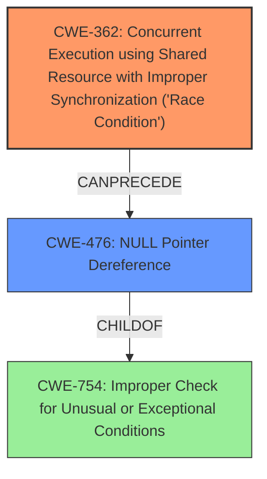

# Analysis for CVE-2024-50260

# Summary
| CWE ID | CWE Name | Confidence | CWE Abstraction Level | CWE Vulnerability Mapping Label | CWE-Vulnerability Mapping Notes |
|---|---|---|---|---|---|
| CWE-362 | Concurrent Execution using Shared Resource with Improper Synchronization ('Race Condition') | 0.9 | Class | Allowed-with-Review | Primary CWE. Root cause is a race condition.|
| CWE-476 | NULL Pointer Dereference | 0.8 | Base | Allowed | Secondary CWE. Result of the race condition. |

## Evidence and Confidence

*   **Confidence Score:** 0.85
*   **Evidence Strength:** HIGH

## Relationship Analysis
The primary relationship that influenced the CWE selection is the CANPRECEDE relationship. The **race condition** (CWE-362) allows the **NULL pointer dereference** (CWE-476) to occur.

## Vulnerability Chain
The vulnerability chain starts with a **race condition** (CWE-362) between `sock_map_link_detach` and `sock_map_link_update_prog`. The `sock_map_link_detach` function sets `sockmap_link->map` to NULL. Concurrently, `sock_map_link_update_prog` attempts to access `sockmap_link->map` without checking for NULL, leading to a **NULL pointer dereference** (CWE-476) and a kernel crash.

## Summary of Analysis
The analysis is based on the provided vulnerability description and the CVE reference content summary. The description clearly states that a **race condition** can trigger a **NULL pointer dereference**. The CVE reference content confirms this, identifying the **race condition** between `sock_map_link_detach` and `sock_map_link_update_prog` as the root cause, and the subsequent **NULL pointer dereference** as the direct result.

CWE-362 (Concurrent Execution using Shared Resource with Improper Synchronization ('Race Condition')) is selected as the primary CWE because the **race condition** is the underlying cause that enables the vulnerability. CWE-476 (NULL Pointer Dereference) is a direct consequence of the **race condition**.

The retriever results support this analysis, with CWE-362 and CWE-476 having high relevance scores. The graph relationships also support this, showing that CWE-362 can precede CWE-476.

The selected CWEs are at the optimal level of specificity. CWE-362 is a Class-level CWE, but it accurately describes the type of **race condition** involved. CWE-476 is a Base-level CWE, which is the preferred level of abstraction for mapping the direct cause of the crash.

CWEs considered but not used:

*   CWE-252 (Unchecked Return Value): While unchecked return values can lead to vulnerabilities, this is not the primary issue in this case. The vulnerability is directly caused by the **race condition** and the subsequent **NULL pointer dereference**, not by an unchecked return value.
*   CWE-665 (Improper Initialization): Although improper initialization can lead to NULL pointers, the root cause here is the **race condition** that allows a valid pointer to be set to NULL and then dereferenced.
*   CWE-824 (Access of Uninitialized Pointer): This CWE is not the primary cause. The pointer is set to NULL due to the **race condition**, not because it was never initialized.
*   CWE-364 (Signal Handler Race Condition): This is a specific type of **race condition** related to signal handlers, which is not applicable in this case.
* CWE-667: Improper Locking - While locking is involved in preventing the race condition, the core problem is the lack of proper synchronization leading to the race, not necessarily an improper lock implementation in itself.