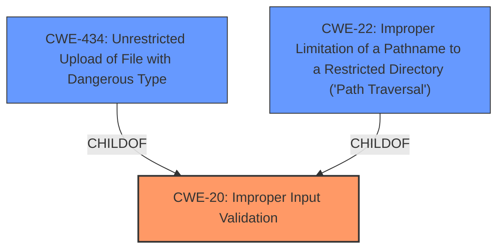

# Raw Analyzer Response for CVE-2024-50333

# Summary

| CWE ID | CWE Name | Confidence | CWE Abstraction Level | CWE Vulnerability Mapping Label | CWE-Vulnerability Mapping Notes |
|---|---|---|---|---|---|
| CWE-20 | Improper Input Validation [CWE Description](https://cwe.mitre.org/data/definitions/20.html) | 0.9 | Class | Allowed | Primary CWE |
| CWE-434 | Unrestricted Upload of File with Dangerous Type [CWE Description](https://cwe.mitre.org/data/definitions/434.html) | 0.7 | Base | Allowed | Secondary Candidate |
| CWE-22 | Improper Limitation of a Pathname to a Restricted Directory ('Path Traversal') [CWE Description](https://cwe.mitre.org/data/definitions/22.html) | 0.6 | Base | Allowed | Secondary Candidate |

## Evidence and Confidence

*   **Confidence Score:** 0.8
*   **Evidence Strength:** MEDIUM

## Relationship Analysis
The primary weakness is a **lack of input validation**, a broad category. However, the specific consequence of this **lack of validation** is that **user input is written to the filesystem**. This behavior aligns with CWE-434 (Unrestricted Upload of File with Dangerous Type) because the attacker can control the content of the file being written. It also can be viewed as CWE-22, because the lack of input validation could lead to writing to unintended locations. CWE-20 is a parent of both of these.

## Vulnerability Chain
The vulnerability chain starts with **improper input validation** (CWE-20), which allows an attacker to write arbitrary data to the filesystem. This leads to the creation of a malicious file (CWE-434), which is then included at runtime, potentially resulting in remote code execution. This is because the lack of validation allows writing to locations outside of the intended directory (CWE-22).

## Summary of Analysis
The initial analysis focused on identifying the root cause of the vulnerability. The description clearly states that "**User input is not validated and is written to the filesystem**". This directly points to CWE-20 (Improper Input Validation) as a primary issue, since this **lack of input validation** is the root cause that allows the arbitrary file write to occur. The Retriever Results listed CWE-22 (Improper Limitation of a Pathname to a Restricted Directory ('Path Traversal')) and CWE-434 (Unrestricted Upload of File with Dangerous Type) as potential candidates. These are secondary concerns, as they describe the specific mechanism and consequence of the **lack of input validation**.

The graph relationships show that CWE-20 is a parent of both CWE-22 and CWE-434. This supports the decision to classify CWE-20 as the primary weakness, as it is a more general class encompassing the specific vulnerabilities.

The selected CWEs are at an optimal level of specificity. CWE-20 captures the fundamental **lack of input validation**, while CWE-434 and CWE-22 specify the dangerous file write and Path Traversal consequences.

The evidence from the "Vulnerability Description Key Phrases" and "CVE Reference Links Content Summary" sections strongly supports this classification.

Relevant CWE Information:
* CWE-20: Improper Input Validation - This is the primary weakness because the **lack of input validation** allows the other issues to occur.
* CWE-434: Unrestricted Upload of File with Dangerous Type - This is a secondary issue because the attacker is able to write to the filesystem.
* CWE-22: Improper Limitation of a Pathname to a Restricted Directory ('Path Traversal') - This is a secondary issue because the attacker is able to write to arbitrary locations.