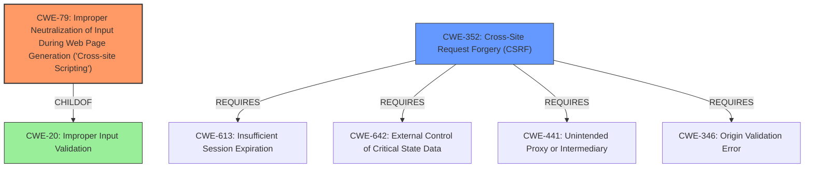

# Analysis for CVE-2024-50335

# Summary
| CWE ID  | CWE Name                                                                  | Confidence | CWE Abstraction Level | CWE Vulnerability Mapping Label | CWE-Vulnerability Mapping Notes |
| :-------- | :------------------------------------------------------------------------ | :--------- | :---------------------- | :------------------------------ | :-------------------------------- |
| CWE-79    | Improper Neutralization of Input During Web Page Generation ('Cross-site Scripting') | 1          | Base                    | Primary                         | Allowed                             |
| CWE-352   | Cross-Site Request Forgery (CSRF)                                       | 0.7        | Compound                  | Secondary                       | Allowed                             |

## Evidence and Confidence

*   **Confidence Score:** 0.85
*   **Evidence Strength:** HIGH

## Relationship Analysis
The primary weakness is CWE-79, which is a base level CWE, which is a child of CWE-20. CWE-79 can lead to other weaknesses. CWE-352 is a compound weakness, which means it has multiple weaknesses that occur simultaneously.

## Vulnerability Chain
The vulnerability chain starts with **insufficient input validation and sanitization** (CWE-79) which leads to Cross-Site Scripting. The XSS allows for the theft of CSRF tokens, which can then be used to perform unauthorized actions and create new administrative users.

## Summary of Analysis
The vulnerability description clearly states that the root cause is **insufficient input validation and sanitization** of the Publish Key field in SuiteCRM, leading to a Reflected Cross-Site Scripting (XSS) vulnerability.

The **Vulnerability Description Key Phrases** includes:
- **rootcause:** **insufficient input validation and sanitization**
- **weakness:** **cross-site scripting**

The **CVE Reference Links Content Summary** also specifies the root cause:
- **Root cause of vulnerability:** Insufficient input validation and sanitization of the "Publish Key" field in the SuiteCRM Edit Profile page.
- **Weaknesses/vulnerabilities present:** Reflected Cross-Site Scripting (XSS) vulnerability.

Based on this evidence, CWE-79 (Improper Neutralization of Input During Web Page Generation ('Cross-site Scripting')) is the most appropriate primary CWE.

Additionally, the XSS vulnerability allows for the theft of CSRF tokens, which can then be used to perform unauthorized actions and create new administrative users. This makes CWE-352 (Cross-Site Request Forgery (CSRF)) a secondary candidate.

The retriever results also list CWE-79 and CWE-352 as the top candidates.

I considered other CWEs from the retriever results, but they were not as relevant as CWE-79 and CWE-352. For example, CWE-863 (Incorrect Authorization) and CWE-287 (Improper Authentication) were considered, but the vulnerability does not directly involve authentication or authorization issues. The primary issue is the lack of input validation, which leads to XSS.

*   **CWE-79**: The application does not neutralize or incorrectly neutralizes user-controllable input before it is placed in output that is used as a web page that is served to other users. This matches the vulnerability description, as the Publish Key field is not properly sanitized, allowing an attacker to inject malicious JavaScript code.
*   **CWE-352**: The web application does not, or can not, sufficiently verify whether a well-formed, valid, consistent request was intentionally provided by the user who submitted the request. The XSS vulnerability allows for the theft of CSRF tokens, which can then be used to forge requests and perform unauthorized actions.