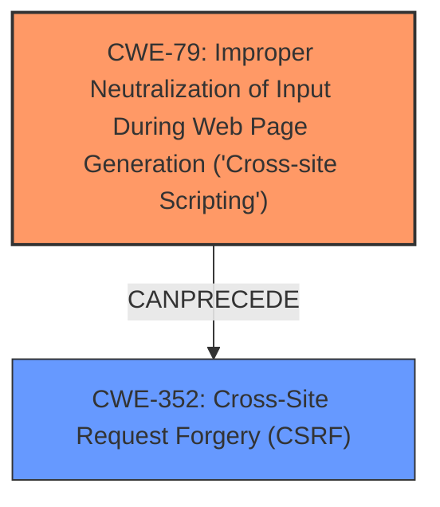

# Analysis Report for CVE-2024-50346

# Vulnerability Analysis Report: CVE-2024-50346

## Description

WebFeed is a lightweight web feed reader extension for Firefox/Chrome. Multiple **HTML injection vulnerabilities** in WebFeed can lead to **CSRF** and UI spoofing attacks. A remote attacker can provide malicious RSS feeds and attract the victim user to visit it using WebFeed. The attacker can then inject malicious HTML into the extension page and fool the victim into sending out HTTP requests to arbitrary sites with the victims credentials. Users are vulnerable to **CSRF** attacks when visiting malicious RSS feeds via WebFeed. Unwanted actions could be executed on the users behalf on arbitrary websites. This issue has been addressed in release version 0.9.2. All users are advised to upgrade. There are no known workarounds for this vulnerability.

## Vulnerability Description Key Phrases

- **Rootcause:** HTML injection vulnerabilities
- **Weakness:** CSRF
- **Impact:** UI spoofing attacks
- **Vector:** malicious RSS feeds
- **Attacker:** remote attacker
- **Product:** WebFeed
- **Version:** prior to 0.9.2

## Analysis (with Relationship Data)

# Summary
| CWE ID | CWE Name | Confidence | CWE Abstraction Level | CWE Vulnerability Mapping Label | CWE-Vulnerability Mapping Notes |
|---|---|---|---|---|---|
| CWE-79 | Improper Neutralization of Input During Web Page Generation ('Cross-site Scripting') | 1.0 | Base | Allowed | Primary CWE. The **HTML injection vulnerability** allows for script execution in the context of the web page. |
| CWE-352 | Cross-Site Request Forgery (CSRF) | 0.9 | Compound | Allowed | Secondary CWE. The successful injection of HTML allows for the creation of forms that trigger **CSRF** attacks. |

## Evidence and Confidence

*   **Confidence Score:** 0.95
*   **Evidence Strength:** HIGH

## Relationship Analysis
The primary weakness, CWE-79, is the **improper neutralization of input**, leading to the ability to inject arbitrary HTML. This then allows for the exploitation of CWE-352, **Cross-Site Request Forgery**. CWE-79 is a base level CWE, providing a good level of specificity. CWE-352 is a compound CWE, reflecting the combination of factors that lead to the CSRF vulnerability. The graph visualization below shows the relationship between these two CWEs:



## Vulnerability Chain
The vulnerability chain starts with **HTML injection vulnerabilities** (CWE-79) allowing an attacker to inject malicious HTML into the extension page. This can then be leveraged to perform **CSRF** attacks (CWE-352) by tricking the user into sending HTTP requests to arbitrary sites with their credentials.

## Summary of Analysis
The analysis is strongly based on the provided evidence, especially the "CVE Reference Links Content Summary" section, which details the **root cause** as improper HTML sanitization leading to **HTML injection** (CWE-79). This injection enables the **CSRF** vulnerability (CWE-352).

The vulnerability description specifically mentions "**HTML injection vulnerabilities** in WebFeed can lead to **CSRF** and UI spoofing attacks." and "Users are vulnerable to **CSRF** attacks when visiting malicious RSS feeds via WebFeed."

The Retriever Results and Complete CWE Specifications confirm that CWE-79 and CWE-352 are relevant. The graph relationships show how CWE-79 can precede CWE-352 in an attack chain. I selected CWE-79 as the primary CWE because the **improper neutralization** is the root cause.

Other CWEs were considered:
*   CWE-20 (**Improper Input Validation**) was considered, but it is a high-level class and the evidence clearly points to **improper neutralization**, making CWE-79 a more specific and appropriate choice.
*   CWE-74 (**Improper Neutralization of Special Elements in Output Used by a Downstream Component ('Injection')**) was also considered, but it's discouraged according to mapping guidance.
*   CWE-116 (**Improper Encoding or Escaping of Output**) is a class CWE, and the vulnerability is more specifically about **improper neutralization** for web page generation.
*   CWE-93 (**Improper Neutralization of CRLF Sequences ('CRLF Injection')**) and CWE-113 (**Improper Neutralization of CRLF Sequences in HTTP Headers ('HTTP Request/Response Splitting')**) are specific to CRLF sequences, and the vulnerability is broader than that.

The selected CWEs are at the optimal level of specificity because they accurately represent the root cause and the resulting vulnerability.


## CWE Relationship Analysis

Current CWEs represent these abstraction levels: .


### Vulnerability Chain Analysis

**Chain starting from CWE-116:**
- 116 (Improper Encoding or Escaping of Output) - ROOT


**Chain starting from CWE-93:**
- 93 (Improper Neutralization of CRLF Sequences ('CRLF Injection')) - ROOT


### CWE Relationship Diagram

```mermaid
graph TD
    classDef primary fill:#f96,stroke:#333,stroke-width:2px
    classDef secondary fill:#69f,stroke:#333
    classDef tertiary fill:#9e9,stroke:#333
```


*Report generated on 2025-07-13 20:04:51*
