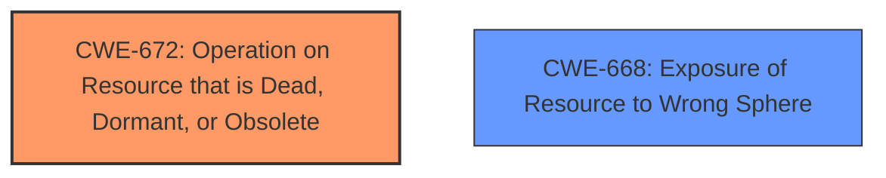

# Raw Analyzer Response for CVE-2024-50353

# Summary

| CWE ID  | CWE Name                                                                                               | Confidence | CWE Abstraction Level | CWE Vulnerability Mapping Label | CWE-Vulnerability Mapping Notes |
| :-------- | :------------------------------------------------------------------------------------------------------- | :---------- | :---------------------- | :------------------------------ | :------------------------------ |
| CWE-672 | Operation on Resource that is Dead, Dormant, or Obsolete | 0.85      | Base                    | Primary CWE              | Allowed                       |
| CWE-668 | Exposure of Resource to Wrong Sphere                                                                  | 0.60      | Class                    | Secondary Candidate           | Discouraged                  |

## Evidence and Confidence

*   **Confidence Score:** 0.75
*   **Evidence Strength:** MEDIUM

## Relationship Analysis

The primary CWE identified is CWE-672 (Operation on Resource that is Dead, Dormant, or Obsolete). This CWE reflects the **incorrect** handling of the SAS URI duration, leading to URLs with unexpected lifespans. CWE-668 (Exposure of Resource to Wrong Sphere) is considered as a possible secondary CWE because the **improper** duration could lead to unintended access, which relates to exposing the resource to the wrong control sphere. However, CWE-672 is more specific to the root cause, focusing on the **improper** operation related to the SAS URI's lifecycle.

## Vulnerability Chain

The chain starts with the **improper SAS Uri duration setting** (CWE-672), which leads to the generation of URLs with unexpected durations. The impact is a potentially longer or shorter validity period, which could lead to unauthorized access or disruption of intended usage.

## Summary of Analysis

The primary assessment is based on the vulnerability description, which highlights the **improper** handling of SAS URI durations. The CVE Reference Links Content Summary explicitly states that the library was incorrectly setting the expiration time for SAS tokens. This aligns with CWE-672, which describes operations on resources that are dead, dormant, or obsolete.

The relationship analysis indicates that CWE-672 is the most specific and relevant CWE. The retriever results suggested other CWEs, like CWE-668, CWE-212 (Improper Removal of Sensitive Information Before Storage or Transfer), and CWE-639 (Authorization Bypass Through User-Controlled Key). However, these are less directly related to the root cause of the vulnerability, which is the **incorrect** handling of the SAS URI duration.

CWE-672 is at the Base level of abstraction, which is appropriate for this vulnerability.

Relevant CWE Information:

# Enhanced Context (25 CWEs)

## CWE-212: Improper Removal of Sensitive Information Before Storage or Transfer
**Abstraction Level**: Base
**Similarity Score**: 0.73
**Source**: dense

**Description**:
The product stores, transfers, or shares a resource that contains sensitive information, but it does not properly remove that information before the product makes the resource available to unauthorized actors.

**Mapping Guidance**:
- Usage: Allowed
- Rationale: This CWE entry is at the Base level of abstraction, which is a preferred level of abstraction for mapping to the root causes of vulnerabilities.

**Why Not Used:** While sensitive information is involved, the root cause is not the removal of this information, but rather the incorrect handling of the duration.

## CWE-668: Exposure of Resource to Wrong Sphere
**Abstraction Level**: Class
**Similarity Score**: 0.71
**Source**: dense

**Description**:
The product exposes a resource to the wrong control sphere, providing unintended actors with inappropriate access to the resource.

**Mapping Guidance**:
- Usage: Discouraged
- Rationale: CWE-668 is high-level and is often misused as a catch-all when lower-level CWE IDs might be applicable. It is sometimes used for low-information vulnerability reports [REF-1287]. It is a level-1 Class (i.e., a child of a Pillar). It is not useful for trend analysis.

**Why Used:** The **improper** duration could lead to unintended access, which relates to exposing the resource to the wrong control sphere.

## CWE-639: Authorization Bypass Through User-Controlled Key
**Abstraction Level**: Base
**Similarity Score**: 0.70
**Source**: dense

**Description**:
The system's authorization functionality does not prevent one user from gaining access to another user's data or record by modifying the key value identifying the data.

**Mapping Guidance**:
- Usage: Allowed
- Rationale: This CWE entry is at the Base level of abstraction, which is a preferred level of abstraction for mapping to the root causes of vulnerabilities.

**Why Not Used:** While the **improper** duration can lead to authorization issues, the root cause is not directly related to bypassing authorization through user-controlled keys.

## CWE-59: Improper Link Resolution Before File Access ('Link Following')
**Abstraction Level**: Base
**Similarity Score**: 0.70
**Source**: dense

**Description**:
The product attempts to access a file based on the filename, but it does not properly prevent that filename from identifying a link or shortcut that resolves to an unintended resource.

**Mapping Guidance**:
- Usage: Allowed
- Rationale: This CWE entry is at the Base level of abstraction, which is a preferred level of abstraction for mapping to the root causes of vulnerabilities.

**Why Not Used:** This vulnerability does not involve link resolution.

## CWE-497: Exposure of Sensitive System Information to an Unauthorized Control Sphere
**Abstraction Level**: Base
**Similarity Score**: 0.70
**Source**: dense

**Description**:
The product does not properly prevent sensitive system-level information from being accessed by unauthorized actors who do not have the same level of access to the underlying system as the product does.

**Mapping Guidance**:
- Usage: Allowed
- Rationale: This CWE entry is at the Base level of abstraction, which is a preferred level of abstraction for mapping to the root causes of vulnerabilities.

**Why Not Used:** The vulnerability is not directly related to the exposure of system-level information.

## CWE-267: Privilege Defined With Unsafe Actions
**Abstraction Level**: Base
**Similarity Score**: 0.70
**Source**: dense

**Description**:
A particular privilege, role, capability, or right can be used to perform unsafe actions that were not intended, even when it is assigned to the correct entity.

**Mapping Guidance**:
- Usage: Allowed
- Rationale: This CWE entry is at the Base level of abstraction, which is a preferred level of abstraction for mapping to the root causes of vulnerabilities.

**Why Not Used:** While related to access control, it's not primarily about defining privileges with unsafe actions.

## CWE-200: Exposure of Sensitive Information to an Unauthorized Actor
**Abstraction Level**: Class
**Similarity Score**: 0.69
**Source**: dense

**Description**:
The product exposes sensitive information to an actor that is not explicitly authorized to have access to that information.

**Mapping Guidance**:
- Usage: Discouraged
- Rationale: CWE-200 is commonly misused to represent the loss of confidentiality in a vulnerability, but confidentiality loss is a technical impact - not a root cause error. As of CWE 4.9, over 400 CWE entries can lead to a loss of confidentiality. Other options are often available. [REF-1287].

**Why Not Used:** Although there is an exposure of sensitive information to an unauthorized actor this is a consequence of the **improper** duration.

## CWE-522: Insufficiently Protected Credentials
**Abstraction Level**: Class
**Similarity Score**: 0.69
**Source**: dense

**Description**:
The product transmits or stores authentication credentials, but it uses an insecure method that is susceptible to unauthorized interception and/or retrieval.

**Mapping Guidance**:
- Usage: Allowed-with-Review
- Rationale: This CWE entry is a Class and might have Base-level children that would be more appropriate

**Why Not Used:** The vulnerability does not involve insufficiently protected credentials.

## CWE-23: Relative Path Traversal
**Abstraction Level**: Base
**Similarity Score**: 0.69
**Source**: dense

**Description**:
The product uses external input to construct a pathname that should be within a restricted directory, but it does not properly neutralize sequences such as ".." that can resolve to a location that is outside of that directory.

**Mapping Guidance**:
- Usage: Allowed
- Rationale: This CWE entry is at the Base level of abstraction, which is a preferred level of abstraction for mapping to the root causes of vulnerabilities.

**Why Not Used:** This vulnerability does not involve path traversal.

## CWE-116: Improper Encoding or Escaping of Output
**Abstraction Level**: Class
**Similarity Score**: 0.69
**Source**: dense

**Description**:
The product prepares a structured message for communication with another component,