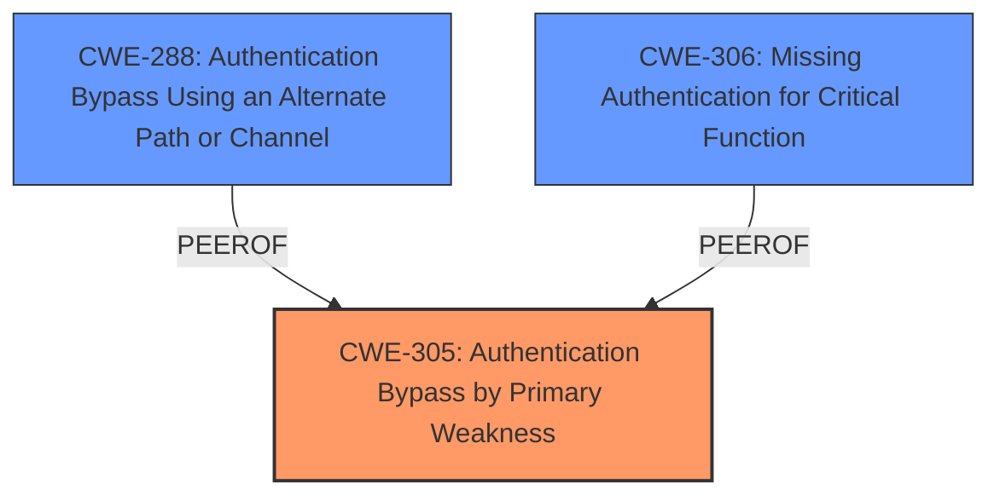

# Raw Analyzer Response for CVE-2024-50478

# Summary
| CWE ID | CWE Name | Confidence | CWE Abstraction Level | CWE Vulnerability Mapping Label | CWE-Vulnerability Mapping Notes |
|---|---|---|---|---|---|
| CWE-305 | Authentication Bypass by Primary Weakness | 0.9 | Base | Primary | Allowed |
| CWE-288 | Authentication Bypass Using an Alternate Path or Channel | 0.7 | Base | Secondary | Allowed |
| CWE-306 | Missing Authentication for Critical Function | 0.6 | Base | Secondary | Allowed |

## Evidence and Confidence

*   **Confidence Score:** 0.8
*   **Evidence Strength:** MEDIUM

## Relationship Analysis
The primary CWE selected is CWE-305, Authentication Bypass by Primary Weakness. This is a base-level CWE that accurately captures the root cause described in the vulnerability. CWE-288, Authentication Bypass Using an Alternate Path or Channel, is considered a secondary CWE as it represents a potential mechanism for bypassing authentication. CWE-306 is also added as a secondary vulnerability if no authentication check for a critical function is present. The relationships are based on the understanding that the **primary weakness** leads to an authentication bypass, and alternate paths or missing authentication can be exploited.

## Vulnerability Chain
The vulnerability chain starts with a **primary weakness** in the authentication mechanism, leading to the ability to bypass authentication and potentially gain admin access.

1.  **Root Cause:** **Primary Weakness** in authentication (CWE-305)
2.  **Weakness:** Potential alternate path or channel to bypass authentication(CWE-288)
3.  **Weakness:** Potential missing authentication check for critical function (CWE-306)
4.  **Impact:** Authentication Bypass, Admin Access

## Summary of Analysis
The initial analysis focused on identifying the **primary weakness** causing the authentication bypass. The evidence from the vulnerability description and CVE reference links points towards a flawed authentication mechanism as the **root cause**. The retriever results and CWE specifications supported the selection of CWE-305 (Authentication Bypass by Primary Weakness) as the primary CWE. CWE-288 and CWE-306 were considered as they represent common methods used in exploiting authentication bypass vulnerabilities. The graph relationships influenced the selection by showing the potential alternative paths and mechanisms for bypassing authentication. The selected CWEs are at the optimal level of specificity, as they accurately represent the **root cause** and potential exploitation methods based on the available evidence.

The assessment is heavily based on the provided evidence, specifically:
*   "Authentication Bypass by **Primary Weakness vulnerability**" from the vulnerability description.
*   "The plugin has a broken authentication mechanism" from the CVE Reference Links Content Summary.

Based on the evidence, CWE-305 is the most accurate representation of the vulnerability. CWE-288 and CWE-306 are secondary candidates as possible exploitation paths.

Relevant CWE Information:

# Enhanced Context (25 CWEs)
The following CWEs were identified as potentially relevant to this vulnerability:

## CWE-305: Authentication Bypass by Primary Weakness
**Abstraction Level**: Base
**Similarity Score**: 0.80
**Source**: dense

**Description**:
The authentication algorithm is sound, but the implemented mechanism can be bypassed as the result of a separate weakness that is primary to the authentication error.

**Mapping Guidance**:
- Usage: Allowed
- Rationale: This CWE entry is at the Base level of abstraction, which is a preferred level of abstraction for mapping to the root causes of vulnerabilities.

## CWE-288: Authentication Bypass Using an Alternate Path or Channel
**Abstraction Level**: Base
**Similarity Score**: 0.76
**Source**: dense

**Description**:
The product requires authentication, but the product has an alternate path or channel that does not require authentication.

**Mapping Guidance**:
- Usage: Allowed
- Rationale: This CWE entry is at the Base level of abstraction, which is a preferred level of abstraction for mapping to the root causes of vulnerabilities.

## CWE-306: Missing Authentication for Critical Function
**Abstraction Level**: Base
**Similarity Score**: 1211.72
**Source**: sparse

**Description**:
The product does not perform any authentication for functionality that requires a provable user identity or consumes a significant amount of resources.

**Mapping Guidance**:
- Usage: Allowed
- Rationale: This CWE entry is at the Base level of abstraction, which is a preferred level of abstraction for mapping to the root causes of vulnerabilities.