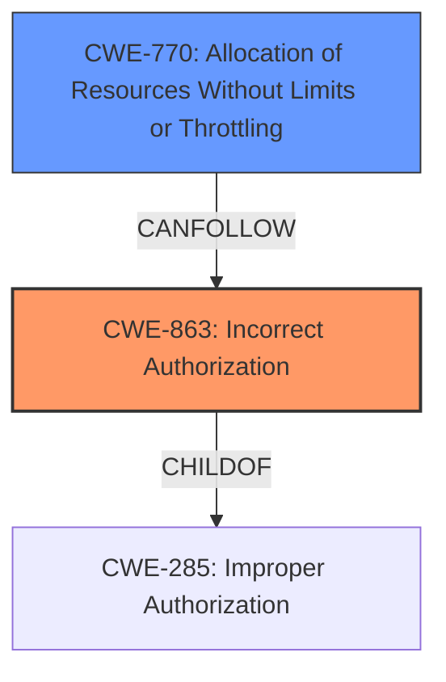

# Analysis Report for CVE-2024-50654

# Vulnerability Analysis Report: CVE-2024-50654

## Description

lilishop <=4.2.4 is vulnerable to Incorrect Access Control, which can allow attackers to obtain coupons beyond the quantity limit by capturing and sending the data packets for coupon collection in high concurrency.

## Vulnerability Description Key Phrases

- **Rootcause:** incorrect access control
- **Impact:** obtain coupons beyond the quantity limit
- **Vector:** capturing and sending the data packets for coupon collection in high concurrency
- **Attacker:** attackers
- **Product:** lilishop
- **Version:** <=4.2.4

## Analysis (with Relationship Data)

# Summary
| CWE ID   | CWE Name                                                                             | Confidence | CWE Abstraction Level | CWE Vulnerability Mapping Label | CWE-Vulnerability Mapping Notes |
| -------- | ------------------------------------------------------------------------------------ | ---------- | --------------------- | ------------------------------- | --------------------------------- |
| CWE-863  | Incorrect Authorization                                                              | 0.8        | Class                 | Allowed-with-Review             | Primary CWE                       |
| CWE-770  | Allocation of Resources Without Limits or Throttling                               | 0.6        | Base                  | Allowed                         | Secondary Candidate               |

## Evidence and Confidence

*   **Confidence Score:** 0.7
*   **Evidence Strength:** MEDIUM

## Relationship Analysis
The primary CWE is CWE-863, which falls under the class level. The analysis considered its parent and children to determine the best fit. CWE-770 is also related, because there are no limits enforced on the coupon allocations.



## Vulnerability Chain
The vulnerability chain starts with **incorrect access control** (CWE-863), leading to the ability to obtain coupons beyond the quantity limit. The **lack of proper concurrency control** and **insufficient rate limiting** contribute to this issue. The impact is financial loss and potential resource exhaustion.

## Summary of Analysis
The initial analysis focused on the **incorrect access control** identified in the vulnerability description. The retriever results and the provided guidance on authentication vs. authorization vs. access control were crucial in determining the appropriate CWE.

The evidence, specifically the lack of proper concurrency control and the ability to bypass coupon limits, supports the selection of CWE-863 (Incorrect Authorization). This is further supported by the retriever results, which identified CWE-863 as a relevant candidate.

The selection of CWE-863 is at the class level of abstraction, which is a reasonable choice given the available information.

Relevant CWE Information:

# Enhanced Context (25 CWEs)
The following CWEs were identified as potentially relevant to this vulnerability:

## CWE-204: Observable Response Discrepancy
**Abstraction Level**: Base
**Similarity Score**: 0.73

## CWE-472: External Control of Assumed-Immutable Web Parameter
**Abstraction Level**: Base
**Similarity Score**: 0.73

## CWE-668: Exposure of Resource to Wrong Sphere
**Abstraction Level**: Class
**Similarity Score**: 0.73

## CWE-703: Improper Check or Handling of Exceptional Conditions
**Abstraction Level**: Pillar
**Similarity Score**: 0.73

## CWE-41: Improper Resolution of Path Equivalence
**Abstraction Level**: Base
**Similarity Score**: 0.73

## CWE-212: Improper Removal of Sensitive Information Before Storage or Transfer
**Abstraction Level**: Base
**Similarity Score**: 0.73

## CWE-639: Authorization Bypass Through User-Controlled Key
**Abstraction Level**: Base
**Similarity Score**: 0.72

## CWE-807: Reliance on Untrusted Inputs in a Security Decision
**Abstraction Level**: Base
**Similarity Score**: 0.72

## CWE-696: Incorrect Behavior Order
**Abstraction Level**: Class
**Similarity Score**: 0.72

## CWE-303: Incorrect Implementation of Authentication Algorithm
**Abstraction Level**: Base
**Similarity Score**: 0.72

## CWE-863: Incorrect Authorization
**Abstraction Level**: Class
**Similarity Score**: 1556.64
**Source**: sparse

**Description**:
The product performs an authorization check when an actor attempts to access a resource or perform an action, but it does not correctly perform the check.

**Mapping Guidance**:
- Usage: Allowed-with-Review
- Rationale: This CWE entry is a Class and might have Base-level children that would be more appropriate

## CWE-285: Improper Authorization
**Abstraction Level**: Class
**Similarity Score**: 1529.66

## CWE-639: Authorization Bypass Through User-Controlled Key
**Abstraction Level**: Base
**Similarity Score**: 1523.23

## CWE-306: Missing Authentication for Critical Function
**Abstraction Level**: Base
**Similarity Score**: 1494.38

## CWE-287: Improper Authentication
**Abstraction Level**: Class
**Similarity Score**: 1457.58

## CWE-942: Permissive Cross-domain Policy with Untrusted Domains
**Abstraction Level**: variant
**Similarity Score**: 3.88

## CWE-770: Allocation of Resources Without Limits or Throttling
**Abstraction Level**: base
**Similarity Score**: 3.65
**Source**: graph

**Description**:
CWE-770: Allocation of Resources Without Limits or Throttling

**Mapping Guidance**:
- Usage: Allowed
- Rationale: This CWE entry is at the Base level of abstraction, which is a preferred level of abstraction for mapping to the root causes of vulnerabilities.

**Relationships**:
- PARENTOF -> CWE-789
- PARENTOF -> CWE-774
- CANFOLLOW -> CWE-20
- PARENTOF -> CWE-1325
- CHILDOF -> CWE-400

## CWE-73: External Control of File Name or Path
**Abstraction Level**: base
**Similarity Score**: 2.73

## CWE-789: Memory Allocation with Excessive Size Value
**Abstraction Level**: variant
**Similarity Score**: 2.68

## CWE-41: Improper Resolution of Path Equivalence
**Abstraction Level**: Base
**Similarity Score**: 2.63

## CWE-306: Missing Authentication for Critical Function
**Abstraction Level**: base
**Similarity Score**: 2.47

## CWE-294: Authentication Bypass by Capture-replay
**Abstraction Level**: base
**Similarity Score**: 2.47

## CWE-22: Improper Limitation of a Pathname to a Restricted Directory ('Path Traversal')
**Abstraction Level**: base
**Similarity Score**: 2.42

## CWE-1284: Improper Validation of Specified Quantity in Input
**Abstraction Level**: base
**Similarity Score**: 2.40

## CWE-472: External Control of Assumed-Immutable Web Parameter
**Abstraction Level**: Base
**Similarity Score**: 2.34

**CWE-863: Incorrect Authorization**

*   **Technical Explanation:** The application performs an authorization check, but it's flawed, allowing attackers to bypass intended coupon limits. This aligns with the vulnerability description, where users can obtain more coupons than allowed due to concurrency issues.
*   **Security Implications:** Attackers can exploit this to gain excessive discounts, leading to financial losses.
*   **Relationship Analysis:** CWE-863 is a class-level CWE.
*   **Mapping Guidance:** The "Allowed-with-Review" usage suggests considering more specific base-level children, but given the nature of the vulnerability and the lack of specific details about the authorization check, CWE-863 is appropriate.
*   **Justification:** The root cause is a flawed authorization check that doesn't properly limit coupon redemptions.

**CWE-770: Allocation of Resources Without Limits or Throttling**

*   **Technical Explanation:** The application lacks proper limits or throttling on coupon allocations, allowing attackers to exploit concurrency and redeem multiple coupons.
*   **Security Implications:** Resource exhaustion and financial loss due to excessive coupon redemption.
*   **Relationship Analysis:** CWE-770 is a base-level CWE and a child of CWE-400 (Uncontrolled Resource Consumption). It can follow CWE-20 (Improper Input Validation).
*   **Mapping Guidance:** Allowed.
*   **Justification:** While the primary issue is an authorization flaw, the lack of resource control contributes to the exploitability of the vulnerability.

**CWEs Considered but Not Used:**

*   **CWE-284 (Improper Access Control):** This is a high-level CWE and less specific than CWE-863, which describes the problem more accurately.
*   **CWE-306 (Missing Authentication for Critical Function):** The vulnerability description indicates that the issue is not a lack of authentication but rather a flaw in authorization.
*   **CWE-1284 (Improper Validation of Specified Quantity in Input):** While there's an improper quantity, it is related to how the coupon is authorized for


## CWE Relationship Analysis

Current CWEs represent these abstraction levels: .


### Vulnerability Chain Analysis

**Chain starting from CWE-400:**
- 400 (Uncontrolled Resource Consumption) - ROOT


**Chain starting from CWE-770:**
- 770 (Allocation of Resources Without Limits or Throttling) - ROOT


### CWE Relationship Diagram

```mermaid
graph TD
    classDef primary fill:#f96,stroke:#333,stroke-width:2px
    classDef secondary fill:#69f,stroke:#333
    classDef tertiary fill:#9e9,stroke:#333
```


*Report generated on 2025-07-13 20:13:23*
