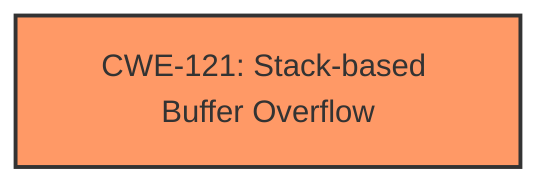

# Analysis for CVE-2024-50667

# Summary
| CWE ID | CWE Name | Confidence | CWE Abstraction Level | CWE Vulnerability Mapping Label | CWE-Vulnerability Mapping Notes |
|---|---|---|---|---|---|
| CWE-121 | Stack-based Buffer Overflow | 1.0 | Variant | Primary | Allowed |

## Evidence and Confidence

*   **Confidence Score:** 1.0
*   **Evidence Strength:** HIGH

## Relationship Analysis
The primary relationship is that CWE-121 [CWE-121: Stack-based Buffer Overflow] is a variant of buffer overflow. There are no other relationships that influenced the decision.

## Vulnerability Chain
The vulnerability chain starts with the **insufficient check of the IPv6 address**, leading to a **stack overflow**, which allows attackers to construct payloads for attacks.

## Summary of Analysis
The vulnerability description explicitly mentions a **stack overflow** in the Trendnet TEW-820AP due to an **insufficient check of the IPv6 address**. The retriever results also strongly suggest CWE-121 [CWE-121: Stack-based Buffer Overflow] as the primary candidate.

*   **Vulnerability Description:** "The boa httpd of Trendnet TEW-820AP 1.01.B01 has a **stack overflow** vulnerability in /boafrm/formIPv6Addr, /boafrm/formIpv6Setup, /boafrm/formDnsv6. The reason is that the check of ipv6 address is not sufficient, which allows attackers to construct payloads for attacks."
*   **Vulnerability Description Key Phrases:** "**weakness:** **stack overflow**"

Given the direct evidence of a **stack overflow** and the high confidence score from the retriever, CWE-121 [CWE-121: Stack-based Buffer Overflow] is the most appropriate and specific CWE.

Other CWEs Considered:

*   CWE-190 [CWE-190: Integer Overflow or Wraparound]: While integer overflows can sometimes lead to buffer overflows, the description specifically mentions a **stack overflow**, making CWE-121 [CWE-121: Stack-based Buffer Overflow] a more precise fit.
*   CWE-125 [CWE-125: Out-of-bounds Read]: This is not a read vulnerability.
*   CWE-120 [CWE-120: Buffer Copy without Checking Size of Input ('Classic Buffer Overflow')]: While related to buffer overflows, CWE-121 [CWE-121: Stack-based Buffer Overflow] is more specific to the location of the buffer on the stack.