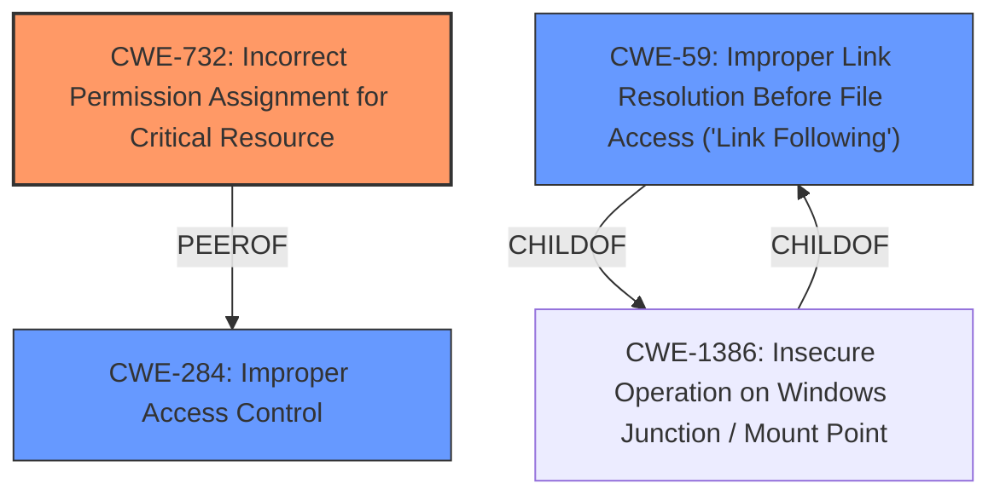

# Raw Analyzer Response for CVE-2024-50804

# Summary
| CWE ID | CWE Name | Confidence | CWE Abstraction Level | CWE Vulnerability Mapping Label | CWE-Vulnerability Mapping Notes |
|---|---|---|---|---|---|
| CWE-732 | Incorrect Permission Assignment for Critical Resource | 0.9 | Class | Allowed-with-Review | Primary CWE |
| CWE-59 | Improper Link Resolution Before File Access ('Link Following') | 0.7 | Base | Allowed | Secondary Candidate |
| CWE-284 | Improper Access Control | 0.6 | Pillar | Discouraged | Secondary Candidate |

## Evidence and Confidence

*   **Confidence Score:** 0.8
*   **Evidence Strength:** HIGH

## Relationship Analysis
The primary weakness is **CWE-732 Incorrect Permission Assignment for Critical Resource**, a Class-level CWE. **CWE-59 Improper Link Resolution Before File Access ('Link Following')** is a Base-level CWE and a child of **CWE-1386 Insecure Operation on Windows Junction / Mount Point**, which is a more specific case. **CWE-284 Improper Access Control** is a general Pillar-level CWE. The relationships between these CWEs highlight the progression from a general access control issue to the specific exploitation of symlinks due to incorrect permissions.

## Vulnerability Chain
The vulnerability chain starts with **CWE-732 Incorrect Permission Assignment for Critical Resource**, which allows a standard user to create a symlink. This leads to **CWE-59 Improper Link Resolution Before File Access ('Link Following')**, where the system accesses the file via the symlink, resulting in arbitrary write and privilege escalation. The final impact is arbitrary code execution.

## Summary of Analysis
The initial assessment focused on the **Insecure Permissions** (**CWE-732**) as the root cause. This is based on the vulnerability description and the CVE Reference Links Content Summary which states that the **permissions weakness** allows for standard users to delete the file after symlink manipulation.

The retriever results and graph relationships reinforced the choice of **CWE-732** as a primary candidate and identified **CWE-59** and **CWE-284** as secondary candidates.

**CWE-732** is the most appropriate because the core issue is that the initial permissions on the `Data` directory and `.dat` file are **incorrectly assigned** to allow standard users to eventually modify/delete critical resources through symlink manipulation.

**CWE-59** is a secondary candidate because the symlink manipulation is a key step in exploiting the **incorrect permissions**. However, the root cause is the **incorrect permission assignment** that allows the symlink to be created and followed in the first place.

**CWE-284** is a more general weakness and less descriptive than **CWE-732** or **CWE-59**, so it's a less suitable choice.

The selected CWEs are at the optimal level of specificity because they directly address the **root cause** (**CWE-732**) and the mechanism of exploitation (**CWE-59**).

Relevant CWE Information:

# Enhanced Context (25 CWEs)
The following CWEs were identified as potentially relevant to this vulnerability:

## CWE-59: Improper Link Resolution Before File Access ('Link Following')
**Abstraction Level**: Base
**Similarity Score**: 0.80
**Source**: dense

**Description**:
The product attempts to access a file based on the filename, but it does not properly prevent that filename from identifying a link or shortcut that resolves to an unintended resource.

**Mapping Guidance**:
- Usage: Allowed
- Rationale: This CWE entry is at the Base level of abstraction, which is a preferred level of abstraction for mapping to the root causes of vulnerabilities.

## CWE-732: Incorrect Permission Assignment for Critical Resource
**Abstraction Level**: Class
**Similarity Score**: 1991.37
**Source**: sparse

**Description**:
The product specifies permissions for a security-critical resource in a way that allows that resource to be read or modified by unintended actors.

**Mapping Guidance**:
- Usage: Allowed-with-Review
- Rationale: While the name itself indicates an assignment of permissions for resources, this is often misused for vulnerabilities in which "permissions" are not checked, which is an "authorization" weakness (CWE-285 or descendants) within CWE's model [REF-1287].

## CWE-284: Improper Access Control
**Abstraction Level**: Pillar
**Similarity Score**: 1955.67
**Source**: sparse

**Description**:
The product does not properly control access to resources, which could allow an attacker to access those resources or perform actions that they are not authorized to perform.

**Mapping Guidance**:
- Usage: Discouraged
- Rationale: This CWE entry is very high-level and is often misused as a catch-all when lower-level CWE IDs might be applicable.

## CWE-269: Improper Privilege Management
**Abstraction Level**: Class
**Similarity Score**: 1969.59
**Source**: sparse

**Description**:
The product does not properly assign, modify, track, or check privileges for an actor, creating an unintended sphere of control for that actor.

**Mapping Guidance**:
- Usage: Discouraged
- Rationale: CWE-269 is commonly misused. It can be conflated with "privilege escalation," which is a technical impact that is listed in many low-information vulnerability reports [REF-1287]. It is not useful for trend analysis.

## CWE-73: External Control of File Name or Path
**Abstraction Level**: Base
**Similarity Score**: 0.76
**Source**: dense

**Description**:
The product allows user input to control or influence paths or file names that are used in filesystem operations.

**Mapping Guidance**:
- Usage: Allowed
- Rationale: This CWE entry is at the Base level of abstraction, which is a preferred level of abstraction for mapping to the root causes of vulnerabilities.

## CWE-285: Improper Authorization
**Abstraction Level**: Class
**Similarity Score**: 1939.79
**Source**: sparse

**Description**:
The product does not perform or incorrectly performs an authorization check when an actor attempts to access a resource or perform an action.

**Mapping Guidance**:
- Usage: Discouraged
- Rationale: CWE-285 is high-level and lower-level CWEs can frequently be used instead. It is a level-1 Class (i.e., a child of a Pillar).

## CWE-863: Incorrect Authorization
**Abstraction Level**: Class
**Similarity Score**: 1955.67
**Source**: sparse

**Description**:
The product performs an authorization check when an actor attempts to access a resource or perform an action, but it does not correctly perform the check.

**Mapping Guidance**:
- Usage: Allowed-with-Review
- Rationale: This CWE entry is a Class and might have Base-level children that would be more appropriate.

## Other CWEs Considered but Not Used:

*   **CWE-269: Improper Privilege Management**: While privilege escalation is the impact, the root cause isn't a failure to manage privileges directly, but rather a failure to set proper permissions initially. The mapping guidance discourages using this CWE when it's just the technical impact.
*   **CWE-285 / CWE-863: Improper/Incorrect Authorization**: These CWEs focus on flawed authorization checks. The vulnerability is not about a broken authorization check, it is the lack of proper permission assignment on the file system.
*   **CWE-73: External Control of File Name or Path**: This vulnerability does not involve external control of the filename or path directly. It's about the symlink resolution due to **incorrect permissions**.
*   **CWE-59: Improper Link Resolution Before File Access ('Link Following')**: While symlink following is part of the exploit, it's a consequence of the **incorrect permissions**, not the primary weakness.
*   **CWE-284: Improper Access Control**: Too broad. **CWE-732** is more specific.