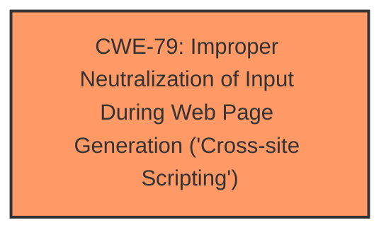

# Analysis for CVE-2024-50839

# Summary
| CWE ID | CWE Name | Confidence | CWE Abstraction Level | CWE Vulnerability Mapping Label | CWE-Vulnerability Mapping Notes |
|---|---|---|---|---|---|
| CWE-79 | Improper Neutralization of Input During Web Page Generation ('Cross-site Scripting') | 0.9 | Base | Allowed | Primary CWE. The application does not neutralize user-controllable input before placing it in a web page. |

## Evidence and Confidence

*   **Confidence Score:** 0.9
*   **Evidence Strength:** LOW

## Relationship Analysis
The primary relationship considered was the parent-child relationship within the CWE hierarchy. Specifically, CWE-79 is a base level CWE. While other more specific child CWEs of CWE-79 exist, such as CWE-80, the provided information is insufficient to determine if a more specific CWE is warranted.

## Vulnerability Chain
The vulnerability chain is as follows:
1.  The application **fails to neutralize** user-supplied input.
2.  The **un-neutralized input** is included in a web page.
3.  A user views the page and the **malicious script executes**.

## Summary of Analysis
The vulnerability description clearly states a Stored Cross-Site Scripting (XSS) vulnerability exists in the KASHIPARA E-learning Management System. The vulnerability lies in the `/admin/add_subject.php` component, where remote attackers can inject arbitrary scripts through the `subject_code` and `title` parameters.

The primary CWE selected is CWE-79, "Improper Neutralization of Input During Web Page Generation ('Cross-site Scripting')". This CWE accurately describes the root cause of the vulnerability, as the application does not neutralize user-controllable input before placing it in output that is used as a web page.

The evidence supporting this classification comes directly from the vulnerability description, which indicates that the application **fails to neutralize** input, leading to the execution of arbitrary scripts. The CWE's description aligns perfectly with this scenario.

The retriever results also support this classification, with CWE-79 being the top-ranked CWE. The mapping guidance for CWE-79 allows its usage, further solidifying its appropriateness.

Other CWEs were considered but ultimately rejected. CWE-80 was considered as a more specific variant of CWE-79, focusing on script-related HTML tags. However, without more information about the exact nature of the injected script, it's safer to stick with the base CWE-79. CWE-434, "Unrestricted Upload of File with Dangerous Type," was considered due to the file upload functionality mentioned. However, the vulnerability description focuses on script injection, making CWE-79 a more accurate representation of the root cause.

The confidence in this classification is high (0.9) due to the clear description of the XSS vulnerability and the alignment with CWE-79's definition.