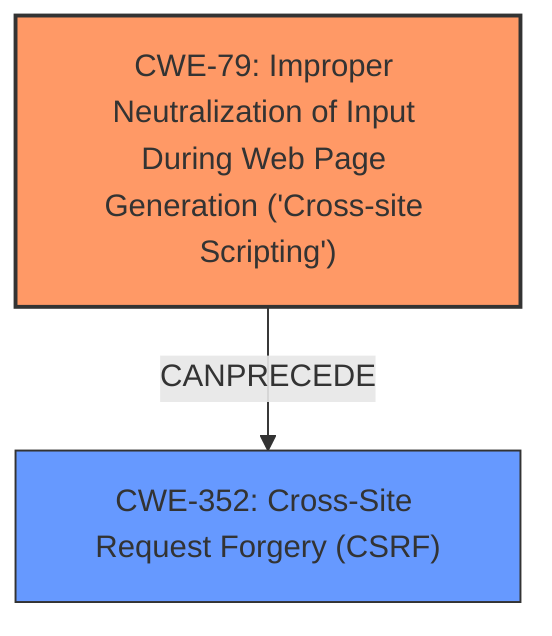

# Analysis for CVE-2024-50857

# Summary
| CWE ID | CWE Name | Confidence | CWE Abstraction Level | CWE Vulnerability Mapping Label | CWE-Vulnerability Mapping Notes |
|---|---|---|---|---|---|
| CWE-79 | Improper Neutralization of Input During Web Page Generation ('Cross-site Scripting') | 1.0 | Base | Primary | Allowed |
| CWE-352 | Cross-Site Request Forgery (CSRF) | 0.8 | Compound | Secondary | Allowed |

## Evidence and Confidence

*   **Confidence Score:** 0.9
*   **Evidence Strength:** MEDIUM

## Relationship Analysis
The primary weakness is **Cross-Site Scripting (CWE-79)**, which involves improper neutralization of input during web page generation. This can lead to the execution of malicious scripts in a user's browser. The secondary weakness is **Cross-Site Request Forgery (CWE-352)**, a compound weakness where an attacker can trick a user into performing actions they did not intend to perform. The relationship between these two is that XSS can facilitate CSRF attacks, by injecting code that generates malicious requests.

## Vulnerability Chain
The vulnerability chain starts with **CWE-79 (Improper Neutralization of Input During Web Page Generation ('Cross-site Scripting'))**, which allows the injection of malicious scripts. This injected script can then be used to perform a **CWE-352 (Cross-Site Request Forgery (CSRF))** attack, leading to data exfiltration and unauthorized actions.

## Summary of Analysis
The primary assessment is based on the evidence provided in the vulnerability description, which explicitly states that the vulnerability is a **Cross-Site Scripting** (XSS) issue in the ip_do_job request of GestioIP v3.5.7. The impact of this XSS vulnerability includes data exfiltration and enabling CSRF attacks.

The description highlights that the **weakness** is **Cross-Site Scripting**, which directly corresponds to **CWE-79 (Improper Neutralization of Input During Web Page Generation ('Cross-site Scripting'))**. This CWE is at the Base level of abstraction and is appropriate for this vulnerability.

The secondary assessment is based on the stated impact that the **Cross-Site Scripting** (XSS) allows CSRF attacks which corresponds to **CWE-352 (Cross-Site Request Forgery (CSRF))**.

The relationship between CWE-79 and CWE-352 is that XSS can be a prerequisite for CSRF. The graph shows this relationship clearly, with CWE-79 preceding CWE-352.

The selected CWEs are at the optimal level of specificity. **CWE-79 (Improper Neutralization of Input During Web Page Generation ('Cross-site Scripting'))** is a Base CWE and precisely describes the root cause of the vulnerability, while **CWE-352 (Cross-Site Request Forgery (CSRF))** describes a potential attack that can be launched due to the **Cross-Site Scripting** vulnerability, by injecting code that generates malicious requests.

**CWE-80 (Improper Neutralization of Script-Related HTML Tags in a Web Page (Basic XSS))** was considered, but **CWE-79 (Improper Neutralization of Input During Web Page Generation ('Cross-site Scripting'))** was deemed more appropriate because it is a broader category that includes CWE-80.