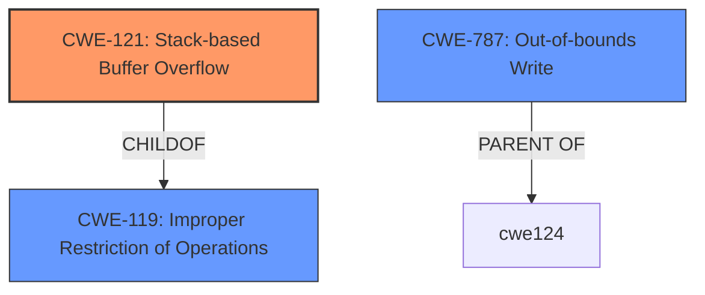

# Analysis for CVE-2024-50997

# Summary
| CWE ID  | CWE Name                                                                    | Confidence | CWE Abstraction Level | CWE Vulnerability Mapping Label | CWE-Vulnerability Mapping Notes |
| :-------- | :-------------------------------------------------------------------------- | :--------- | :---------------------- | :------------------------------ | :------------------------------ |
| CWE-121   | Stack-based Buffer Overflow                                                  | 0.9        | Variant               | Primary CWE                   | Allowed                       |
| CWE-787   | Out-of-bounds Write                                                          | 0.7        | Base                    | Secondary Candidate             | Allowed                       |
| CWE-119   | Improper Restriction of Operations within the Bounds of a Memory Buffer      | 0.6        | Class                   | Secondary Candidate             | Discouraged                   |

## Evidence and Confidence

*   **Confidence Score:** 0.8
*   **Evidence Strength:** MEDIUM

## Relationship Analysis

The primary CWE is CWE-121, a Variant of CWE-119 (Improper Restriction of Operations within the Bounds of a Memory Buffer). CWE-121 specifically describes stack-based buffer overflows, which is directly mentioned in the vulnerability description. CWE-787 (Out-of-bounds Write) is a related Base CWE that can result from a buffer overflow.

## Vulnerability Chain

The vulnerability chain starts with a **stack overflow** due to the pptp_user_ip parameter at pptp.cgi, leading to an **out-of-bounds write** on the stack, finally resulting in a Denial of Service (DoS).

## Summary of Analysis

The vulnerability description explicitly mentions a **stack overflow** in the pptp.cgi component when handling the pptp_user_ip parameter. This directly aligns with CWE-121 (Stack-based Buffer Overflow), which is a Variant of CWE-119 (Improper Restriction of Operations within the Bounds of a Memory Buffer). CWE-787 (Out-of-bounds Write) is a plausible consequence of the buffer overflow.

The evidence provided is the vulnerability description which states "Netgear R8500 v1.0.2.160, XR300 v1.0.3.78, R7000P v1.3.3.154, and R6400 v2 1.0.4.128 were discovered to contain a **stack overflow** via the pptp_user_ip parameter at pptp.cgi. This vulnerability allows attackers to cause a Denial of Service (DoS) via a crafted POST request."

The retriever results also support CWE-121 as the top candidate.

I considered CWE-120 (Buffer Copy without Checking Size of Input) because it was the Primary CWE match for similar CVE descriptions. However, the provided description does not specifically mention a buffer copy operation, so CWE-121 is a more precise fit.

Relevant CWE Information:

# Enhanced Context (25 CWEs)
The following CWEs were identified as potentially relevant to this vulnerability:

## CWE-121: Stack-based Buffer Overflow
**Abstraction Level**: Variant
**Similarity Score**: 0.75
**Source**: dense

**Description**:
A stack-based buffer overflow condition is a condition where the buffer being overwritten is allocated on the stack (i.e., is a local variable or, rarely, a parameter to a function).

**Mapping Guidance**:
- Usage: Allowed
- Rationale: This CWE entry is at the Variant level of abstraction, which is a preferred level of abstraction for mapping to the root causes of vulnerabilities.

## CWE-787: Out-of-bounds Write
**Abstraction Level**: base
**Similarity Score**: 3.89
**Source**: graph

**Description**:
CWE-787: Out-of-bounds Write

**Mapping Guidance**:
- Usage: Allowed
- Rationale: This CWE entry is at the Base level of abstraction, which is a preferred level of abstraction for mapping to the root causes of vulnerabilities.

**Relationships**:
- CANFOLLOW -> CWE-825
- CANFOLLOW -> CWE-824
- CANFOLLOW -> CWE-823
- CANFOLLOW -> CWE-822
- PARENTOF -> CWE-124

## CWE-119: Improper Restriction of Operations within the Bounds of a Memory Buffer
**Abstraction Level**: Class
**Similarity Score**: 0.71
**Source**: dense

**Description**:
The product performs operations on a memory buffer, but it reads from or writes to a memory location outside the buffer's intended boundary. This may result in read or write operations on unexpected memory locations that could be linked to other variables, data structures, or internal program data.

**Mapping Guidance**:
- Usage: Discouraged
- Rationale: CWE-119 is commonly misused in low-information vulnerability reports when lower-level CWEs could be used instead, or when more details about the vulnerability are available.