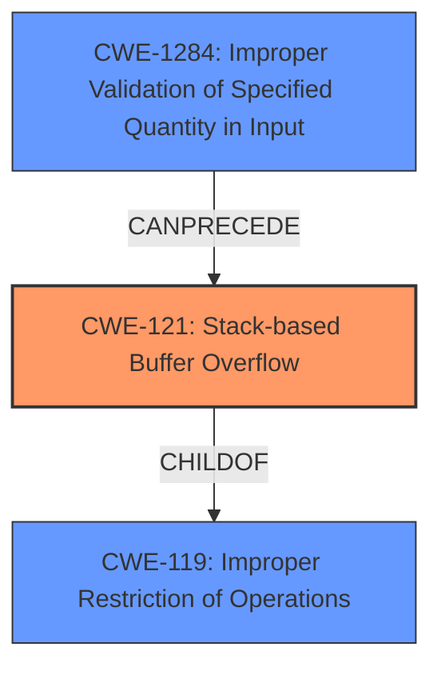

# Raw Analyzer Response for CVE-2024-51000

# Summary
| CWE ID | CWE Name | Confidence | CWE Abstraction Level | CWE Vulnerability Mapping Label | CWE-Vulnerability Mapping Notes |
|---|---|---|---|---|---|
| CWE-121 | Stack-based Buffer Overflow | 1.0 | Variant | Primary | Allowed |
| CWE-1284 | Improper Validation of Specified Quantity in Input | 0.6 | Base | Secondary | Allowed |
| CWE-119 | Improper Restriction of Operations within the Bounds of a Memory Buffer | 0.5 | Class | Secondary | Discouraged |

## Evidence and Confidence

*   **Confidence Score:** 0.8
*   **Evidence Strength:** MEDIUM

## Relationship Analysis
The primary CWE, CWE-121 (Stack-based Buffer Overflow), is a variant of CWE-119 (Improper Restriction of Operations within the Bounds of a Memory Buffer). This hierarchical relationship is important because CWE-119 is a more general class, and CWE-121 is a more specific type of buffer overflow that occurs on the stack. There is a potential chain relationship where insufficient input validation (CWE-1284) can precede a buffer overflow (CWE-121).

## Vulnerability Chain
The vulnerability chain starts with potentially **improper input validation** (CWE-1284) of the `opmode`, `opmode_an`, and `opmode_an_2` parameters. This leads to a **stack-based buffer overflow** (CWE-121) when the data is processed by `wireless.cgi`. The resulting impact is a **Denial of Service** (DoS).

## Summary of Analysis
The primary weakness is a **stack overflow** in the `wireless.cgi` component of the Netgear R8500 router. The vulnerability occurs due to a **crafted POST request** targeting the `opmode`, `opmode_an`, and `opmode_an_2` parameters.

The evidence from the vulnerability description clearly points to a stack overflow. The "Vulnerability Description Key Phrases" section explicitly identifies "**stack overflow**" as the **weakness**. The "Retriever Results" list CWE-121 (Stack-based Buffer Overflow) as the top result with a score of 1.0, further supporting this classification.

CWE-121 is a Variant-level CWE, which is the preferred level of abstraction for mapping vulnerabilities. The mapping guidance for CWE-121 indicates that it is "Allowed."

CWE-1284 is a potential contributing factor if the size of the input is not properly validated before being copied to the stack buffer. This would make it a secondary CWE, where **improper validation** leads to the overflow.

CWE-119 is a more general CWE that describes **improper restriction of operations within the bounds of a memory buffer**. While technically correct, it is less specific than CWE-121.

I considered CWE-120 (Buffer Copy without Checking Size of Input ('Classic Buffer Overflow')) but it is not the best fit. The description states the overflow occurs via specific parameters in a crafted POST request, suggesting insufficient validation of the input size is more likely the root cause than simply copying without any size checks.

Based on the evidence and relationship analysis, CWE-121 is the most appropriate primary CWE because the vulnerability is explicitly identified as a stack overflow.

Relevant CWE Information:

# Enhanced Context (25 CWEs)
The following CWEs were identified as potentially relevant to this vulnerability:

## CWE-77: Improper Neutralization of Special Elements used in a Command ('Command Injection')
**Abstraction Level**: Class
**Similarity Score**: 0.73
**Source**: dense

**Description**:
The product constructs all or part of a command using externally-influenced input from an upstream component, but it does not neutralize or incorrectly neutralizes special elements that could modify the intended command when it is sent to a downstream component.

**Mapping Guidance**:
- Usage: Allowed-with-Review
- Rationale: CWE-77 is often misused when OS command injection (CWE-78) was intended instead [REF-1287].

*Not Used*: This is not a command injection vulnerability.

## CWE-121: Stack-based Buffer Overflow
**Abstraction Level**: Variant
**Similarity Score**: 0.73
**Source**: dense

**Description**:
A stack-based buffer overflow condition is a condition where the buffer being overwritten is allocated on the stack (i.e., is a local variable or, rarely, a parameter to a function).

**Mapping Guidance**:
- Usage: Allowed
- Rationale: This CWE entry is at the Variant level of abstraction, which is a preferred level of abstraction for mapping to the root causes of vulnerabilities.

*Used*: This is the primary CWE because the vulnerability description states it is a **stack overflow**.

## CWE-755: Improper Handling of Exceptional Conditions
**Abstraction Level**: Class
**Similarity Score**: 0.72
**Source**: dense

**Description**:
The product does not handle or incorrectly handles an exceptional condition.

**Mapping Guidance**:
- Usage: Discouraged
- Rationale: This CWE entry is a level-1 Class (i.e., a child of a Pillar). It might have lower-level children that would be more appropriate

*Not Used*: This is too general.

## CWE-790: Improper Filtering of Special Elements
**Abstraction Level**: Class
**Similarity Score**: 0.71
**Source**: dense

**Description**:
The product receives data from an upstream component, but does not filter or incorrectly filters special elements before sending it to a downstream component.

**Mapping Guidance**:
- Usage: Allowed-with-Review
- Rationale: This CWE entry is a Class and might have Base-level children that would be more appropriate

*Not Used*: The description does not indicate special elements are involved.

## CWE-288: Authentication Bypass Using an Alternate Path or Channel
**Abstraction Level**: Base
**Similarity Score**: 0.71
**Source**: dense

**Description**:
The product requires authentication, but the product has an alternate path or channel that does not require authentication.

**Mapping Guidance**:
- Usage: Allowed
- Rationale: This CWE entry is at the Base level of abstraction, which is a preferred level of abstraction for mapping to the root causes of vulnerabilities.

*Not Used*: This is not an authentication bypass.

## CWE-78: Improper Neutralization of Special Elements used in an OS Command ('OS Command Injection')
**Abstraction Level**: Base
**Similarity Score**: 0.71
**Source**: dense

**Description**:
The product constructs all or part of an OS command using externally-influenced input from an upstream component, but it does not neutralize or incorrectly neutralizes special elements that could modify the intended OS command when it is sent to a downstream component.

**Mapping Guidance**:
- Usage: Allowed
- Rationale: This CWE entry is at the Base level of abstraction, which is a preferred level of abstraction for mapping to the root causes of vulnerabilities.

*Not Used*: This is not a command injection vulnerability.

## CWE-912: Hidden Functionality
**Abstraction Level**: Class
**Similarity Score**: 0.71
**Source**: dense

**Description**:
The product contains functionality that is not documented, not part of the specification, and not accessible through an interface or command sequence that is obvious to the product's users or administrators.

**Mapping Guidance**:
- Usage: Allowed-with-Review
- Rationale: This CWE entry is a Class and might have Base-level children that would be more appropriate

*Not Used*: There's no mention of hidden functionality.

## CWE-497: Exposure of Sensitive System Information to an Unauthorized Control Sphere
**Abstraction Level**: Base
**Similarity Score**: 0.70
**Source**: dense

**Description**:
The product does not properly prevent sensitive system-level information from being accessed by unauthorized actors who do not have the same level of access to the underlying system as the product does.

**Mapping Guidance**:
- Usage: Allowed
- Rationale: This CWE entry is at the Base level of abstraction, which is a preferred level of abstraction for mapping to the root causes of vulnerabilities.

*Not Used*: There's no mention of information exposure.

## CWE-134: Use of Externally-Controlled Format String
**Abstraction Level**: Base
**Similarity Score**: 0.70
**Source**: dense

**Description**:
The product uses a function that accepts a format string as an argument