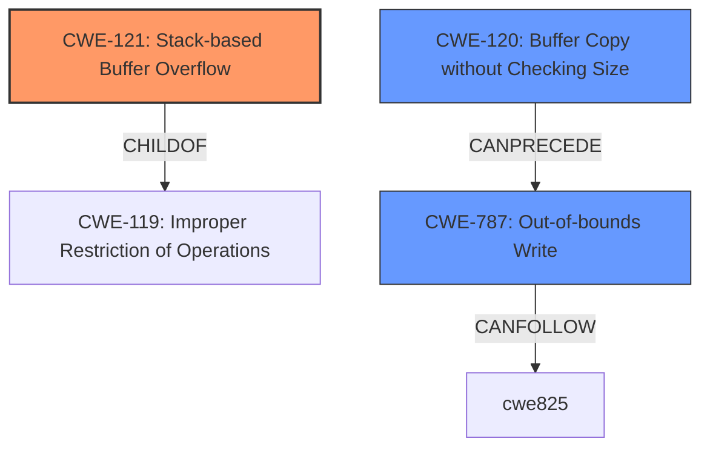

# Raw Analyzer Response for CVE-2024-51011

# Summary
| CWE ID | CWE Name | Confidence | CWE Abstraction Level | CWE Vulnerability Mapping Label | CWE-Vulnerability Mapping Notes |
|---|---|---|---|---|---|
| CWE-121 | Stack-based Buffer Overflow | 0.8 | Variant | Allowed | Primary CWE |
| CWE-787 | Out-of-bounds Write | 0.5 | Base | Allowed | Secondary Candidate |
| CWE-120 | Buffer Copy without Checking Size of Input ('Classic Buffer Overflow') | 0.4 | Base | Allowed-with-Review | Secondary Candidate |

## Evidence and Confidence

*   **Confidence Score:** 0.7
*   **Evidence Strength:** MEDIUM

## Relationship Analysis
The primary CWE is CWE-121, Stack-based Buffer Overflow, which is a variant of the more general CWE-119, Improper Restriction of Operations within the Bounds of a Memory Buffer. CWE-787, Out-of-bounds Write, is a parent of CWE-124, Buffer Underwrite ('Buffer Underflow'). CWE-120, Buffer Copy without Checking Size of Input ('Classic Buffer Overflow') is related to buffer overflows in general and can precede CWE-416 (Use After Free) and CWE-231 (Reliance on Data/Mechanism Outside of Security Perimeter). The selection of CWE-121 is more specific than CWE-119 and reflects the stack-based nature of the overflow.

## Vulnerability Chain
The vulnerability chain starts with the **stack overflow** due to a crafted POST request containing a malicious pppoe_localip parameter. This leads to a Denial of Service (DoS). The chain is: **Stack Overflow** (CWE-121) -> Out-of-bounds Write (CWE-787) -> Denial of Service.

## Summary of Analysis
The initial assessment focused on the description indicating a "**stack overflow**" via a crafted POST request. The primary CWE match from similar CVE descriptions was CWE-120, but the retriever results indicated CWE-121, Stack-based Buffer Overflow, as the best match, which aligns with the description. The term "**stack overflow**" is explicit evidence.

CWE-121 (Stack-based Buffer Overflow): This is selected because the vulnerability description explicitly mentions a "**stack overflow**" via the pppoe_localip parameter. This indicates that the buffer being overflowed is located on the stack. The security implication is a denial of service, as stated in the description.

CWE-787 (Out-of-bounds Write): This is a potential secondary CWE because a stack overflow typically involves writing beyond the boundaries of the allocated buffer on the stack. While the description focuses on the stack overflow itself, an out-of-bounds write is the underlying mechanism.

CWE-120 (Buffer Copy without Checking Size of Input ('Classic Buffer Overflow')): This was considered due to the primary CWE match for similar CVE descriptions and the general association with buffer overflows. However, CWE-121 is more specific since the description mentioned that the overflow is stack based.

The final selection of CWE-121 is based on the explicit mention of "**stack overflow**" in the vulnerability description and its higher specificity compared to the other considered CWEs.

Relevant CWE Information:

# Enhanced Context (25 CWEs)
The following CWEs were identified as potentially relevant to this vulnerability:

## CWE-121: Stack-based Buffer Overflow
**Abstraction Level**: Variant
**Similarity Score**: 0.73
**Source**: dense

**Description**:
A stack-based buffer overflow condition is a condition where the buffer being overwritten is allocated on the stack (i.e., is a local variable or, rarely, a parameter to a function).

**Mapping Guidance**:
- Usage: Allowed
- Rationale: This CWE entry is at the Variant level of abstraction, which is a preferred level of abstraction for mapping to the root causes of vulnerabilities.

## CWE-787: Out-of-bounds Write
**Abstraction Level**: base
**Similarity Score**: 3.89
**Source**: graph

**Description**:
CWE-787: Out-of-bounds Write

**Mapping Guidance**:
- Usage: Allowed
- Rationale: This CWE entry is at the Base level of abstraction, which is a preferred level of abstraction for mapping to the root causes of vulnerabilities.