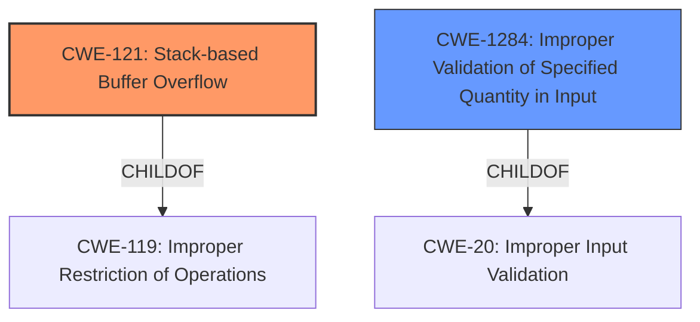

# Analysis for CVE-2024-51012

# Summary
| CWE ID | CWE Name | Confidence | CWE Abstraction Level | CWE Vulnerability Mapping Label | CWE-Vulnerability Mapping Notes |
|---|---|---|---|---|---|
| CWE-121 | Stack-based Buffer Overflow | 1.0 | Variant | Allowed | Primary CWE |
| CWE-1284 | Improper Validation of Specified Quantity in Input | 0.6 | Base | Allowed | Secondary Candidate |

## Evidence and Confidence

*   **Confidence Score:** 0.8
*   **Evidence Strength:** MEDIUM

## Relationship Analysis
The primary relationship influencing the selection is the direct match of "stack overflow" to CWE-121. The description explicitly mentions a **stack overflow** via a specific parameter. CWE-121 is a variant of buffer overflows which are children of the more general "Improper Restriction of Operations within the Bounds of a Memory Buffer" (CWE-119). CWE-1284 is included as a secondary candidate due to the potential for an improperly validated quantity being the root cause of the overflow.

## Vulnerability Chain
The vulnerability chain appears to start with an **improper handling of input**, possibly related to the size or length of the `ipv6_pri_dns` parameter. This leads to the **stack overflow**, which then results in a Denial of Service (DoS). The chain can be represented as follows: Improper Input Handling -> Stack-based Buffer Overflow -> Denial of Service.

## Summary of Analysis
The initial analysis identified CWE-121 as the primary candidate due to the explicit mention of a **stack overflow**. This is strongly supported by the vulnerability description. The retriever results also listed CWE-121 with the highest score. While the CVE Reference Links Content Summary section had no specific details about the root cause, the vulnerability description itself provides sufficient information. I've also included CWE-1284 as a secondary candidate because an improperly validated quantity could be the reason for the stack overflow. My assessment is primarily based on the vulnerability description, which explicitly states "**stack overflow** via the ipv6_pri_dns parameter at ipv6_fix.cgi". This is direct evidence supporting the selection of CWE-121. CWE-121 is at the optimal level of specificity because it accurately describes the type of buffer overflow.

Relevant CWE Information:

# Enhanced Context (25 CWEs)
The following CWEs were identified as potentially relevant to this vulnerability:

## CWE-121: Stack-based Buffer Overflow
**Abstraction Level**: Variant
**Similarity Score**: 0.72
**Source**: dense

**Description**:
A stack-based buffer overflow condition is a condition where the buffer being overwritten is allocated on the stack (i.e., is a local variable or, rarely, a parameter to a function).

**Mapping Guidance**:
- Usage: Allowed
- Rationale: This CWE entry is at the Variant level of abstraction, which is a preferred level of abstraction for mapping to the root causes of vulnerabilities.

## CWE-1284: Improper Validation of Specified Quantity in Input
**Abstraction Level**: Base
**Similarity Score**: 603.06
**Source**: sparse

**Description**:
The product receives input that is expected to specify a quantity (such as size or length), but it does not validate or incorrectly validates that the quantity has the required properties.

**Mapping Guidance**:
- Usage: Allowed
- Rationale: This CWE entry is at the Base level of abstraction, which is a preferred level of abstraction for mapping to the root causes of vulnerabilities.

---

**CWE-121: Stack-based Buffer Overflow**
*   **Technical Explanation:** The vulnerability description clearly states that there is a **stack overflow** in the Netgear R8500 device. This occurs when more data is written to a buffer located on the stack than it can hold. In this specific case, the overflow is triggered by the `ipv6_pri_dns` parameter at `ipv6_fix.cgi`.
*   **Security Implications:** A **stack overflow** can lead to arbitrary code execution, denial of service, or information disclosure. In this case, it leads to denial of service.
*   **Relationship:** CWE-121 is a variant of CWE-119 (Improper Restriction of Operations within the Bounds of a Memory Buffer). It's more specific, as it identifies the stack as the location of the overflow.
*   **Mapping Guidance Influence:** The MITRE mapping guidance allows for the use of CWE-121, as it is at the Variant level of abstraction.
*   **Primary/Secondary:** Primary

**CWE-1284: Improper Validation of Specified Quantity in Input**
*   **Technical Explanation:** This CWE is potentially relevant because the root cause of the **stack overflow** might be due to the program not properly validating the size or length of the `ipv6_pri_dns` parameter before copying it to the stack buffer.
*   **Security Implications:** If the quantity (size/length) of the input is not validated, an attacker can provide an excessively large value, leading to a buffer overflow.
*   **Relationship:** CWE-1284 is a child of CWE-20 (Improper Input Validation). It specifies a particular type of input validation issue related to quantities.
*   **Mapping Guidance Influence:** The MITRE mapping guidance allows for the use of CWE-1284, as it is at the Base level of abstraction.
*   **Primary/Secondary:** Secondary Candidate

**CWEs Considered but Not Used:**

*   CWE-77, CWE-78: These relate to command injection, which is not indicated in the vulnerability description.
*   CWE-190: This relates to Integer Overflows, and there's no evidence in the description to suggest this is the root cause.
*   CWE-125: This relates to out-of-bounds read, whereas the description indicates an out-of-bounds write (overflow).
*   CWE-770: Allocation of Resources Without Limits or Throttling - While related to resource management, there's no explicit mention of resource allocation issues in the description.
*   CWE-789: Memory Allocation with Excessive Size Value - While related to memory allocation, there is no explicit mention of memory allocation issues in the description.