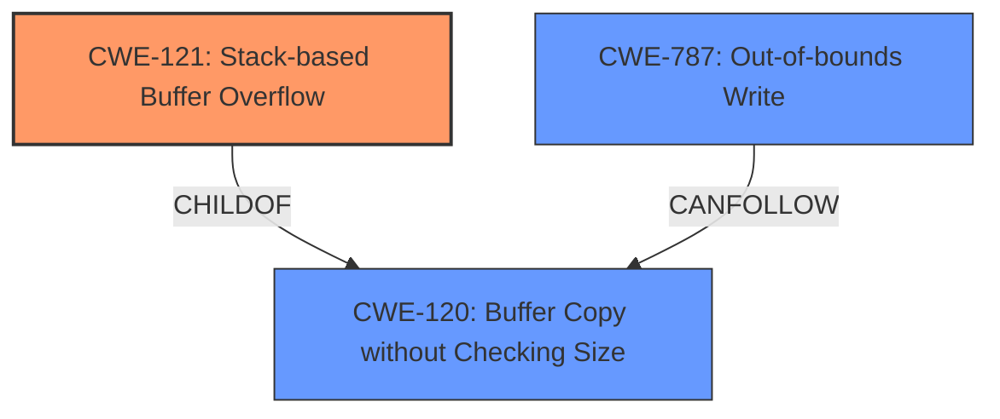

# Raw Analyzer Response for CVE-2024-51014

# Summary
| CWE ID | CWE Name | Confidence | CWE Abstraction Level | CWE Vulnerability Mapping Label | CWE-Vulnerability Mapping Notes |
|---|---|---|---|---|---|
| CWE-121 | Stack-based Buffer Overflow | 1.0 | Variant | Allowed | Primary CWE |
| CWE-120 | Buffer Copy without Checking Size of Input ('Classic Buffer Overflow') | 0.6 | Base | Allowed-with-Review | Secondary Candidate |
| CWE-787 | Out-of-bounds Write | 0.5 | Base | Allowed | Secondary Candidate |

## Evidence and Confidence

*   **Confidence Score:** 0.8
*   **Evidence Strength:** MEDIUM

## Relationship Analysis
The primary relationship is that CWE-121 (Stack-based Buffer Overflow) is a variant of CWE-120 (Buffer Copy without Checking Size). CWE-787 (Out-of-bounds Write) can be a consequence of a buffer overflow, but the description explicitly mentions a "stack overflow", making CWE-121 the most appropriate choice. CWE-121 is a variant which is more specific than the base CWE-120.

## Vulnerability Chain
The vulnerability chain starts with the **stack overflow** condition due to a crafted POST request, leading to a denial of service.

## Summary of Analysis
The vulnerability description clearly states a **stack overflow** in `bridge_wireless_main.cgi` due to the `ssid_an` parameter. The primary CWE is therefore CWE-121 (Stack-based Buffer Overflow).

*   **CWE-121 Stack-based Buffer Overflow**: This is the most direct match for the described vulnerability. The description mentions a **stack overflow**, which aligns precisely with CWE-121. This is a variant, which is a preferred level of abstraction. Confidence: 1.0
*   **CWE-120 Buffer Copy without Checking Size**: This is a more general case of buffer overflow. Since the description specifies a **stack overflow**, CWE-121 is more specific and appropriate. CWE-120 is the Primary CWE match based on similar CVE descriptions. Confidence: 0.6
*   **CWE-787 Out-of-bounds Write**: This could be a consequence of the buffer overflow, but the root cause is the overflow itself. So, it is a secondary effect. Confidence: 0.5

The decision is based on the explicit mention of "**stack overflow**" in the vulnerability description. The retriever results also list CWE-121 as the top result. Although there is no CVE Reference Links Content Summary, the Vulnerability Description Key Phrases clearly identifies the **weakness** as "**stack overflow**".