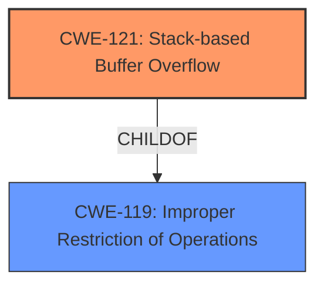

# Analysis Report for CVE-2024-51017

# Vulnerability Analysis Report: CVE-2024-51017

## Description

Netgear R7000P v1.3.3.154 was discovered to contain a **stack overflow** via the l2tp_user_netmask parameter at l2tp.cgi. This vulnerability allows attackers to cause a Denial of Service (DoS) via a crafted POST request.

## Vulnerability Description Key Phrases

- **Weakness:** stack overflow
- **Impact:** Denial of Service (DoS)
- **Vector:** crafted POST request
- **Attacker:** attackers
- **Product:** Netgear R7000P
- **Version:** v1.3.3.154
- **Component:** l2tp_user_netmask parameter at l2tp.cgi

## Analysis (with Relationship Data)

# Summary
| CWE ID | CWE Name | Confidence | CWE Abstraction Level | CWE Vulnerability Mapping Label | CWE-Vulnerability Mapping Notes |
|---|---|---|---|---|---|
| CWE-121 | Stack-based Buffer Overflow | 1.0 | Variant | Primary | Allowed |

## Evidence and Confidence

*   **Confidence Score:** 1.0
*   **Evidence Strength:** HIGH

## Relationship Analysis
The primary CWE is CWE-121 (Stack-based Buffer Overflow), which is a variant of the more general CWE-119 (Improper Restriction of Operations within the Bounds of a Memory Buffer). Since the vulnerability description explicitly states a **stack overflow**, choosing the more specific CWE-121 is appropriate.



## Vulnerability Chain
The vulnerability chain starts with the **stack overflow** due to the `l2tp_user_netmask` parameter at `l2tp.cgi`, leading to a Denial of Service (DoS). The chain is:

1.  **Stack-based Buffer Overflow (CWE-121)**: The root cause is a **stack overflow** condition.
2.  **Denial of Service (DoS)**: The impact of the overflow.

## Summary of Analysis
The vulnerability description clearly states that a **stack overflow** exists via the `l2tp_user_netmask` parameter, triggered by a crafted POST request. This directly aligns with CWE-121, which describes a buffer overflow on the stack. The provided information is sufficient to confidently map this vulnerability to CWE-121. The retriever results also list CWE-121 as the top candidate.

Relevant CWE Information:

# Enhanced Context (25 CWEs)
The following CWEs were identified as potentially relevant to this vulnerability:

## CWE-121: Stack-based Buffer Overflow
**Abstraction Level**: Variant
**Similarity Score**: 0.74
**Source**: dense

**Description**:
A stack-based buffer overflow condition is a condition where the buffer being overwritten is allocated on the stack (i.e., is a local variable or, rarely, a parameter to a function).

**Mapping Guidance**:
- Usage: Allowed
- Rationale: This CWE entry is at the Variant level of abstraction, which is a preferred level of abstraction for mapping to the root causes of vulnerabilities.

## CWE-120: Buffer Copy without Checking Size of Input ('Classic Buffer Overflow')
**Abstraction Level**: Base
**Similarity Score**: 554.77
**Source**: sparse

**Description**:
The product copies an input buffer to an output buffer without verifying that the size of the input buffer is less than the size of the output buffer, leading to a buffer overflow.

**Mapping Guidance**:
- Usage: Allowed-with-Review
- Rationale: There are some indications that this CWE ID might be misused and selected simply because it mentions "buffer overflow" - an increasingly vague term. This CWE entry is only appropriate for "Buffer Copy" operations (not buffer reads), in which where there is no "Checking [the] Size of Input", and (by implication of the copy) writing past the end of the buffer.

**CWE-120 was considered but not used** because the vulnerability description specifies the overflow occurs on the stack and CWE-121 is the more accurate and specific mapping.


## CWE Relationship Analysis

Current CWEs represent these abstraction levels: .


### Vulnerability Chain Analysis

**Chain starting from CWE-119:**
- 119 (Improper Restriction of Operations within the Bounds of a Memory Buffer) - ROOT


**Chain starting from CWE-121:**
- 121 (Stack-based Buffer Overflow) - ROOT


### CWE Relationship Diagram

```mermaid
graph TD
    classDef primary fill:#f96,stroke:#333,stroke-width:2px
    classDef secondary fill:#69f,stroke:#333
    classDef tertiary fill:#9e9,stroke:#333
```


*Report generated on 2025-07-13 20:26:11*
