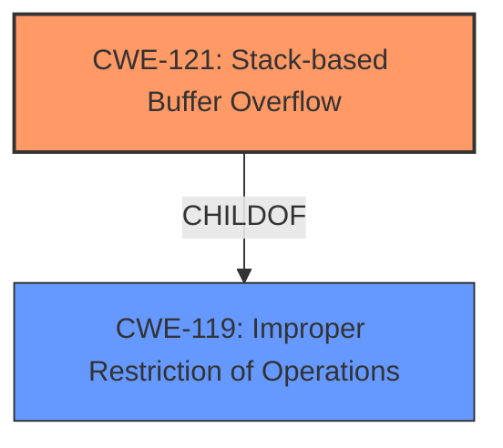

# Enhanced Analysis for CVE-2024-51020

# Summary
| CWE ID  | CWE Name                                                                  | Confidence | CWE Abstraction Level | CWE Vulnerability Mapping Label | CWE-Vulnerability Mapping Notes |
| :-------- | :------------------------------------------------------------------------ | :--------- | :---------------------- | :------------------------------ | :------------------------------ |
| CWE-121   | Stack-based Buffer Overflow                                               | 1.0        | Variant               | Primary                         | Allowed                       |

## Evidence and Confidence

*   **Confidence Score:** 1.0
*   **Evidence Strength:** HIGH

## Relationship Analysis
The primary identified CWE is CWE-121 (Stack-based Buffer Overflow), which is a variant of CWE-119 (Improper Restriction of Operations within the Bounds of a Memory Buffer). The analysis focused on identifying the most specific CWE that accurately represents the vulnerability, which is the stack-based buffer overflow.



## Vulnerability Chain
The vulnerability chain starts with the **stack overflow** (CWE-121) caused by a crafted POST request. This leads to a Denial of Service (DoS). The root cause is the **improper handling of the 'apn' parameter** in the usbISP_detail_edit.cgi script, which allows writing beyond the boundaries of the stack-allocated buffer.

## Summary of Analysis
The vulnerability description clearly states that the vulnerability is a **stack overflow**. The "Vulnerability Description Key Phrases" section explicitly identifies "stack overflow" as the **weakness**. Therefore, CWE-121 (Stack-based Buffer Overflow) is the most appropriate CWE.

The retriever results list CWE-121 as the top combined result with a score of 1.0.

The evidence is strong, and the selection of CWE-121 aligns with the vulnerability description and retriever results.

Relevant CWE Information:

# Enhanced Context (25 CWEs)
The following CWEs were identified as potentially relevant to this vulnerability:

## CWE-121: Stack-based Buffer Overflow
**Abstraction Level**: Variant
**Similarity Score**: 0.73
**Source**: dense

**Description**:
A stack-based buffer overflow condition is a condition where the buffer being overwritten is allocated on the stack (i.e., is a local variable or, rarely, a parameter to a function).

**Mapping Guidance**:
- Usage: Allowed
- Rationale: This CWE entry is at the Variant level of abstraction, which is a preferred level of abstraction for mapping to the root causes of vulnerabilities.

### Final Conclusion:
I am confident in selecting CWE-121 (Stack-based Buffer Overflow) as the primary CWE.

## Additional Considerations and Rejected CWEs:

*   **CWE-190: Integer Overflow or Wraparound**: While this CWE appeared in the retriever results, it does not directly relate to the described **stack overflow** vulnerability. Integer overflow can sometimes lead to buffer overflows, but there is no evidence of integer manipulation in the provided description.
*   **CWE-77: Improper Neutralization of Special Elements used in a Command ('Command Injection') and CWE-78: Improper Neutralization of Special Elements used in an OS Command ('OS Command Injection')**: These CWEs relate to command injection vulnerabilities. There's no mention of command injection in the description, so they are not applicable.
*   **CWE-125: Out-of-bounds Read**: This CWE describes reading data outside buffer boundaries. The vulnerability is described as a **stack overflow**, which involves writing data out of bounds, not reading.
*   **CWE-787: Out-of-bounds Write**: While related, CWE-787 is more general. Since the overflow occurs on the stack, CWE-121 is more specific and appropriate.
*   **CWE-1284: Improper Validation of Specified Quantity in Input**: This could be a contributing factor, but the primary issue is the **stack overflow**, making CWE-121 more relevant as the root cause.


## CWE Relationship Analysis

Current CWEs represent these abstraction levels: .


### Vulnerability Chain Analysis

**Chain starting from CWE-121:**
- 121 (Stack-based Buffer Overflow) - ROOT


**Chain starting from CWE-1284:**
- 1284 (Improper Validation of Specified Quantity in Input) - ROOT


### CWE Relationship Diagram

```mermaid
graph TD
    classDef primary fill:#f96,stroke:#333,stroke-width:2px
    classDef secondary fill:#69f,stroke:#333
    classDef tertiary fill:#9e9,stroke:#333
```