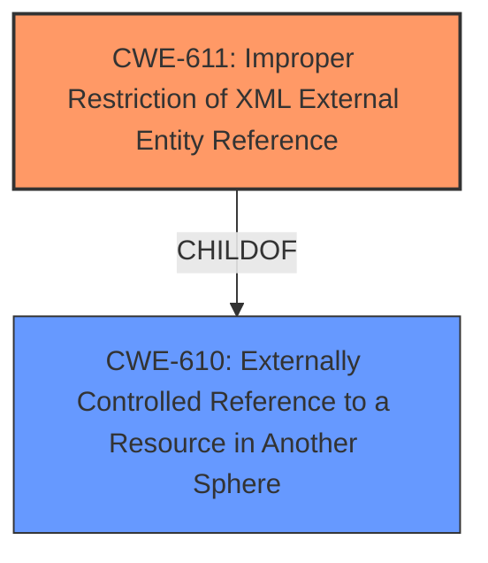

# Analysis Report for CVE-2024-51135

# Vulnerability Analysis Report: CVE-2024-51135

## Description

An **XML External Entity (XXE)** vulnerability in the component DocumentBuilderFactory of powertac-server v1.9.0 allows attackers to access sensitive information or execute arbitrary code via supplying a crafted request containing malicious XML entities.

## Vulnerability Description Key Phrases

- **Rootcause:** XML External Entity (XXE)
- **Impact:** ['access sensitive information', 'execute arbitrary code']
- **Vector:** crafted request containing malicious XML entities
- **Attacker:** attackers
- **Product:** powertac-server
- **Version:** v1.9.0
- **Component:** DocumentBuilderFactory

## Analysis (with Relationship Data)

# Summary
| CWE ID | CWE Name | Confidence | CWE Abstraction Level | CWE Vulnerability Mapping Label | CWE-Vulnerability Mapping Notes |
|---|---|---|---|---|---|
| CWE-611 | Improper Restriction of XML External Entity Reference | 1.0 | Base | Primary | Allowed |

## Evidence and Confidence

*   **Confidence Score:** 1.0
*   **Evidence Strength:** HIGH

## Relationship Analysis
The primary relationship considered was the parent-child relationship between CWE-610 (Externally Controlled Reference to a Resource in Another Sphere) and CWE-611. While CWE-610 is a broader class, CWE-611 is a more specific base vulnerability that directly addresses the **improper restriction of XML external entity references**, aligning precisely with the vulnerability description. There were no other relationships in the Retriever Results that impacted this decision. The abstraction level of Base was chosen as it is the most specific and the preferred level of abstraction.



## Vulnerability Chain
The vulnerability chain starts with the **improper configuration of the DocumentBuilderFactory**, leading to the **XXE vulnerability**. This allows an attacker to inject malicious XML entities, potentially leading to Server-Side Request Forgery (SSRF), information leakage, or Denial of Service. The **root cause** is the insecure XML processing.

## Summary of Analysis
The analysis is based on the provided vulnerability description and the CVE Reference Links Content Summary. The vulnerability description explicitly mentions an **"XML External Entity (XXE)"** vulnerability. The CVE Reference Links Content Summary confirms that the root cause is the **insecure processing of XML data** due to the **lack of proper configuration on the `DocumentBuilderFactory` instance**, which allows external entity resolution.

CWE-611 (Improper Restriction of XML External Entity Reference) is the most appropriate CWE because it directly addresses the root cause and mechanism of the vulnerability. The retriever results also strongly suggest CWE-611 as the primary candidate.

Other CWEs considered but not used:

*   CWE-776 (Improper Restriction of Recursive Entity References in DTDs ('XML Entity Expansion')): While related to XML vulnerabilities, it focuses on recursive entity definitions, which is not the primary issue described.
*   CWE-91 (XML Injection (aka Blind XPath Injection)): This is also related to XML vulnerabilities, but it focuses on the injection of XML code.
*   CWE-134 (Use of Externally-Controlled Format String): This CWE relates to the use of format strings.
*   CWE-123 (Write-what-where Condition): This CWE relates to memory corruption.
*   CWE-941 (Incorrectly Specified Destination in a Communication Channel): This CWE relates to communication channel destination.
*   CWE-441 (Unintended Proxy or Intermediary ('Confused Deputy')): While this could be an impact of XXE, it is not the root cause.

The selected CWE is at the optimal level of specificity because it directly reflects the **root cause** of the vulnerability as described in the provided evidence.


## CWE Relationship Analysis

Current CWEs represent these abstraction levels: .


### Vulnerability Chain Analysis

**Chain starting from CWE-91:**
- 91 (XML Injection (aka Blind XPath Injection)) - ROOT


**Chain starting from CWE-123:**
- 123 (Write-what-where Condition) - ROOT


### CWE Relationship Diagram

```mermaid
graph TD
    classDef primary fill:#f96,stroke:#333,stroke-width:2px
    classDef secondary fill:#69f,stroke:#333
    classDef tertiary fill:#9e9,stroke:#333
```


*Report generated on 2025-07-13 20:29:53*
