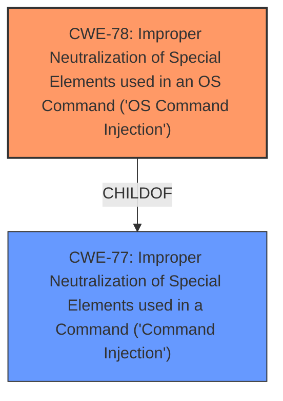

# Analysis Report for CVE-2024-51151

# Vulnerability Analysis Report: CVE-2024-51151

## Description

D-Link DI-8200 16.07.26A1 is vulnerable to remote command execution in the msp_info_htm function via the flag parameter and cmd parameter.

## Vulnerability Description Key Phrases

- **Impact:** remote command execution
- **Product:** D-Link DI-8200
- **Version:** 16.07.26A1
- **Component:** msp_info_htm function

## Analysis (with Relationship Data)

# Summary
| CWE ID | CWE Name | Confidence | CWE Abstraction Level | CWE Vulnerability Mapping Label | CWE-Vulnerability Mapping Notes |
|---|---|---|---|---|---|
| CWE-78 | Improper Neutralization of Special Elements used in an OS Command ('OS Command Injection') | 0.9 | Base | Primary | Allowed |
| CWE-77 | Improper Neutralization of Special Elements used in a Command ('Command Injection') | 0.6 | Class | Secondary | Allowed-with-Review |

## Evidence and Confidence

*   **Confidence Score:** 0.9
*   **Evidence Strength:** LOW

## Relationship Analysis
The primary relationship impacting the decision is the hierarchical relationship between CWE-77 and CWE-78. CWE-78 is a child of CWE-77, making it more specific to OS commands. The vulnerability description explicitly mentions "remote command execution," which strongly suggests CWE-78.



## Vulnerability Chain
The vulnerability chain starts with **improper neutralization** of special elements within the `flag` and `cmd` parameters, leading to the **impact** of remote command execution.

## Summary of Analysis
The initial analysis strongly pointed to CWE-78 due to the "remote command execution" impact. While CWE-77 is a broader category, CWE-78 provides more specific context. Since the evidence is based solely on the vulnerability description and there is no CVE reference links content summary, the confidence level is high, but limited by the information available.

The selection of CWE-78 is at the optimal level of specificity because it directly addresses the OS command execution aspect of the vulnerability.

Relevant CWE Information:

# Enhanced Context (25 CWEs)
The following CWEs were identified as potentially relevant to this vulnerability:

## CWE-78: Improper Neutralization of Special Elements used in an OS Command ('OS Command Injection')
**Abstraction Level**: Base
**Similarity Score**: 0.72
**Source**: dense

**Description**:
The product constructs all or part of an OS command using externally-influenced input from an upstream component, but it does not neutralize or incorrectly neutralizes special elements that could modify the intended OS command when it is sent to a downstream component.

**Mapping Guidance**:
- Usage: Allowed
- Rationale: This CWE entry is at the Base level of abstraction, which is a preferred level of abstraction for mapping to the root causes of vulnerabilities.

## CWE-77: Improper Neutralization of Special Elements used in a Command ('Command Injection')
**Abstraction Level**: Class
**Similarity Score**: 0.69
**Source**: dense

**Description**:
The product constructs all or part of a command using externally-influenced input from an upstream component, but it does not neutralize or incorrectly neutralizes special elements that could modify the intended command when it is sent to a downstream component.

**Mapping Guidance**:
- Usage: Allowed-with-Review
- Rationale: CWE-77 is often misused when OS command injection (CWE-78) was intended instead [REF-1287].

## Vulnerability Analysis

The vulnerability description states that D-Link DI-8200 16.07.26A1 is vulnerable to remote command execution in the `msp_info_htm` function via the `flag` and `cmd` parameters.

**CWE-78: Improper Neutralization of Special Elements used in an OS Command ('OS Command Injection')**

*   **Explanation:** This CWE describes a scenario where a product constructs an OS command using externally influenced input without properly neutralizing special elements that could modify the intended command. In this case, the `flag` and `cmd` parameters are the externally influenced inputs, and the vulnerability allows for remote command execution, indicating that special elements are not being properly neutralized.
*   **Security Implications:** An attacker could inject malicious commands into the `flag` or `cmd` parameters, leading to arbitrary code execution on the device.
*   **Relationship:** CWE-78 is a child of CWE-77.
*   **Primary/Secondary:** Primary.
*   **Mapping Guidance:** The usage is "Allowed," and it is a Base-level CWE, which is preferred.
*   **Evidence:** The vulnerability description explicitly states "remote command execution," which is a direct consequence of OS command injection.

**CWE-77: Improper Neutralization of Special Elements used in a Command ('Command Injection')**

*   **Explanation:** This CWE is a more general form of command injection, where the command is not necessarily an OS command. While CWE-78 is more specific, CWE-77 could also apply.
*   **Security Implications:** Similar to CWE-78, an attacker could inject malicious commands, but the scope is broader.
*   **Relationship:** CWE-77 is the parent of CWE-78.
*   **Primary/Secondary:** Secondary.
*   **Mapping Guidance:** The usage is "Allowed-with-Review," suggesting that a more specific CWE might be appropriate.
*   **Evidence:** The vulnerability description mentions "command execution," making this a plausible, although less precise, classification.

**CWEs Considered But Not Used:**

*   CWE-89: Improper Neutralization of Special Elements used in an SQL Command ('SQL Injection'): This was considered, but the vulnerability description does not indicate SQL injection.
*   CWE-79: Improper Neutralization of Input During Web Page Generation ('Cross-site Scripting'): This was considered, but the vulnerability description does not indicate cross-site scripting.
*   CWE-22: Improper Limitation of a Pathname to a Restricted Directory ('Path Traversal'): This was considered, but the vulnerability description does not indicate path traversal.
*   CWE-121: Stack-based Buffer Overflow: This was considered, but the vulnerability description does not indicate a buffer overflow. The root cause is injection not memory corruption.
*   CWE-74: Improper Neutralization of Special Elements in Output Used by a Downstream Component ('Injection'): This is too general. CWE-78 is more specific.
*   CWE-1336: Improper Neutralization of Special Elements Used in a Template Engine: The description doesn't mention a template engine.
*   CWE-912: Hidden Functionality: While the vulnerability might exploit hidden functionality, that's not the root cause. The core issue is command injection.
*   CWE-184: Incomplete List of Disallowed Inputs: This is a possible contributing factor, but the primary issue is the lack of proper neutralization, not an incomplete list.


## CWE Relationship Analysis

Current CWEs represent these abstraction levels: .


### Vulnerability Chain Analysis

**Chain starting from CWE-89:**
- 89 (Improper Neutralization of Special Elements used in an SQL Command ('SQL Injection')) - ROOT


**Chain starting from CWE-121:**
- 121 (Stack-based Buffer Overflow) - ROOT


### CWE Relationship Diagram

```mermaid
graph TD
    classDef primary fill:#f96,stroke:#333,stroke-width:2px
    classDef secondary fill:#69f,stroke:#333
    classDef tertiary fill:#9e9,stroke:#333
```


*Report generated on 2025-07-13 20:30:11*
