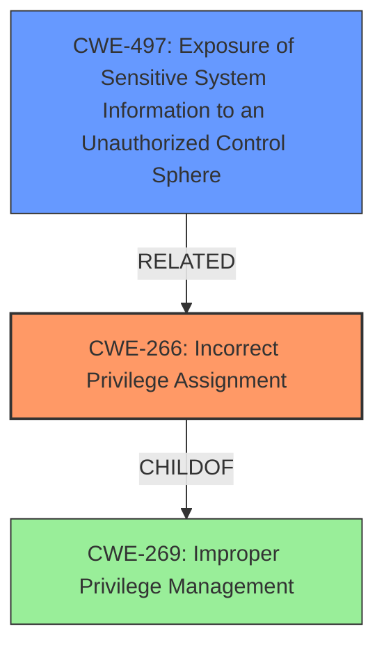

# Analysis for CVE-2024-51162

# Summary
| CWE ID | CWE Name | Confidence | CWE Abstraction Level | CWE Vulnerability Mapping Label | CWE-Vulnerability Mapping Notes |
|---|---|---|---|---|---|
| CWE-266 | Incorrect Privilege Assignment | 0.8 | Base | Primary CWE | Allowed |
| CWE-497 | Exposure of Sensitive System Information to an Unauthorized Control Sphere | 0.7 | Base | Secondary Candidate | Allowed |

## Evidence and Confidence

*   **Confidence Score:** 0.75
*   **Evidence Strength:** MEDIUM

## Relationship Analysis
The primary relationship influencing the selection was the parent-child relationship where more specific **Base** level CWEs are preferred over higher-level **Class** CWEs when the evidence supports it. The choice of CWE-266 over CWE-269 (Improper Privilege Management) reflects this preference for specificity. The relationship between privilege assignment and information exposure also influenced the inclusion of CWE-497 as a secondary concern.

## Vulnerability Chain
The vulnerability chain begins with the **incorrect assignment of privileges** (CWE-266), which allows a user with any privilege to dump the whole Audimex database. This leads to the **exposure of sensitive system information** (CWE-497), such as password hashes and audit data. The chain highlights how an initial flawed privilege assignment can cascade into a significant data exposure issue.

## Summary of Analysis
The initial assessment focused on identifying the root cause of the vulnerability based on the description. The key phrase "it is possible for any user (with any privilege) of Audimex to dump the whole Audimex database" suggests a problem with privilege assignment.

The Retriever Results provided several candidate CWEs, including CWE-916, CWE-639, CWE-863, and CWE-269. However, after analyzing the vulnerability description and the provided guidance, CWE-266 (Incorrect Privilege Assignment) was chosen as the primary CWE because it best describes the root cause: a user with any privilege being able to dump the entire database indicates that privileges were not correctly assigned in the first place. This is further supported by the "Privileges vs Permissions Guidance", that gives the following mapping example:

* ✅ **CWE-266**: *“When a new user registers, the system assigns them admin role due to a missing role validation.”*

The chosen CWE is at the optimal level of specificity because it directly addresses the **incorrect privilege assignment** that allows the attack to occur.

CWE-497 (Exposure of Sensitive System Information to an Unauthorized Control Sphere) was selected as a secondary CWE because the dumping of the database leads directly to sensitive information being exposed.

Relevant CWE Information:

# Enhanced Context (25 CWEs)

## CWE-266: Incorrect Privilege Assignment
**Abstraction Level**: Base
**Similarity Score**: 0.79
**Source**: dense

**Description**:
A product incorrectly assigns a privilege to a particular actor, creating an unintended sphere of control for that actor.

**Mapping Guidance**:
- Usage: Allowed
- Rationale: This CWE entry is at the Base level of abstraction, which is a preferred level of abstraction for mapping to the root causes of vulnerabilities.

## CWE-497: Exposure of Sensitive System Information to an Unauthorized Control Sphere
**Abstraction Level**: Base
**Similarity Score**: 0.75
**Source**: dense

**Description**:
The product does not properly prevent sensitive system-level information from being accessed by unauthorized actors who do not have the same level of access to the underlying system as the product does.

## CWE-269: Improper Privilege Management
**Abstraction Level**: Class
**Similarity Score**: 1368.30
**Source**: sparse

**Description**:
The product does not properly assign, modify, track, or check privileges for an actor, creating an unintended sphere of control for that actor.

**Mapping Guidance**:
- Usage: Discouraged
- Rationale: CWE-269 is commonly misused. It can be conflated with "privilege escalation," which is a technical impact that is listed in many low-information vulnerability reports [REF-1287]. It is not useful for trend analysis.