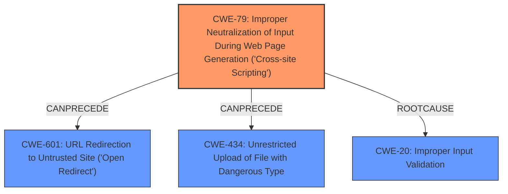

# Analysis Report for CVE-2024-5125

# Vulnerability Analysis Report: CVE-2024-5125

## Description

parisneo/lollms-webui version 9.6 is vulnerable to **Cross-Site Scripting** (XSS) and **Open Redirect** due to inadequate input validation and processing of SVG files during the upload process. The **XSS vulnerability** allows attackers to embed malicious JavaScript code within SVG files, which is executed upon rendering, leading to potential credential theft and unauthorized data access. The **Open Redirect** vulnerability arises from insufficient URL validation within SVG files, enabling attackers to redirect users to malicious websites, thereby exposing them to phishing attacks, malware distribution, and reputation damage. These vulnerabilities are present in the applications functionality to send files to the AI module.

## Vulnerability Description Key Phrases

- **Rootcause:** ["['inadequate input validation'", "'insufficient URL validation']"]
- **Weakness:** ['Cross-Site Scripting', 'Open Redirect', 'XSS vulnerability']
- **Impact:** ['credential theft', 'phishing', 'redirect users to malicious websites', 'unauthorized data access']
- **Vector:** malicious SVG files
- **Attacker:** attackers
- **Product:** parisneo/lollms-webui
- **Version:** 9.6

## Analysis (with Relationship Data)

# Summary
| CWE ID  | CWE Name  | Confidence | CWE Abstraction Level | CWE Vulnerability Mapping Label | CWE-Vulnerability Mapping Notes |
|---|---|---|---|---|---|
| CWE-79 | Improper Neutralization of Input During Web Page Generation ('Cross-site Scripting') | 1 | Base | Primary | Allowed |
| CWE-601 | URL Redirection to Untrusted Site ('Open Redirect') | 1 | Base | Secondary | Allowed |
| CWE-434 | Unrestricted Upload of File with Dangerous Type | 0.8 | Base | Secondary | Allowed |
| CWE-20 | Improper Input Validation | 0.7 | Class | Secondary | Discouraged |

## Evidence and Confidence

*   **Confidence Score:** 0.9
*   **Evidence Strength:** HIGH

## Relationship Analysis
The primary weakness is **CWE-79**, which is a base CWE. The **Open Redirect** vulnerability is best represented by **CWE-601**. The ability to upload **malicious SVG files** points to **CWE-434**. The root cause of **inadequate input validation** maps to **CWE-20**, though it's a discouraged mapping and should be as specific as possible.



## Vulnerability Chain
The vulnerability chain starts with **inadequate input validation** (CWE-20) which leads to **improper neutralization of input** (CWE-79). The **improper neutralization** then facilitates **Cross-Site Scripting (XSS)**, **Open Redirect** (CWE-601), and is caused by **Unrestricted Upload of File with Dangerous Type** (CWE-434). The impact includes **credential theft**, **unauthorized data access**, **phishing attacks**, and **redirection to malicious websites**.

## Summary of Analysis
The analysis identifies **CWE-79** as the primary weakness because the description explicitly states that the **Cross-Site Scripting (XSS)** is due to the product's failure to neutralize user-controllable input. This aligns perfectly with the description of **CWE-79**. The description also mentions **Open Redirect** due to **insufficient URL validation**, and the most appropriate CWE for this is **CWE-601**. Finally, the fact that **malicious SVG files** can be uploaded indicates a failure to restrict the upload of dangerous file types, hence **CWE-434**. The root cause of **inadequate input validation** is represented by **CWE-20**.

Relevant evidence from the vulnerability description includes:

*   "**Cross-Site Scripting** (XSS) ... due to **inadequate input validation** and processing of SVG files during the upload process."
*   "The **XSS vulnerability** allows attackers to embed malicious JavaScript code within SVG files, which is executed upon rendering..."
*   "The **Open Redirect** vulnerability arises from **insufficient URL validation** within SVG files, enabling attackers to redirect users to malicious websites..."

The relationship graph shows how **CWE-79** is a prerequisite for the other weaknesses. The selection of these CWEs is at the optimal level of specificity, as they directly relate to the described vulnerabilities and are at the Base or Variant level where possible.

Other CWEs considered but not used:

*   **CWE-80 (Improper Neutralization of Script-Related HTML Tags in a Web Page (Basic XSS))**: While related to XSS, **CWE-79** is a broader category that encompasses the root cause more effectively, as the vulnerability is not limited to specific HTML tags.
*   **CWE-116 (Improper Encoding or Escaping of Output)**: Although encoding issues can contribute to XSS, the primary issue here is the lack of neutralization, making **CWE-79** a better fit.
*   **CWE-611 (Improper Restriction of XML External Entity Reference)**: While SVG files are XML-based, the vulnerability description focuses on script execution and URL redirection rather than XXE, making **CWE-611** less relevant.
*   **CWE-74 (Improper Neutralization of Special Elements in Output Used by a Downstream Component ('Injection'))**: **CWE-74** is a broad class for injection issues, while **CWE-79** is more specific to XSS, which is the stated vulnerability.


## CWE Relationship Analysis

Current CWEs represent these abstraction levels: .


### Vulnerability Chain Analysis

**Chain starting from CWE-611:**
- 611 (Improper Restriction of XML External Entity Reference) - ROOT


**Chain starting from CWE-116:**
- 116 (Improper Encoding or Escaping of Output) - ROOT


### CWE Relationship Diagram

```mermaid
graph TD
    classDef primary fill:#f96,stroke:#333,stroke-width:2px
    classDef secondary fill:#69f,stroke:#333
    classDef tertiary fill:#9e9,stroke:#333
```


*Report generated on 2025-07-13 20:31:20*
