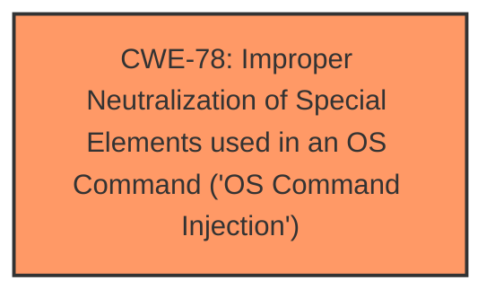

# Analysis Report for CVE-2024-51254

# Vulnerability Analysis Report: CVE-2024-51254

## Description

DrayTek Vigor3900 1.5.1.3 allows attackers to inject malicious commands into mainfunction.cgi and execute arbitrary commands by calling the sign_cacertificate function.

## Vulnerability Description Key Phrases

- **Impact:** execute arbitrary commands
- **Attacker:** attackers
- **Product:** DrayTek Vigor3900
- **Version:** 1.5.1.3
- **Component:** mainfunction.cgi

## Analysis (with Relationship Data)

# Summary
| CWE ID | CWE Name | Confidence | CWE Abstraction Level | CWE Vulnerability Mapping Label | CWE-Vulnerability Mapping Notes |
|---|---|---|---|---|---|
| CWE-78 | Improper Neutralization of Special Elements used in an OS Command ('OS Command Injection') | 0.9 | Base | Allowed | Primary CWE. The vulnerability allows attackers to inject malicious commands into the system. |

## Evidence and Confidence

*   **Confidence Score:** 0.9
*   **Evidence Strength:** HIGH

## Relationship Analysis
The primary relationship that influenced the decision was the direct match between the vulnerability description and CWE-78. The description explicitly mentions the ability to inject malicious commands, which aligns directly with the definition of CWE-78. No other relationships significantly impacted the selection, as the evidence strongly supports the primary CWE.



## Vulnerability Chain
The vulnerability chain starts with the **improper neutralization** of special elements in the OS command, leading to the ability to execute arbitrary commands.

## Summary of Analysis
The analysis is based on the vulnerability description, which clearly indicates that attackers can inject malicious commands into the DrayTek Vigor3900 device. This aligns directly with the definition of CWE-78, "Improper Neutralization of Special Elements used in an OS Command ('OS Command Injection')." The description states: "DrayTek Vigor3900 1.5.1.3 allows attackers to inject malicious commands into mainfunction.cgi and execute arbitrary commands by calling the sign_cacertificate function."

CWE-78 is at the Base level of abstraction, which is preferred. Other CWEs were considered but deemed less relevant. For example, CWE-88 (Improper Neutralization of Argument Delimiters in a Command ('Argument Injection')) could be a secondary weakness if the command injection was specifically related to argument delimiters, but the description doesn't specify this. CWE-94 (Improper Control of Generation of Code ('Code Injection')) is more general. CWE-78 directly addresses the **root cause** of the vulnerability, which is the **improper neutralization** of special elements used in an OS command.

Relevant CWE Information:

# Enhanced Context (25 CWEs)
The following CWEs were identified as potentially relevant to this vulnerability:

## CWE-78: Improper Neutralization of Special Elements used in an OS Command ('OS Command Injection')
**Abstraction Level**: Base
**Similarity Score**: 0.71
**Source**: dense

**Description**:
The product constructs all or part of an OS command using externally-influenced input from an upstream component, but it does not neutralize or incorrectly neutralizes special elements that could modify the intended OS command when it is sent to a downstream component.

**Mapping Guidance**:
- Usage: Allowed
- Rationale: This CWE entry is at the Base level of abstraction, which is a preferred level of abstraction for mapping to the root causes of vulnerabilities.


## CWE Relationship Analysis

Current CWEs represent these abstraction levels: .


### Vulnerability Chain Analysis

**Chain starting from CWE-88:**
- 88 (Improper Neutralization of Argument Delimiters in a Command ('Argument Injection')) - ROOT


**Chain starting from CWE-94:**
- 94 (Improper Control of Generation of Code ('Code Injection')) - ROOT


### CWE Relationship Diagram

```mermaid
graph TD
    classDef primary fill:#f96,stroke:#333,stroke-width:2px
    classDef secondary fill:#69f,stroke:#333
    classDef tertiary fill:#9e9,stroke:#333
```


*Report generated on 2025-07-13 20:31:33*
