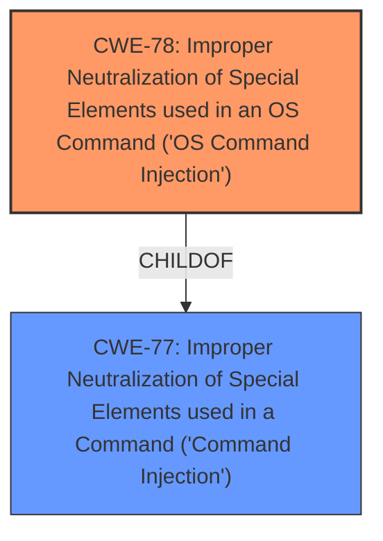

# Enhanced Analysis for CVE-2024-51257

# Summary
| CWE ID | CWE Name | Confidence | CWE Abstraction Level | CWE Vulnerability Mapping Label | CWE-Vulnerability Mapping Notes |
|---|---|---|---|---|---|
| CWE-78 | Improper Neutralization of Special Elements used in an OS Command ('OS Command Injection') | 0.9 | Base | Allowed | Primary CWE |

## Evidence and Confidence

*   **Confidence Score:** 0.9
*   **Evidence Strength:** MEDIUM

## Relationship Analysis
The primary relationship that influenced the decision was the ChildOf relationship between CWE-78 and CWE-77 (Improper Neutralization of Special Elements used in a Command ('Command Injection')). CWE-78 is a more specific case of command injection, focusing on OS commands, which aligns with the vulnerability description. The Retriever Results also indicate that CWE-78 is a good match.



## Vulnerability Chain
The vulnerability chain begins with **improper neutralization** of special elements within the input passed to `mainfunction.cgi`, which leads to the ability to inject malicious commands and ultimately execute arbitrary commands on the system.

## Summary of Analysis
The primary CWE identified is CWE-78, based on the vulnerability description indicating that attackers can inject malicious commands into `mainfunction.cgi` and execute arbitrary commands. This clearly points to OS command injection. The retriever results and relationship analysis support this decision. The assessment is based on the provided evidence, specifically the phrase "inject malicious commands" and "execute arbitrary commands". The graph relationships helped to confirm that a more specific CWE was available. CWE-78 is at the optimal level of specificity, being a Base CWE that accurately describes the **root cause** of the vulnerability.

Relevant CWE Information:

# Enhanced Context (25 CWEs)
The following CWEs were identified as potentially relevant to this vulnerability:

## CWE-78: Improper Neutralization of Special Elements used in an OS Command ('OS Command Injection')
**Abstraction Level**: Base
**Similarity Score**: 0.71
**Source**: dense

**Description**:
The product constructs all or part of an OS command using externally-influenced input from an upstream component, but it does not neutralize or incorrectly neutralizes special elements that could modify the intended OS command when it is sent to a downstream component.

**Mapping Guidance**:
- Usage: Allowed
- Rationale: This CWE entry is at the Base level of abstraction, which is a preferred level of abstraction for mapping to the root causes of vulnerabilities.

## Vulnerability Description
DrayTek Vigor3900 1.5.1.3 allows attackers to **inject malicious commands** into mainfunction.cgi and **execute arbitrary commands** by calling the doCertificate function.

### Vulnerability Description Key Phrases
- **impact:** execute arbitrary commands
- **attacker:** attackers
- **product:** DrayTek Vigor3900
- **version:** 1.5.1.3
- **component:** mainfunction.cgi

## Retriever Results

### Top Combined Results

| Rank | CWE ID | Name | Abstraction | Usage  | Retrievers | Individual Scores |
|------|--------|------|-------------|-------|------------|-------------------|
| 1 | 78 | Improper Neutralization of Special Elements used in an OS Command ('OS Command Injection') | Base | Allowed | sparse | 0.047 |

**CWE-78**: Improper Neutralization of Special Elements used in an OS Command ('OS Command Injection')

*   **Technical Explanation:** The vulnerability description explicitly states that attackers can inject malicious commands into the `mainfunction.cgi` component, leading to arbitrary command execution. This perfectly aligns with the characteristics of CWE-78, where externally-influenced input is used to construct an OS command without proper neutralization of special elements.
*   **Security Implications:** The ability to inject and execute arbitrary commands poses a significant security risk, potentially allowing attackers to gain complete control over the affected system.
*   **Relationship Analysis:** CWE-78 is a specific type of command injection and is a child of CWE-77 (Improper Neutralization of Special Elements used in a Command ('Command Injection')).
*   **Mapping Guidance:** The MITRE mapping guidance allows for the use of CWE-78 at the Base level of abstraction, which is the preferred level for mapping root causes.
*   **Confidence:** Confidence is high (0.9) due to the direct match between the vulnerability description and the definition of CWE-78.

**Other CWEs Considered:**

*   **CWE-88 (Improper Neutralization of Argument Delimiters in a Command ('Argument Injection'))**: Considered but deemed less specific than CWE-78, as the vulnerability description focuses on command injection rather than argument injection.
*   **CWE-94 (Improper Control of Generation of Code ('Code Injection'))**: Considered, but the vulnerability is more about injecting commands rather than generating code.
*   **CWE-93 (Improper Neutralization of CRLF Sequences ('CRLF Injection'))**: Not applicable as the vulnerability does not involve CRLF sequences.
*   **CWE-138 (Improper Neutralization of Special Elements)**: Too general; CWE-78 provides a more specific classification.
*   **CWE-77 (Improper Neutralization of Special Elements used in a Command ('Command Injection'))**: Considered, but CWE-78 is more specific because it explicitly involves OS commands.
*   **CWE-22 (Improper Limitation of a Pathname to a Restricted Directory ('Path Traversal'))**: Not applicable; the vulnerability does not involve path traversal.
*   **CWE-23 (Relative Path Traversal)**: Not applicable; the vulnerability does not involve path traversal.
*   **CWE-121 (Stack-based Buffer Overflow)**: There is no evidence of a buffer overflow in the description.
*   **CWE-184 (Incomplete List of Disallowed Inputs)**: While possible, the description doesn't emphasize a list of disallowed inputs, but rather the lack of neutralization, making CWE-78 a better fit.


## CWE Relationship Analysis

Current CWEs represent these abstraction levels: .


### Vulnerability Chain Analysis

**Chain starting from CWE-121:**
- 121 (Stack-based Buffer Overflow) - ROOT


**Chain starting from CWE-94:**
- 94 (Improper Control of Generation of Code ('Code Injection')) - ROOT


### CWE Relationship Diagram

```mermaid
graph TD
    classDef primary fill:#f96,stroke:#333,stroke-width:2px
    classDef secondary fill:#69f,stroke:#333
    classDef tertiary fill:#9e9,stroke:#333
```