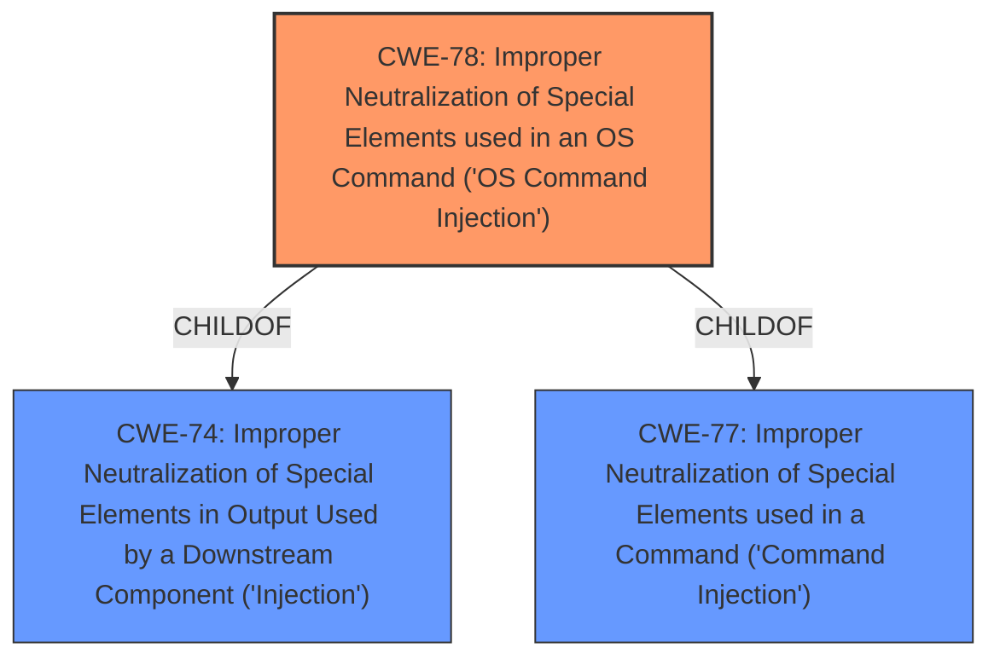

# Analysis Report for CVE-2024-51299

# Vulnerability Analysis Report: CVE-2024-51299

## Description

In Draytek Vigor3900 1.5.1.3, attackers can inject malicious commands into mainfunction.cgi and execute arbitrary commands by calling the dumpSyslog function.

## Vulnerability Description Key Phrases

- **Impact:** execute arbitrary commands
- **Attacker:** attackers
- **Product:** Draytek Vigor3900
- **Version:** 1.5.1.3
- **Component:** mainfunction.cgi

## Analysis (with Relationship Data)

# Summary
| CWE ID | CWE Name | Confidence | CWE Abstraction Level | CWE Vulnerability Mapping Label | CWE-Vulnerability Mapping Notes |
|---|---|---|---|---|---|
| CWE-78 | Improper Neutralization of Special Elements used in an OS Command ('OS Command Injection') | 1.0 | Base | Allowed | Primary CWE. The vulnerability allows attackers to inject malicious commands into mainfunction.cgi and execute arbitrary commands. This aligns with CWE-78, which describes the construction of OS commands using externally-influenced input without proper neutralization. |

## Evidence and Confidence

*   **Confidence Score:** 1.0
*   **Evidence Strength:** HIGH

## Relationship Analysis
The primary CWE is CWE-78, which is a base level CWE. The retriever results also suggested CWE-78 as the top candidate. There are several other related CWEs, like CWE-88, CWE-94, and CWE-93, that involve improper neutralization, but CWE-78 is most specific to OS command injection, which is the stated vulnerability.



## Vulnerability Chain
The vulnerability chain starts with the **improper neutralization** of special elements in the input to `mainfunction.cgi`. This leads to the ability to inject and execute arbitrary OS commands by calling the `dumpSyslog` function.

## Summary of Analysis
The vulnerability description clearly states that attackers can inject malicious commands and execute arbitrary commands, which directly corresponds to the description of CWE-78. The retriever results also support this classification. The evidence is strong, and the confidence in the assessment is high.

The vulnerability description states: "attackers can inject malicious commands into mainfunction.cgi and execute arbitrary commands by calling the dumpSyslog function." This aligns perfectly with CWE-78's description: "The product constructs all or part of an OS command using externally-influenced input...but it does not neutralize or incorrectly neutralizes special elements that could modify the intended OS command."


## CWE Relationship Analysis

Current CWEs represent these abstraction levels: .


### Vulnerability Chain Analysis

**Chain starting from CWE-94:**
- 94 (Improper Control of Generation of Code ('Code Injection')) - ROOT


**Chain starting from CWE-93:**
- 93 (Improper Neutralization of CRLF Sequences ('CRLF Injection')) - ROOT


### CWE Relationship Diagram

```mermaid
graph TD
    classDef primary fill:#f96,stroke:#333,stroke-width:2px
    classDef secondary fill:#69f,stroke:#333
    classDef tertiary fill:#9e9,stroke:#333
```


*Report generated on 2025-07-13 20:33:49*
