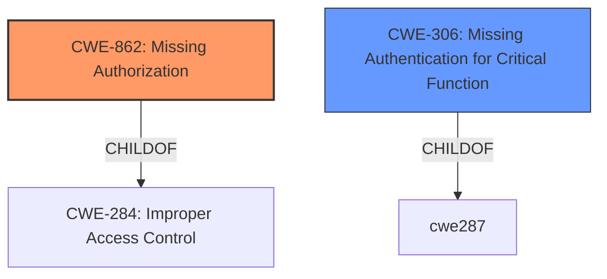

# Enhanced Analysis for CVE-2024-5130

# Summary
| CWE ID  | CWE Name                                                  | Confidence | CWE Abstraction Level | CWE Vulnerability Mapping Label | CWE-Vulnerability Mapping Notes |
| :-------- | :-------------------------------------------------------- | :---------- | :-------------------- | :------------------------------ | :------------------------------ |
| CWE-862   | Missing Authorization                                     | 0.9         | Class                 | Primary                         | Allowed-with-Review           |
| CWE-306   | Missing Authentication for Critical Function            | 0.7         | Base                  | Secondary                       | Allowed                       |

## Evidence and Confidence

*   **Confidence Score:** 0.8
*   **Evidence Strength:** HIGH

## Relationship Analysis
The primary relationship is between CWE-862 (Missing Authorization) and its child CWEs, and also considers CWE-306 (Missing Authentication for Critical Function). CWE-862 is a class-level CWE, and there might be more specific base-level CWEs. However, the description focuses on the absence of authorization checks, making CWE-862 appropriate. CWE-306 could be a related weakness given unauthenticated users were able to delete data sets, meaning there was missing authentication.



## Vulnerability Chain
The vulnerability chain starts with the **lack of proper authorization checks** (CWE-862), which allows unauthenticated users (CWE-306) to delete any dataset, leading to a data integrity issue.

## Summary of Analysis
The initial analysis focused on the **Incorrect Authorization** and **lack of proper authorization checks** key phrases in the vulnerability description. The primary weakness is the **lack of proper authorization checks** (CWE-862), as the endpoint doesn't verify if the provided project ID belongs to the current user. The fact that 'unauthenticated users' were able to exploit this weakness leads to a secondary weakness of CWE-306.

The selection of CWE-862 is based on the description stating the **lack of proper authorization checks** in the dataset deletion endpoint. This aligns directly with the definition of CWE-862: "The product does not perform an authorization check when an actor attempts to access a resource or perform an action."

CWE-306 applies because the vulnerability description mentions "unauthenticated users" being able to delete datasets. This indicates a **missing authentication** problem for a critical function.

Other CWEs were considered but deemed less appropriate:

*   CWE-863 (**Incorrect Authorization**): This CWE implies that an authorization check is performed but is done incorrectly. The description states that authorization checks were missing.
*   CWE-285 (**Improper Authorization**): Similar to CWE-863, this suggests that there was an authorization check, but it was done improperly.
*   CWE-639 (**Authorization Bypass Through User-Controlled Key**): This CWE involves modifying a key value to gain unauthorized access. The vulnerability description doesn't mention anything related to manipulating key values.

The selected CWEs are at an appropriate level of specificity. CWE-862 is a class-level CWE, but it directly captures the essence of the vulnerability, which is a missing authorization check.
CWE-306 is a Base level CWE, and it directly captures the fact that the vulnerability was exploited by unauthenticated users.


## CWE Relationship Analysis

Current CWEs represent these abstraction levels: .


### Vulnerability Chain Analysis

**Chain starting from CWE-863:**
- 863 (Incorrect Authorization) - ROOT


**Chain starting from CWE-862:**
- 862 (Missing Authorization) - ROOT


### CWE Relationship Diagram

```mermaid
graph TD
    classDef primary fill:#f96,stroke:#333,stroke-width:2px
    classDef secondary fill:#69f,stroke:#333
    classDef tertiary fill:#9e9,stroke:#333
```