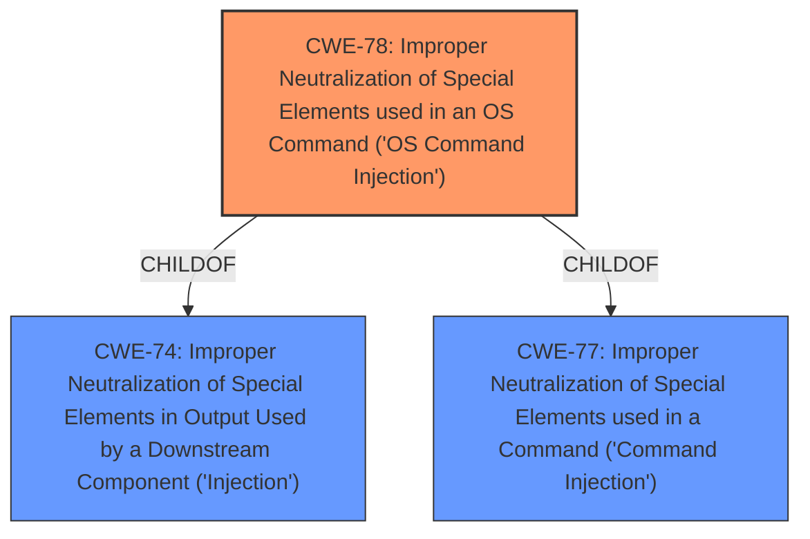

# Raw Analyzer Response for CVE-2024-51301

# Summary
| CWE ID | CWE Name | Confidence | CWE Abstraction Level | CWE Vulnerability Mapping Label | CWE-Vulnerability Mapping Notes |
|---|---|---|---|---|---|
| CWE-78 | Improper Neutralization of Special Elements used in an OS Command ('OS Command Injection') | 1.0 | Base | Allowed | Primary CWE - This CWE accurately reflects the root cause of the vulnerability, where attackers can inject malicious commands and execute arbitrary commands. |

## Evidence and Confidence

*   **Confidence Score:** 1.0
*   **Evidence Strength:** HIGH

## Relationship Analysis
The primary relationship considered was the ChildOf relationship, specifically how CWE-78 (Improper Neutralization of Special Elements used in an OS Command ('OS Command Injection')) relates to its parent CWEs. While other CWEs like CWE-77 (Improper Neutralization of Special Elements used in a Command ('Command Injection')) were considered, CWE-78 was chosen due to its specificity regarding OS commands. The abstraction level was a Base, which is preferred.

## Vulnerability Chain
The vulnerability chain involves the following steps:
1.  The attacker injects malicious commands into `mainfunction.cgi`. This is the **root cause**.
2.  The injected commands are executed due to the **improper neutralization** of special elements.
3.  Arbitrary commands are executed on the system, resulting in a compromise of the system's integrity and availability. This is the **impact**.

The primary CWE, CWE-78, represents the root cause, where the system fails to neutralize special elements, leading to command injection.

## Summary of Analysis
The analysis is based on the provided vulnerability description, which explicitly states that attackers can **inject malicious commands** into `mainfunction.cgi` and **execute arbitrary commands**. This directly maps to CWE-78 (Improper Neutralization of Special Elements used in an OS Command ('OS Command Injection')), which describes the **improper neutralization** of special elements used in an OS command. The retriever results also list CWE-78 as the top candidate. The graph relationships show that CWE-78 is a child of CWE-77 and CWE-74, but CWE-78 is more specific, since the attack results in OS command execution. The selected CWE is at the optimal level of specificity, as it clearly describes the root cause of the vulnerability.

Relevant CWE Information:

# Enhanced Context (25 CWEs)
The following CWEs were identified as potentially relevant to this vulnerability:

## CWE-78: Improper Neutralization of Special Elements used in an OS Command ('OS Command Injection')
**Abstraction Level**: Base
**Similarity Score**: 0.72
**Source**: dense

**Description**:
The product constructs all or part of an OS command using externally-influenced input from an upstream component, but it does not neutralize or incorrectly neutralizes special elements that could modify the intended OS command when it is sent to a downstream component.

**Mapping Guidance**:
- Usage: Allowed
- Rationale: This CWE entry is at the Base level of abstraction, which is a preferred level of abstraction for mapping to the root causes of vulnerabilities.

## CWE-88: Improper Neutralization of Argument Delimiters in a Command ('Argument Injection')
**Abstraction Level**: Base
**Similarity Score**: 0.70
**Source**: dense

**Description**:
The product constructs a string for a command to be executed by a separate component
in another control sphere, but it does not properly delimit the
intended arguments, options, or switches within that command string.

**Mapping Guidance**:
- Usage: Allowed
- Rationale: This CWE entry is at the Base level of abstraction, which is a preferred level of abstraction for mapping to the root causes of vulnerabilities.

## CWE-94: Improper Control of Generation of Code ('Code Injection')
**Abstraction Level**: Class
**Similarity Score**: 0.70
**Source**: dense

**Description**:
The product contains functionality that is not documented, not part of the specification, and not accessible through an interface or command sequence that is obvious to the product's users or administrators.

**Mapping Guidance**:
- Usage: Allowed-with-Review
- Rationale: This CWE entry is a Class and might have Base-level children that would be more appropriate

## CWE-93: Improper Neutralization of CRLF Sequences ('CRLF Injection')
**Abstraction Level**: Base
**Similarity Score**: 0.70
**Source**: dense

**Description**:
The product uses CRLF (carriage return line feeds) as a special element, e.g. to separate lines or records, but it does not neutralize or incorrectly neutralizes CRLF sequences from inputs.

**Mapping Guidance**:
- Usage: Allowed
- Rationale: This CWE entry is at the Base level of abstraction, which is a preferred level of abstraction for mapping to the root causes of vulnerabilities.

## CWE-77: Improper Neutralization of Special Elements used in a Command ('Command Injection')
**Abstraction Level**: Class
**Similarity Score**: 0.69
**Source**: dense

**Description**:
The product constructs all or part of a command using externally-influenced input from an upstream component, but it does not neutralize or incorrectly neutralizes special elements that could modify the intended OS command when it is sent to a downstream component.

**Mapping Guidance**:
- Usage: Allowed-with-Review
- Rationale: This CWE entry is a Class and might have Base-level children that would be more appropriate

## CWE-22: Improper Limitation of a Pathname to a Restricted Directory ('Path Traversal')
**Abstraction Level**: Base
**Similarity Score**: 0.69
**Source**: dense

**Description**:
The web application does not adequately enforce appropriate authorization on all restricted URLs, scripts, or files.

**Mapping Guidance**:
- Usage: Allowed
- Rationale: This CWE entry is at the Base level of abstraction, which is a preferred level of abstraction for mapping to the root causes of vulnerabilities.

## CWE-96: Improper Neutralization of Directives in Statically Saved Code ('Static Code Injection')
**Abstraction Level**: Base
**Similarity Score**: 0.69
**Source**: dense

**Description**:
The product requires authentication, but the product has an alternate path or channel that does not require authentication.

**Mapping Guidance**:
- Usage: Allowed
- Rationale: This CWE entry is at the Base level of abstraction, which is a preferred level of abstraction for mapping to the root causes of vulnerabilities.

## CWE-184: Incomplete List of Disallowed Inputs
**Abstraction Level**: Base
**Similarity Score**: 2.87
**Source**: graph

**Description**:
The product implements a protection mechanism that relies on a list of inputs (or properties of inputs) that are not allowed by policy or otherwise require other action to neutralize before additional processing takes place, but the list is incomplete.

**Mapping Guidance**:
- Usage: Allowed
- Rationale: This CWE entry is at the Base level of abstraction, which is a preferred level of abstraction for mapping to the root causes of vulnerabilities.

### Other CWEs Considered but Not Used:
*   CWE-77 (Improper Neutralization of Special Elements used in a Command ('Command Injection')): While related to command injection, CWE-78 is more specific to OS commands, making it a better fit.
*   CWE-88 (Improper Neutralization of Argument Delimiters in a Command ('Argument Injection')): Argument injection is a specific type of command injection. Since the description states that attackers can **inject malicious commands** without further specifying the nature of the injection, CWE-78 is a better fit.
*   CWE-94 (Improper Control of Generation of Code ('Code Injection')): This CWE is too broad, as it covers any form of code injection, while the vulnerability is specific to OS command injection.
*   CWE-93 (Improper Neutralization of CRLF Sequences ('CRLF Injection')): This CWE is specific to CRLF injection, which is not mentioned in the vulnerability description.
*   CWE-22 (Improper Limitation of a Pathname to a Restricted Directory ('Path Traversal')): This CWE is not relevant, as the vulnerability is related to command injection, not path traversal.
*   CWE-96 (Improper Neutralization of Directives in Statically Saved Code ('Static Code Injection')): This CWE is not relevant, as the vulnerability is not related to static code injection.
*   CWE-184 (Incomplete List of Disallowed Inputs): While a blacklist approach could be a contributing factor, the core issue is the **improper neutralization** of special elements,