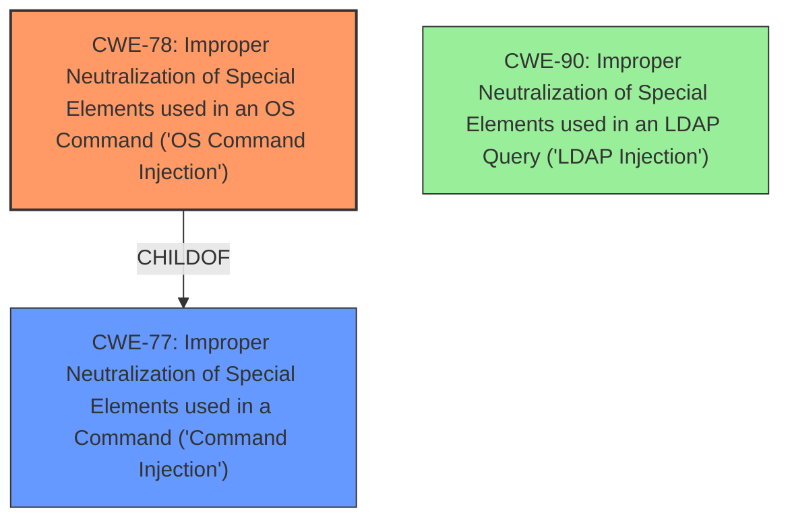

# Raw Analyzer Response for CVE-2024-51304

# Summary
| CWE ID | CWE Name | Confidence | CWE Abstraction Level | CWE Vulnerability Mapping Label | CWE-Vulnerability Mapping Notes |
|---|---|---|---|---|---|
| CWE-78 | Improper Neutralization of Special Elements used in an OS Command ('OS Command Injection') | 1.0 | Base | Primary CWE | Allowed |
| CWE-90 | Improper Neutralization of Special Elements used in an LDAP Query ('LDAP Injection') | 0.7 | Base | Secondary Candidate | Allowed |

## Evidence and Confidence

*   **Confidence Score:** 0.9
*   **Evidence Strength:** HIGH

## Relationship Analysis
The primary relationship that influenced the decision was the parent-child relationship between CWE-77 (Improper Neutralization of Special Elements used in a Command ('Command Injection')) and CWE-78 (Improper Neutralization of Special Elements used in an OS Command ('OS Command Injection')). Given the vulnerability involves injecting commands that are then executed by the operating system, CWE-78, being a more specific child of CWE-77, was chosen.

## Vulnerability Chain
The vulnerability chain starts with the **improper neutralization** of input, leading to **command injection**, and culminating in the execution of arbitrary commands.
  - **Root Cause:** **Improper neutralization** of special elements in input.
  - **Weakness:** **Command injection** vulnerability in mainfunction.cgi.
  - **Impact:** Execution of arbitrary commands.

## Summary of Analysis
The initial assessment strongly points to CWE-78 (Improper Neutralization of Special Elements used in an OS Command ('OS Command Injection')) as the primary weakness. This is based on the vulnerability description indicating attackers can inject malicious commands and execute arbitrary commands. The key phrase "**command injection**" directly supports this. The fact that the commands are executed by the OS solidifies the choice of CWE-78 over the more general CWE-77.

The "CWE for similar CVE Descriptions" section also lists CWE-78 as the Primary CWE Match, further supporting this selection.

CWE-90 (Improper Neutralization of Special Elements used in an LDAP Query ('LDAP Injection')) was considered because the vulnerability description mentions the ldap_search_dn function. However, the core issue is the ability to inject and execute arbitrary commands, not specifically to manipulate LDAP queries, so CWE-90 is a secondary, less direct mapping.

The choice of CWE-78 is at the optimal level of specificity, being a Base CWE, and directly reflects the **root cause** of the vulnerability: the **improper neutralization** of special elements leading to OS command injection.

Relevant CWE Information:

# Enhanced Context (25 CWEs)
The following CWEs were identified as potentially relevant to this vulnerability:

## CWE-78: Improper Neutralization of Special Elements used in an OS Command ('OS Command Injection')
**Abstraction Level**: Base
**Similarity Score**: 0.72
**Source**: dense

**Description**:
The product constructs all or part of an OS command using externally-influenced input from an upstream component, but it does not neutralize or incorrectly neutralizes special elements that could modify the intended OS command when it is sent to a downstream component.

**Mapping Guidance**:
- Usage: Allowed
- Rationale: This CWE entry is at the Base level of abstraction, which is a preferred level of abstraction for mapping to the root causes of vulnerabilities.

## CWE-90: Improper Neutralization of Special Elements used in an LDAP Query ('LDAP Injection')
**Abstraction Level**: Base
**Similarity Score**: 0.71
**Source**: dense

**Description**:
The product constructs all or part of an LDAP query using externally-influenced input from an upstream component, but it does not neutralize or incorrectly neutralizes special elements that could modify the intended LDAP query when it is sent to a downstream component.

**Mapping Guidance**:
- Usage: Allowed
- Rationale: This CWE entry is at the Base level of abstraction, which is a preferred level of abstraction for mapping to the root causes of vulnerabilities.