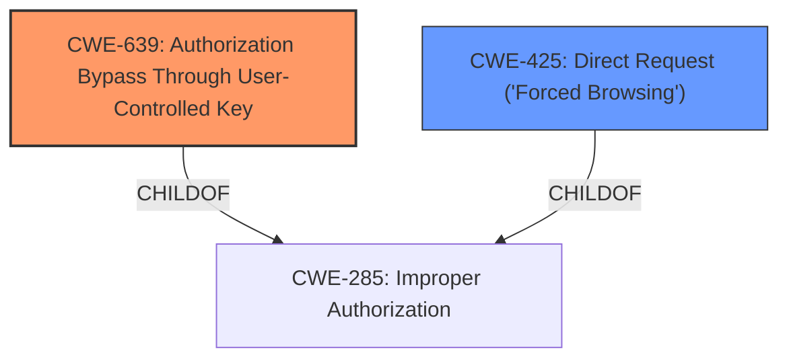

# Enhanced Analysis for CVE-2024-51392

# Summary
| CWE ID | CWE Name | Confidence | CWE Abstraction Level | CWE Vulnerability Mapping Label | CWE-Vulnerability Mapping Notes |
|---|---|---|---|---|---|
| CWE-639 | Authorization Bypass Through User-Controlled Key | 0.75 | Base | Allowed | Primary CWE |
| CWE-425 | Direct Request ('Forced Browsing') | 0.5 | Base | Allowed | Secondary Candidate |

## Evidence and Confidence

*   **Confidence Score:** 0.7
*   **Evidence Strength:** MEDIUM

## Relationship Analysis
The primary CWE selected, CWE-639 (Authorization Bypass Through User-Controlled Key), is a Base level CWE, providing a specific description of the **authorization bypass** achieved by manipulating a user-controlled key. CWE-425 (Direct Request ('Forced Browsing')) is also a Base level CWE that is related to authorization issues. The choice of CWE-639 is more specific because it identifies how the authorization is bypassed (via a user-controlled key).



## Vulnerability Chain
The vulnerability chain starts with a **missing or improper authorization check**, which is then exploited via a **user-controlled key** to bypass authorization, leading to **privilege escalation**.
  - **Root Cause:** Authorization Bypass Through User-Controlled Key (CWE-639)
  - **Impact:** Privilege Escalation

## Summary of Analysis
The initial analysis identified several potential CWEs based on keyword matching and retriever results. The vulnerability description indicates that a remote attacker can escalate privileges by manipulating the `url` parameter of the `getPDF.php` component.

The primary CWE selected is CWE-639 (Authorization Bypass Through User-Controlled Key) because it precisely captures the vulnerability mechanism: an attacker uses a user-controlled key (the `url` parameter) to bypass authorization and escalate privileges.

CWE-425 (Direct Request ('Forced Browsing')) was considered because it relates to inadequate authorization enforcement, but it is less specific than CWE-639, as it doesn't pinpoint the user-controlled key aspect.

The final decision is based on the evidence that the `url` parameter allows for authorization bypass and subsequent privilege escalation. The selection of CWE-639 is at the optimal level of specificity, representing the root cause of the vulnerability.

Relevant CWE Information:

# Enhanced Context (25 CWEs)
The following CWEs were identified as potentially relevant to this vulnerability:

## CWE-639: Authorization Bypass Through User-Controlled Key
**Abstraction Level**: Base
**Similarity Score**: 0.043 (sparse)

**Description**:
The software uses a key or index to access a resource, data, or functionality, but the key is derived from user-controlled input, and the software does not validate or incorrectly validates that the key refers to a resource, data, or functionality that the user is authorized to access.

**Mapping Guidance**:
- Usage: Allowed
- Rationale: This CWE entry is at the Base level of abstraction, which is a preferred level of abstraction for mapping to the root causes of vulnerabilities.

**Relationships**:
- CHILDOF -> CWE-285
- PEEROF -> CWE-990

The description of CWE-639 directly aligns with the vulnerability description, where the `url` parameter acts as a user-controlled key that bypasses authorization.

## CWE-425: Direct Request ('Forced Browsing')
**Abstraction Level**: Base
**Similarity Score**: 0.505 (dense)

**Description**:
The web application does not adequately enforce appropriate authorization on all restricted URLs, scripts, or files.

**Mapping Guidance**:
- Usage: Allowed
- Rationale: This CWE entry is at the Base level of abstraction, which is a preferred level of abstraction for mapping to the root causes of vulnerabilities.

**Relationships**:
- CANPRECEDE -> CWE-98
- CANPRECEDE -> CWE-471
- CHILDOF -> CWE-424
- CHILDOF -> CWE-288
- CHILDOF -> CWE-862

CWE-425 is a broader category that applies when authorization is not adequately enforced. While applicable, it doesn't capture the specific mechanism of authorization bypass through a user-controlled key.


## CWE Relationship Analysis

Current CWEs represent these abstraction levels: .


### Vulnerability Chain Analysis

**Chain starting from CWE-288:**
- 288 (Authentication Bypass Using an Alternate Path or Channel) - ROOT


**Chain starting from CWE-471:**
- 471 (Modification of Assumed-Immutable Data (MAID)) - ROOT


### CWE Relationship Diagram

```mermaid
graph TD
    classDef primary fill:#f96,stroke:#333,stroke-width:2px
    classDef secondary fill:#69f,stroke:#333
    classDef tertiary fill:#9e9,stroke:#333
```