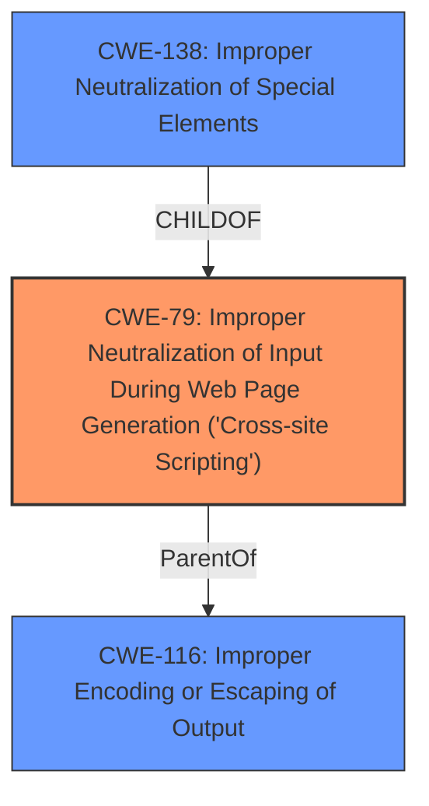

# Analysis Report for CVE-2024-51434

# Vulnerability Analysis Report: CVE-2024-51434

## Description

**Inconsistent tag parsing** allows for **XSS** in Froala WYSIWYG editor 4.3.0 and earlier.

## Vulnerability Description Key Phrases

- **Rootcause:** Inconsistent tag parsing
- **Weakness:** ['XSS', 'cross-site scripting']
- **Product:** Froala WYSIWYG editor
- **Version:** 4.3.0 and earlier

## Analysis (with Relationship Data)

# Summary
| CWE ID | CWE Name | Confidence | CWE Abstraction Level | CWE Vulnerability Mapping Label | CWE-Vulnerability Mapping Notes |
|---|---|---|---|---|---|
| CWE-79 | Improper Neutralization of Input During Web Page Generation ('Cross-site Scripting') | 1.0 | Base | Allowed | Primary CWE. The vulnerability description clearly indicates an XSS vulnerability due to **improper neutralization** of input. |
| CWE-116 | Improper Encoding or Escaping of Output | 0.7 | Class | Allowed-with-Review | Secondary CWE. This is related to **improper neutralization** because encoding/escaping is a form of neutralization. |
| CWE-138 | Improper Neutralization of Special Elements | 0.5 | Class | Discouraged | Secondary CWE. "Inconsistent tag parsing" is related to **improper neutralization** of special elements. |

## Evidence and Confidence

*   **Confidence Score:** 0.9
*   **Evidence Strength:** MEDIUM

## Relationship Analysis
The primary relationship is that CWE-79 [Improper Neutralization of Input During Web Page Generation ('Cross-site Scripting')] is a base class. CWE-116 [Improper Encoding or Escaping of Output] is a class level CWE that can be a cause of CWE-79. The relationship between inconsistent tag parsing and XSS suggests a potential chain where **improper parsing** leads to **improper neutralization**, resulting in XSS.



## Vulnerability Chain
The vulnerability chain starts with **inconsistent tag parsing**, which leads to **improper neutralization** of input, ultimately resulting in cross-site scripting (XSS).

## Summary of Analysis
The analysis is based on the provided evidence that indicates an XSS vulnerability due to **inconsistent tag parsing**. The primary CWE is CWE-79 [Improper Neutralization of Input During Web Page Generation ('Cross-site Scripting')], as it directly addresses the core issue of **improper neutralization** of user-controllable input.

CWE-116 [Improper Encoding or Escaping of Output] was considered because encoding and escaping are common neutralization techniques, and the vulnerability description mentions "inconsistent tag parsing", which could lead to encoding/escaping issues. However, CWE-79 is more direct.

CWE-138 [Improper Neutralization of Special Elements] was also considered, because the root cause is "inconsistent tag parsing" which can lead to the **improper neutralization** of special elements. It is less specific than CWE-79, as it doesn't directly imply XSS, so it's a secondary candidate.

The selected CWEs are at the optimal level of specificity, as they accurately represent the weakness and its root cause based on the provided information.


## CWE Relationship Analysis

Current CWEs represent these abstraction levels: .


### Vulnerability Chain Analysis

**Chain starting from CWE-79:**
- 79 (Improper Neutralization of Input During Web Page Generation ('Cross-site Scripting')) - ROOT


**Chain starting from CWE-116:**
- 116 (Improper Encoding or Escaping of Output) - ROOT


### CWE Relationship Diagram

```mermaid
graph TD
    classDef primary fill:#f96,stroke:#333,stroke-width:2px
    classDef secondary fill:#69f,stroke:#333
    classDef tertiary fill:#9e9,stroke:#333
```


*Report generated on 2025-07-13 20:35:49*
