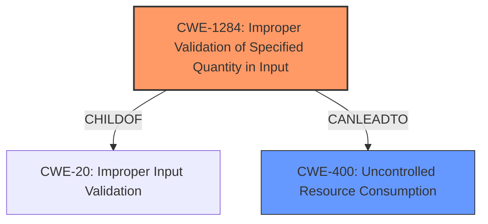

# Analysis Report for CVE-2024-51512

# Vulnerability Analysis Report: CVE-2024-51512

## Description

Vulnerability of parameter type not being verified in the WantAgent module Impact Successful exploitation of this vulnerability may affect availability.

## Vulnerability Description Key Phrases

- **Impact:** affect availability
- **Component:** WantAgent module

## Analysis (with Relationship Data)

# Summary
| CWE ID     | CWE Name                                                                      | Confidence | CWE Abstraction Level | CWE Vulnerability Mapping Label | CWE-Vulnerability Mapping Notes |
|------------|-------------------------------------------------------------------------------|------------|-----------------------|---------------------------------|---------------------------------|
| CWE-1284   | Improper Validation of Specified Quantity in Input                          | 0.75       | Base                  | Primary                           | Allowed                          |
| CWE-400    | Uncontrolled Resource Consumption                                             | 0.50       | Class                 | Secondary                         | Allowed-with-Review            |

## Evidence and Confidence

*   **Confidence Score:** 0.70
*   **Evidence Strength:** MEDIUM

## Relationship Analysis

The primary CWE selected, CWE-1284, is a base-level weakness which is preferred. CWE-1284's description aligns well with the **improper** input validation described in the vulnerability. CWE-400 is a class-level weakness that describes the impact of **improper** input validation which can lead to availability issues.



## Vulnerability Chain

The vulnerability chain starts with the **improper** validation of the input parameter's type (CWE-1284). This leads to an attacker providing **unsafe** inputs that are not properly handled. The **impact** of this is that the system's availability is affected (CWE-400), likely because the **improper** inputs cause resource exhaustion or unexpected behavior that disrupts service.

## Summary of Analysis

The initial analysis focused on identifying the **root cause** of the vulnerability, which is the **lack of parameter type verification**. The retriever results suggested several potential CWEs, but many focused on the impact rather than the root cause. The "CVE Reference Links Content Summary" section states: "The vulnerability is due to the **lack of parameter type verification** in the WantAgent module" and "Improper input validation of parameters." This statement highlights the **root cause** as **improper** input validation, leading to the selection of CWE-1284 (Improper Validation of Specified Quantity in Input) as the primary CWE. While the description mentions that this may affect availability, the **impact** of availability is a symptom of the **improper** input validation, which aligns more closely with CWE-400 (Uncontrolled Resource Consumption).

The final decision prioritizes CWE-1284 as the **root cause** because it is a base-level weakness that accurately describes the **improper** validation of the input, and CWE-400 is a secondary weakness describing the **impact**.

Relevant CWE Information:

# Enhanced Context (25 CWEs)
The following CWEs were identified as potentially relevant to this vulnerability:

## CWE-472: External Control of Assumed-Immutable Web Parameter
**Abstraction Level**: Base
**Similarity Score**: 0.72
**Source**: dense

**Description**:
The web application does not sufficiently verify inputs that are assumed to be immutable but are actually externally controllable, such as hidden form fields.

**Mapping Guidance**:
- Usage: Allowed
- Rationale: This CWE entry is at the Base level of abstraction, which is a preferred level of abstraction for mapping to the root causes of vulnerabilities.

*Not selected because:* This CWE focuses on **immutable** web parameters which is not the case in the description.

## CWE-807: Reliance on Untrusted Inputs in a Security Decision
**Abstraction Level**: Base
**Similarity Score**: 0.72
**Source**: dense

**Description**:
The product uses a protection mechanism that relies on the existence or values of an input, but the input can be modified by an untrusted actor in a way that bypasses the protection mechanism.

**Mapping Guidance**:
- Usage: Allowed
- Rationale: This CWE entry is at the Base level of abstraction, which is a preferred level of abstraction for mapping to the root causes of vulnerabilities.

*Not selected because:* This CWE focuses on the case where a protection mechanism relies on untrusted inputs. In this case, there is no protection mechanism that relies on the untrusted inputs.

## CWE-1289: Improper Validation of Unsafe Equivalence in Input
**Abstraction Level**: Base
**Similarity Score**: 0.72
**Source**: dense

**Description**:
The product receives an input value that is used as a resource identifier or other type of reference, but it does not validate or incorrectly validates that the input is equivalent to a potentially-unsafe value.

**Mapping Guidance**:
- Usage: Allowed
- Rationale: This CWE entry is at the Base level of abstraction, which is a preferred level of abstraction for mapping to the root causes of vulnerabilities.

*Not selected because:* The description mentions the **lack of parameter type verification** and not the unsafe equivalence of the input.

## CWE-1391: Use of Weak Credentials
**Abstraction Level**: Class
**Similarity Score**: 0.71
**Source**: dense

**Description**:
The product uses weak credentials (such as a default key or hard-coded password) that can be calculated, derived, reused, or guessed by an attacker.

**Mapping Guidance**:
- Usage: Allowed-with-Review
- Rationale: This CWE entry is a Class and might have Base-level children that would be more appropriate

*Not selected because:* This CWE focuses on weak credentials, which is not mentioned in the description.

## CWE-497: Exposure of Sensitive System Information to an Unauthorized Control Sphere
**Abstraction Level**: Base
**Similarity Score**: 0.70
**Source**: dense

**Description**:
The product does not properly prevent sensitive system-level information from being accessed by unauthorized actors who do not have the same level of access to the underlying system as the product does.

**Mapping Guidance**:
- Usage: Allowed
- Rationale: This CWE entry is at the Base level of abstraction, which is a preferred level of abstraction for mapping to the root causes of vulnerabilities.

*Not selected because:* This CWE focuses on sensitive information exposure and not **improper** input validation.

## CWE-280: Improper Handling of Insufficient Permissions or Privileges
**Abstraction Level**: Base
**Similarity Score**: 0.70
**Source**: dense

**Description**:
The product does not handle or incorrectly handles when it has insufficient privileges to access resources or functionality as specified by their permissions. This may cause it to follow unexpected code paths that may leave the product in an invalid state.

**Mapping Guidance**:
- Usage: Allowed
- Rationale: This CWE entry is at the Base level of abstraction, which is a preferred level of abstraction for mapping to the root causes of vulnerabilities.

*Not selected because:* This CWE focuses on permissions and privileges and not on **improper** input validation.

## CWE-1286: Improper Validation of Syntactic Correctness of Input
**Abstraction Level**: Base
**Similarity Score**: 0.70
**Source**: dense

**Description**:
The product receives input that is expected to be well-formed - i.e., to comply with a certain syntax - but it does not validate or incorrectly validates that the input complies with the syntax.

**Mapping Guidance**:
- Usage: Allowed
- Rationale: This CWE entry is at the Base level of abstraction, which is a preferred level of abstraction for mapping to the root causes of vulnerabilities.

*Not selected because:* The description focuses on the **lack of parameter type verification** and not the syntax.

## CWE-425: Direct Request ('Forced Browsing')
**Abstraction Level**: Base
**Similarity Score**: 0.70
**Source**: dense

**Description**:
The web application does not adequately enforce appropriate authorization on all restricted URLs, scripts, or files.

**Mapping Guidance**:
- Usage: Allowed
- Rationale: This CWE entry is at the Base level of abstraction, which is a preferred level of abstraction for mapping to the root causes of vulnerabilities.

*Not selected because:* This CWE focuses on authorization and not on input validation.

## CWE-941: Incorrectly Specified Destination in a Communication Channel
**Abstraction Level**: Base
**Similarity Score**: 0.70
**Source**: dense

**Description**:
The product creates a communication channel to initiate an outgoing request to an actor, but it does not correctly specify the intended destination for that actor.

**Mapping Guidance**:
- Usage: Allowed
- Rationale: This CWE entry is at the Base level of abstraction, which is a preferred level of abstraction for mapping to the root causes of vulnerabilities.

*Not selected because:* This CWE focuses on communication channels and not on **improper** input validation.

## CWE-303: Incorrect Implementation of Authentication Algorithm
**Abstraction Level**: Base
**Similarity


## CWE Relationship Analysis

Current CWEs represent these abstraction levels: .


### Vulnerability Chain Analysis

**Chain starting from CWE-1284:**
- 1284 (Improper Validation of Specified Quantity in Input) - ROOT


**Chain starting from CWE-400:**
- 400 (Uncontrolled Resource Consumption) - ROOT


### CWE Relationship Diagram

```mermaid
graph TD
    classDef primary fill:#f96,stroke:#333,stroke-width:2px
    classDef secondary fill:#69f,stroke:#333
    classDef tertiary fill:#9e9,stroke:#333
```


*Report generated on 2025-07-13 20:37:51*
