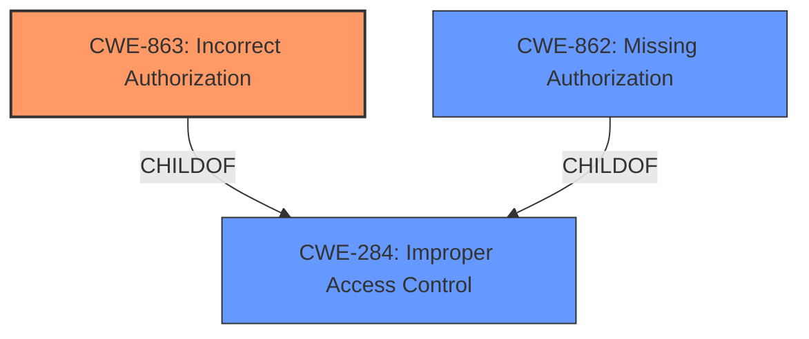

# Analysis Report for CVE-2024-51516

# Vulnerability Analysis Report: CVE-2024-51516

## Description

**Permission control vulnerability** in the ability module Impact Successful exploitation of this vulnerability may cause features to function abnormally.

## Vulnerability Description Key Phrases

- **Rootcause:** Permission control vulnerability
- **Impact:** features to function abnormally
- **Component:** ability module

## Analysis (with Relationship Data)

# Summary

| CWE ID  | CWE Name                                               | Confidence | CWE Abstraction Level | CWE Vulnerability Mapping Label | CWE-Vulnerability Mapping Notes |
| :------- | :----------------------------------------------------- | :--------- | :-------------------- | :------------------------------ | :------------------------------ |
| CWE-863 | Incorrect Authorization                                | 0.8        | Class                | Allowed-with-Review             | Primary CWE                     |
| CWE-285 | Improper Authorization                                | 0.6        | Class                | Discouraged                     | Secondary Candidate             |
| CWE-862 | Missing Authorization                                 | 0.5        | Class                | Allowed-with-Review             | Secondary Candidate             |

## Evidence and Confidence

*   **Confidence Score:** 0.7
*   **Evidence Strength:** MEDIUM

## Relationship Analysis

The analysis focused on the relationships between authorization-related CWEs. CWE-863 (Incorrect Authorization) and CWE-862 (Missing Authorization) are both children of CWE-284 (Improper Access Control), indicating that they are more specific forms of access control issues. CWE-863 was chosen as the primary CWE due to the description mentioning a "**Permission control vulnerability**", which suggests that authorization mechanisms are present but **incorrect**, rather than entirely missing.



## Vulnerability Chain

The vulnerability chain starts with a **Permission control vulnerability** in the ability module. The **incorrect** permission control leads to abnormal functionality of features.

*   Root Cause: **Incorrect** Permission Control (CWE-863)
*   Impact: Features function abnormally.

## Summary of Analysis

The initial analysis considered several authorization-related CWEs, with a focus on distinguishing between missing and **incorrect** authorization. The vulnerability description's key phrase, "**Permission control vulnerability**," strongly suggests that an authorization mechanism is in place but not functioning correctly.

The selection of CWE-863 is based on the evidence from the "Vulnerability Description Key Phrases" section, which states "**rootcause:** **Permission control vulnerability**". This directly indicates a problem with how permissions are controlled, rather than a complete lack of authorization (CWE-862). The high-level CWE-284 was deemed too general.

The final decision is well-supported by the available evidence, placing the CWE at an optimal level of specificity.

Relevant CWE Information:

*   **CWE-863**: Incorrect Authorization
    *   **Description**: The product performs an authorization check when an actor attempts to access a resource or perform an action, but it does not correctly perform the check.
    *   **Relevance**: Matches the description of "**Permission control vulnerability**," indicating that an authorization mechanism exists but is flawed.

*   **CWE-285**: Improper Authorization
    *   **Description**: The product does not perform or incorrectly performs an authorization check when an actor attempts to access a resource or perform an action.
    *   **Relevance**: Similar to CWE-863, but more general. Considered as a secondary candidate.

*   **CWE-862**: Missing Authorization
    *   **Description**: When an actor attempts to access a resource or perform an action, the product does not perform an authorization check.
    *   **Relevance**: Less likely, as the description indicates a "**Permission control vulnerability**," which suggests the presence of an authorization mechanism, albeit a flawed one.


## CWE Relationship Analysis

Current CWEs represent these abstraction levels: .


### Vulnerability Chain Analysis

**Chain starting from CWE-284:**
- 284 (Improper Access Control) - ROOT


**Chain starting from CWE-863:**
- 863 (Incorrect Authorization) - ROOT


### CWE Relationship Diagram

```mermaid
graph TD
    classDef primary fill:#f96,stroke:#333,stroke-width:2px
    classDef secondary fill:#69f,stroke:#333
    classDef tertiary fill:#9e9,stroke:#333
```


*Report generated on 2025-07-13 20:38:46*
