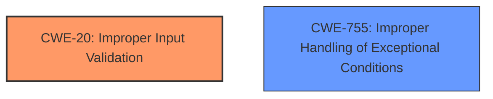

# Analysis for CVE-2024-51520

# Summary
| CWE ID | CWE Name | Confidence | CWE Abstraction Level | CWE Vulnerability Mapping Label | CWE-Vulnerability Mapping Notes |
|---|---|---|---|---|---|
| CWE-20 | Improper Input Validation | 0.9 | Class | Primary | Discouraged |
| CWE-755 | Improper Handling of Exceptional Conditions | 0.6 | Class | Secondary | Discouraged |

## Evidence and Confidence

*   **Confidence Score:** 0.8
*   **Evidence Strength:** MEDIUM

## Relationship Analysis
The primary relationship that influenced the decision was the parent-child relationship. While more specific CWEs exist under CWE-20, the provided information does not give enough detail to choose a variant. CWE-755 was considered as a possible secondary CWE, but again, there isn't enough evidence to make a strong mapping decision.

## Vulnerability Chain
The vulnerability chain starts with **input parameters not being verified**, leading to potential issues affecting availability.

`Improper Input Validation (CWE-20) -> Affects Availability`

The chain begins with the root cause, **improper input validation**, and its direct consequence is an impact on availability.

## Summary of Analysis
The initial assessment pointed towards **improper input validation** as the primary weakness due to the vulnerability description explicitly stating "**input parameters not being verified**". The provided evidence supports this, as the "CVE Reference Links Content Summary" confirms the "**Improper Input Validation:** The core issue is that the HDC module does not properly validate the input parameters it receives."

CWE-20 is a Class-level CWE, and the mapping guidance discourages its use when more specific CWEs are available. However, the current evidence lacks the granularity required to pinpoint a more precise weakness. Therefore, despite the discouragement, CWE-20 remains the most appropriate choice given the available information.

CWE-755 was considered due to the potential for unhandled exceptional conditions arising from invalid input. However, without further details, it's difficult to definitively confirm this aspect.

In conclusion, the assessment relies heavily on the provided evidence, and the final selection of CWE-20 reflects the most accurate representation of the vulnerability based on the information at hand. A more specific CWE might be warranted with additional details.

Relevant CWE Information:

# Enhanced Context (25 CWEs)
The following CWEs were identified as potentially relevant to this vulnerability:

## CWE-20: Improper Input Validation
**Abstraction Level**: Class
**Similarity Score**: 0.74
**Source**: dense

**Description**:
The product receives input or data, but it does
        not validate or incorrectly validates that the input has the
        properties that are required to process the data safely and
        correctly.

**Mapping Guidance**:
- Usage: Discouraged
- Rationale: CWE-20 is commonly misused in low-information vulnerability reports when lower-level CWEs could be used instead, or when more details about the vulnerability are available [REF-1287]. It is not useful for trend analysis. It is also a level-1 Class (i.e., a child of a Pillar).

**Technical Explanation for CWE-20:**
The vulnerability stems from the HDC module not properly validating input parameters. This allows potentially malicious or unexpected data to be processed, leading to availability issues. The security implication is that an attacker can potentially craft malicious input to disrupt service availability.
**Why CWE-20 was selected:**
The vulnerability description explicitly states "**input parameters not being verified**", aligning directly with the definition of CWE-20.
**Confidence Score:** 0.9

## CWE-755: Improper Handling of Exceptional Conditions
**Abstraction Level**: Class
**Similarity Score**: 0.74
**Source**: dense

**Description**:
The product does not handle or incorrectly handles an exceptional condition.

**Mapping Guidance**:
- Usage: Discouraged
- Rationale: This CWE entry is a level-1 Class (i.e., a child of a Pillar). It might have lower-level children that would be more appropriate

**Technical Explanation for CWE-755:**
The improper input validation could lead to exceptional conditions that the HDC module does not handle correctly, leading to crashes or other availability issues. The security implication is that an attacker can potentially trigger these unhandled exceptions to disrupt service availability.
**Why CWE-755 was considered:**
The vulnerability description mentions potential impacts on availability, and improper handling of exceptional conditions could be a contributing factor. However, there is no direct evidence to confirm that this is the case.

**Why CWE-755 was not the primary CWE:**
The primary root cause of the vulnerability appears to be improper input validation, as stated in the description.

**Confidence Score:** 0.6

## CWE-345: Insufficient Verification of Data Authenticity
**Abstraction Level**: Class
**Similarity Score**: 0.73
**Source**: dense

**Description**:
The product does not sufficiently verify the origin or authenticity of data, in a way that causes it to accept invalid data.
**Why CWE-345 was not selected:**
While related to input, the core issue is not about data authenticity, but rather the lack of validation.

## CWE-119: Improper Restriction of Operations within the Bounds of a Memory Buffer
**Abstraction Level**: Class
**Similarity Score**: 0.72
**Source**: dense

**Description**:
The product performs operations on a memory buffer, but it reads from or writes to a memory location outside the buffer's intended boundary. This may result in read or write operations on unexpected memory locations that could be linked to other variables, data structures, or internal program data.
**Why CWE-119 was not selected:**
There is no evidence to suggest that memory buffers are involved, or any out-of-bounds operations are occurring.

## CWE-138: Improper Neutralization of Special Elements
**Abstraction Level**: Class
**Similarity Score**: 0.72
**Source**: dense

**Description**:
The product receives input from an upstream component, but it does not neutralize or incorrectly neutralizes special elements that could be interpreted as control elements or syntactic markers when they are sent to a downstream component.
**Why CWE-138 was not selected:**
The vulnerability is not about special element neutralization, but a general lack of input validation.

## CWE-807: Reliance on Untrusted Inputs in a Security Decision
**Abstraction Level**: Base
**Similarity Score**: 0.72
**Source**: dense

**Description**:
The product uses a protection mechanism that relies on the existence or values of an input, but the input can be modified by an untrusted actor in a way that bypasses the protection mechanism.
**Why CWE-807 was not selected:**
There is no evidence to suggest that a protection mechanism is being bypassed.

## CWE-1285: Improper Validation of Specified Index, Position, or Offset in Input
**Abstraction Level**: Base
**Similarity Score**: 0.72
**Source**: dense

**Description**:
The product receives input that is expected to specify an index, position, or offset into an indexable resource such as a buffer or file, but it does not validate or incorrectly validates that the specified index/position/offset has the required properties.
**Why CWE-1285 was not selected:**
The vulnerability is not specifically about indexes, positions, or offsets.

## CWE-203: Observable Discrepancy
**Abstraction Level**: Base
**Similarity Score**: 0.71
**Source**: dense

**Description**:
The product behaves differently or sends different responses under different circumstances in a way that is observable to an unauthorized actor, which exposes security-relevant information about the state of the product, such as whether a particular operation was successful or not.
**Why CWE-203 was not selected:**
The vulnerability is not directly related to observable discrepancies or information disclosure.

## CWE-134: Use of Externally-Controlled Format String
**Abstraction Level**: Base
**Similarity Score**: 0.71
**Source**: dense

**Description**:
The product uses a function that accepts a format string as an argument, but the format string originates from an external source.
**Why CWE-134 was not selected:**
There is no evidence to suggest that format strings are involved.

## CWE-1391: Use of Weak Credentials
**Abstraction Level**: Class
**Similarity Score**: 0.71
**Source**: dense

**Description**:
The product uses weak credentials (such as a default key or hard-coded password) that can be calculated, derived, reused, or guessed by an attacker.
**Why CWE-1391 was not selected:**
The vulnerability is not related to weak credentials.

## CWE-116: Improper Encoding or Escaping of Output
**Abstraction Level**: Class
**Similarity Score**: 845.41
**Source**: sparse

**Description**:
The product