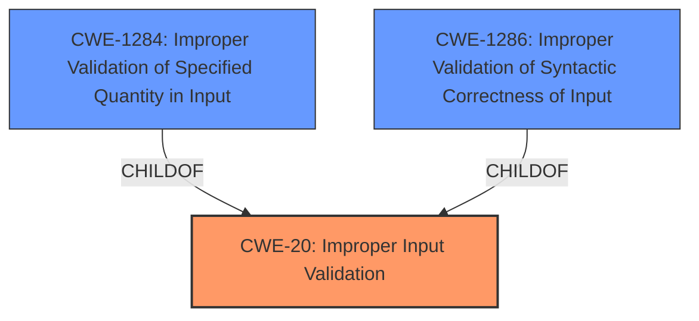

# Analysis for CVE-2024-51521

# Summary
| CWE ID | CWE Name | Confidence | CWE Abstraction Level | CWE Vulnerability Mapping Label | CWE-Vulnerability Mapping Notes |
|---|---|---|---|---|---|
| CWE-20 | Improper Input Validation | 0.9 | Class | Primary CWE | Discouraged - but chosen due to lack of more specific information |
| CWE-1284 | Improper Validation of Specified Quantity in Input | 0.6 | Base | Secondary Candidate | Allowed |
| CWE-1286 | Improper Validation of Syntactic Correctness of Input | 0.5 | Base | Secondary Candidate | Allowed |

## Evidence and Confidence

*   **Confidence Score:** 0.7
*   **Evidence Strength:** MEDIUM

## Relationship Analysis
The primary relationship that influenced the decision was the parent-child relationship between CWE-20 and its more specific children. While the evidence points to an input validation issue, the specific nature of the validation failure (e.g., quantity, syntax) is not detailed enough to warrant a more specific CWE. The relationships between CWE-20 and potential overflow or buffer-related issues (CWE-190, CWE-125, CWE-119) were also considered, but ultimately, the lack of concrete evidence prevented their selection.

## Vulnerability Chain
The vulnerability chain starts with the **improper input validation** (**CWE-20**), which leads to the potential impact of affecting availability. The exact mechanism by which the **improper input validation** leads to the impact is not specified, representing a missing link in the chain.

## Summary of Analysis
The analysis is heavily based on the provided evidence, which is somewhat limited. The key piece of evidence is the description of the vulnerability as an "**Input parameter verification vulnerability**". This directly points to an input validation issue. The CVE Reference Links Content Summary further reinforces this by stating, "The vulnerability stems from a **lack of proper input parameter verification** within the background service module," and identifies the **weakness** as "**Improper input validation**".

Given this evidence, **CWE-20 (Improper Input Validation)** is selected as the primary CWE. While CWE-20 is a Class-level CWE and the mapping guidance discourages its use when more specific CWEs are available, the lack of detail about the specific type of input validation failure necessitates its selection. Without knowing *what* property of the input is not being validated, it is impossible to select a more specific Base-level CWE.

The retriever results listed several candidate CWEs related to buffer overflows, integer overflows and code injection. These were rejected because the evidence refers only to **input parameter verification vulnerability** and **improper input validation**, and there is no suggestion of any buffer overflow, integer overflow or code injection.

CWE-1284 (Improper Validation of Specified Quantity in Input) and CWE-1286 (Improper Validation of Syntactic Correctness of Input) were considered as more specific alternatives to CWE-20, and selected as secondary candidates. However, the vulnerability description lacks the detail required to be certain that the input validation issue is related to quantity or syntax.

Relevant CWE Information:

# Enhanced Context (25 CWEs)
The following CWEs were identified as potentially relevant to this vulnerability:

## CWE-20: Improper Input Validation
**Abstraction Level**: Class
**Similarity Score**: 0.73
**Source**: dense

**Description**:
The product receives input or data, but it does
        not validate or incorrectly validates that the input has the
        properties that are required to process the data safely and
        correctly.

**Mapping Guidance**:
- Usage: Discouraged
- Rationale: CWE-20 is commonly misused in low-information vulnerability reports when lower-level CWEs could be used instead, or when more details about the vulnerability are available [REF-1287]. It is not useful for trend analysis. It is also a level-1 Class (i.e., a child of a Pillar).

**Justification:** The vulnerability description explicitly mentions an "input parameter verification vulnerability," which aligns directly with the description of CWE-20. However, the mapping guidance discourages its use when more specific CWEs are available. In this case, the lack of detail prevents the selection of a more specific CWE.

## CWE-1284: Improper Validation of Specified Quantity in Input
**Abstraction Level**: Base
**Similarity Score**: 580.67
**Source**: sparse

**Description**:
The product receives input that is expected to specify a quantity (such as size or length), but it does not validate or incorrectly validates that the quantity has the required properties.

**Mapping Guidance**:
- Usage: Allowed
- Rationale: This CWE entry is at the Base level of abstraction, which is a preferred level of abstraction for mapping to the root causes of vulnerabilities.

**Justification:** CWE-1284 is a possible, more specific, alternative to CWE-20. The evidence is insufficient to determine if the input validation failure relates to a specified quantity. It is selected as a secondary candidate.

## CWE-1286: Improper Validation of Syntactic Correctness of Input
**Abstraction Level**: Base
**Similarity Score**: 0.71
**Source**: dense

**Description**:
The product receives input that is expected to be well-formed - i.e., to comply with a certain syntax - but it does not validate or incorrectly validates that the input complies with the syntax.

**Mapping Guidance**:
- Usage: Allowed
- Rationale: This CWE entry is at the Base level of abstraction, which is a preferred level of abstraction for mapping to the root causes of vulnerabilities.

**Justification:** CWE-1286 is a possible, more specific, alternative to CWE-20. The evidence is insufficient to determine if the input validation failure relates to syntactic correctness. It is selected as a secondary candidate.