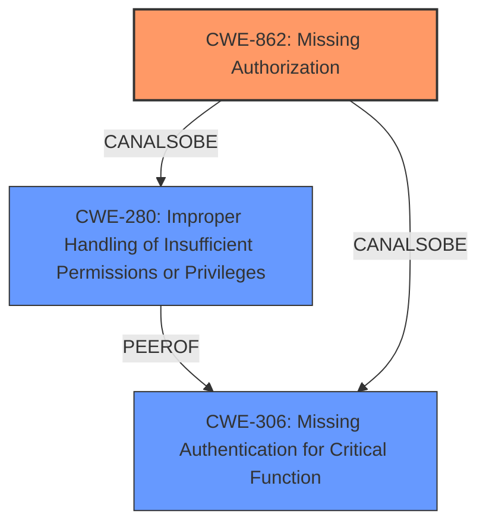

# Raw Analyzer Response for CVE-2024-51524

# Summary
| CWE ID    | CWE Name                                                         | Confidence | CWE Abstraction Level | CWE Vulnerability Mapping Label | CWE-Vulnerability Mapping Notes |
| --------- | ---------------------------------------------------------------- | ---------- | --------------------- | ------------------------------- | ----------------------------- |
| CWE-862   | Missing Authorization                                          | 0.9        | Class                 | Allowed-with-Review             | Primary CWE                   |
| CWE-280   | Improper Handling of Insufficient Permissions or Privileges      | 0.6        | Base                  | Allowed                         | Secondary Candidate           |
| CWE-306   | Missing Authentication for Critical Function                     | 0.5        | Base                  | Allowed                         | Secondary Candidate           |

## Evidence and Confidence

*   **Confidence Score:** 0.8
*   **Evidence Strength:** MEDIUM

## Relationship Analysis
The primary relationship that influenced the selection was the hierarchical relationship between CWE-862, as a Class, and its potential Base-level children. While there isn't enough information to pinpoint a more specific Base variant, the vulnerability clearly involves **missing authorization**.
CWE-280 and CWE-306 were considered as possible alternatives or contributing factors but were deemed less directly applicable based on the limited information available. CWE-280 could be present if the system doesn't properly handle cases where the user doesn't have enough privileges. CWE-306 could be present if a critical function is missing authentication.

## Vulnerability Chain
The vulnerability chain starts with the **missing authorization** (CWE-862) in the Wi-Fi module, leading to a **permission control vulnerability**. Successful exploitation affects the service confidentiality.
Missing Authorization -> Permission Control Vulnerability -> Impact to Confidentiality

## Summary of Analysis
Based on the provided evidence, the primary weakness is **missing authorization** within the Wi-Fi module. This leads to a **permission control vulnerability**, which can compromise service confidentiality. The selection of CWE-862 is based on the explicit mention of a **permission control vulnerability** and the fact that it stems from **inadequate permission management**. CWE-862 directly addresses the absence of proper authorization mechanisms.

The evidence supporting this assessment comes from:

*   **Vulnerability Description Key Phrases:** "**Permission control vulnerability**"
*   **CVE Reference Links Content Summary:** "**Root Cause:** The vulnerability stems from improper permission control within the Wi-Fi module.", "**Weakness:** Inadequate permission management."

The graph relationships influenced the decision to consider other CWEs, but ultimately, CWE-862 was chosen as the most direct representation of the root cause based on the available evidence.
CWE-862 is at the optimal level of specificity as it directly addresses the core issue of **missing authorization**, which is the **rootcause** of the **permission control vulnerability**.

Relevant CWE Information:

# Enhanced Context (25 CWEs)
The following CWEs were identified as potentially relevant to this vulnerability:

## CWE-280: Improper Handling of Insufficient Permissions or Privileges
**Abstraction Level**: Base
**Similarity Score**: 0.78
**Source**: dense

**Description**:
The product does not handle or incorrectly handles when it has insufficient privileges to access resources or functionality as specified by their permissions. This may cause it to follow unexpected code paths that may leave the product in an invalid state.

**Mapping Guidance**:
- Usage: Allowed
- Rationale: This CWE entry is at the Base level of abstraction, which is a preferred level of abstraction for mapping to the root causes of vulnerabilities.

## CWE-306: Missing Authentication for Critical Function
**Abstraction Level**: base
**Similarity Score**: 2.40
**Source**: graph

**Description**:
CWE-306: Missing Authentication for Critical Function

**Mapping Guidance**:
- Usage: Allowed
- Rationale: This CWE entry is at the Base level of abstraction, which is a preferred level of abstraction for mapping to the root causes of vulnerabilities.

**Relationships**:
- PARENTOF -> CWE-322
- PARENTOF -> CWE-288
- CHILDOF -> CWE-287
- CHILDOF -> CWE-287
- CHILDOF -> CWE-306

## CWE-862: Missing Authorization
**Abstraction Level**: Class
**Similarity Score**: 1497.50
**Source**: sparse

**Description**:
The product performs an authorization check when an actor attempts to access a resource or perform an action, but it does not correctly perform the check.

**Mapping Guidance**:
- Usage: Allowed-with-Review
- Rationale: This CWE entry is a Class and might have Base-level children that would be more appropriate

**CWEs Considered but Not Used:**

*   CWE-285 Improper Authorization: While related to access control, the vulnerability description emphasizes the **absence** of authorization, not an improper implementation. Therefore, CWE-285 is less suitable.
*   CWE-284 Improper Access Control: This is a high-level CWE and less specific than CWE-862.
*   CWE-269 Improper Privilege Management: This CWE is related to the assignment and management of privileges, but the description focuses on **missing authorization**, making CWE-862 more appropriate.
*   CWE-732 Incorrect Permission Assignment for Critical Resource: Similar to CWE-269, this is about incorrect assignment, not the **missing** aspect.
*   CWE-319 Cleartext Transmission of Sensitive Information: Irrelevant to the described vulnerability.
*   CWE-755 Improper Handling of Exceptional Conditions: The vulnerability is not about exceptional conditions, but the fundamental **lack** of authorization.
*   CWE-863 Incorrect Authorization: Similar to CWE-285, the emphasis is on the authorization being implemented incorrectly, not on it being missing.
*   CWE-1191 On-Chip Debug and Test Interface With Improper Access Control: This is specific to debug interfaces and not directly applicable to the **missing authorization** in the Wi-Fi module.
*   CWE-274 Improper Handling of Insufficient Privileges: This CWE relates to how the system handles cases where privileges are insufficient, but the primary issue is the **lack of authorization**.