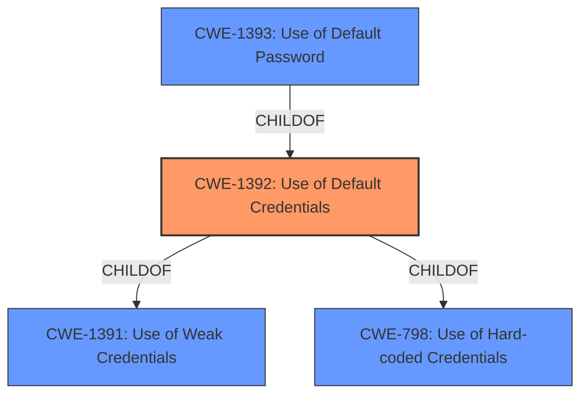

# Analysis Report for CVE-2024-51551

# Vulnerability Analysis Report: CVE-2024-51551

## Description

**Default Credentail vulnerabilities** in ASPECT on Linux allows access to the product using publicly available **default credentials**. Affected products ABB ASPECT - Enterprise v3.07.02 NEXUS Series v3.07.02 MATRIX Series v3.07.02

## Vulnerability Description Key Phrases

- **Rootcause:** ['Default Credentail vulnerabilities', 'default credentials']
- **Impact:** access to the product
- **Product:** ['ABB ASPECT', 'Enterprise', 'NEXUS Series', 'MATRIX Series']
- **Version:** v3.07.02

## Analysis (with Relationship Data)

# Summary
| CWE ID  | CWE Name                                                       | Confidence | CWE Abstraction Level | CWE Vulnerability Mapping Label | CWE-Vulnerability Mapping Notes |
| :-------- | :------------------------------------------------------------- | :--------- | :-------------------- | :------------------------------ | :------------------------------ |
| CWE-1392 | Use of Default Credentials                                     | 1.0        | Base                  | Primary                         | Allowed                       |

## Evidence and Confidence

*   **Confidence Score:** 1.0
*   **Evidence Strength:** HIGH

## Relationship Analysis
The primary relationship is that CWE-1392 [CWE-1392: Use of Default Credentials] is a Base level CWE. Several other CWEs were considered, but they were either too general (Class level) or less directly related to the **root cause** of the vulnerability, which is the **use of default credentials**.



## Vulnerability Chain
The vulnerability chain starts with the **use of default credentials** (CWE-1392 [CWE-1392: Use of Default Credentials]), which leads to unauthorized **access to the product**.

## Summary of Analysis
The analysis focused on identifying the **root cause** of the vulnerability, which is the **use of default credentials**. The vulnerability description explicitly states that the vulnerability involves **default credentials**, which directly maps to CWE-1392 [CWE-1392: Use of Default Credentials]. The other CWEs considered were either too general or related to the impact of the vulnerability rather than the **root cause**. CWE-1392 [CWE-1392: Use of Default Credentials] is the most specific and accurate representation of the vulnerability.

Relevant CWE Information:

# Enhanced Context (25 CWEs)
The following CWEs were identified as potentially relevant to this vulnerability:

## CWE-1392: Use of Default Credentials
**Abstraction Level**: Base
**Similarity Score**: 0.74
**Source**: dense

**Description**:
The product uses **default credentials** (such as passwords or cryptographic keys) for potentially critical functionality.

**Mapping Guidance**:
- Usage: Allowed
- Rationale: This CWE entry is at the Base level of abstraction, which is a preferred level of abstraction for mapping to the root causes of vulnerabilities.


## CWE Relationship Analysis

Current CWEs represent these abstraction levels: .


### Vulnerability Chain Analysis

**Chain starting from CWE-1393:**
- 1393 (Use of Default Password) - ROOT


**Chain starting from CWE-798:**
- 798 (Use of Hard-coded Credentials) - ROOT


### CWE Relationship Diagram

```mermaid
graph TD
    classDef primary fill:#f96,stroke:#333,stroke-width:2px
    classDef secondary fill:#69f,stroke:#333
    classDef tertiary fill:#9e9,stroke:#333
```


*Report generated on 2025-07-13 20:42:41*
