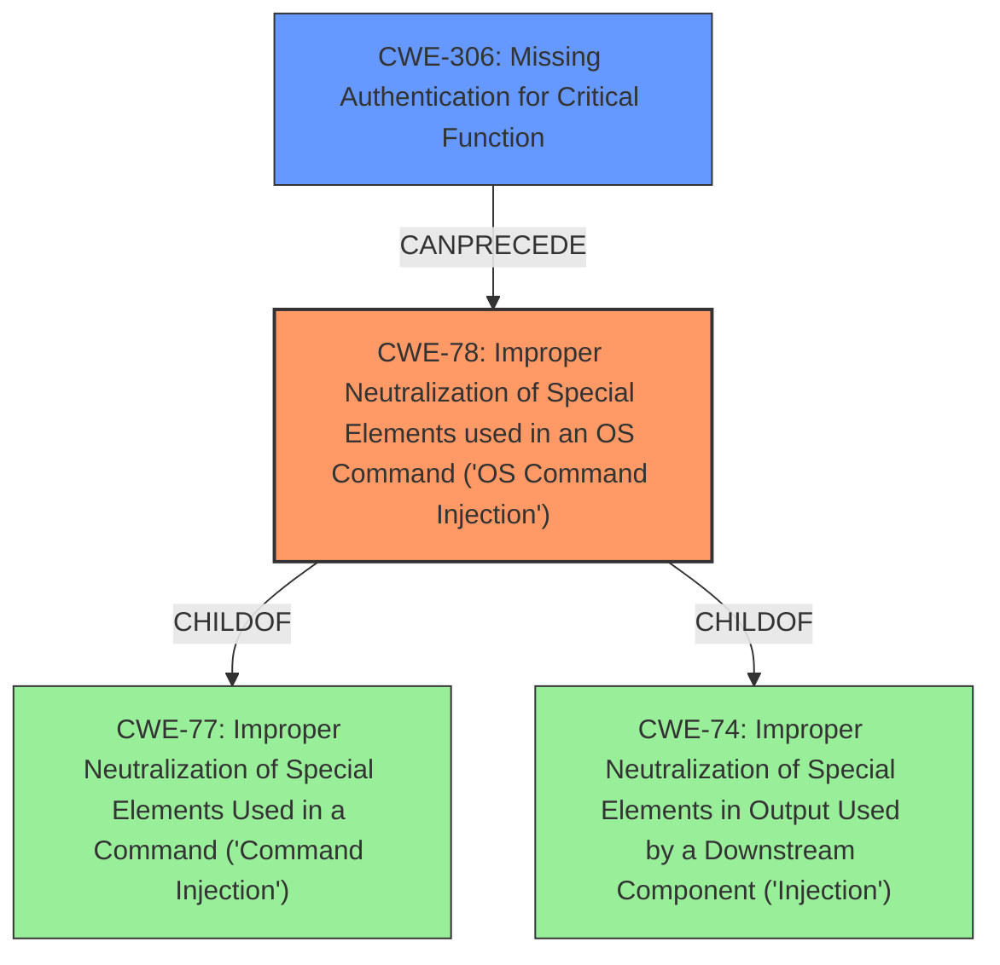

# Analysis Report for CVE-2024-51567

# Vulnerability Analysis Report: CVE-2024-51567

## Description

upgrademysqlstatus in databases/views.py in CyberPanel (aka Cyber Panel) before 5b08cd6 allows remote attackers to bypass authentication and execute arbitrary commands via /dataBases/upgrademysqlstatus by bypassing secMiddleware (which is only for a POST request) and using shell metacharacters in the statusfile property, as exploited in the wild in October 2024 by PSAUX. Versions through 2.3.6 and (unpatched) 2.3.7 are affected.

## Vulnerability Description Key Phrases

- **Impact:** bypass authentication and execute arbitrary commands
- **Vector:** shell metacharacters in statusfile property
- **Attacker:** remote attackers
- **Product:** CyberPanel
- **Version:** before 5b08cd6
- **Component:** upgrademysqlstatus in databases/views.py

## Analysis (with Relationship Data)

# Summary
| CWE ID | CWE Name | Confidence | CWE Abstraction Level | CWE Vulnerability Mapping Label | CWE-Vulnerability Mapping Notes |
|---|---|---|---|---|---|
| CWE-78 | Improper Neutralization of Special Elements used in an OS Command ('OS Command Injection') | 1.0 | Base | Allowed | Primary CWE. The **command injection** vulnerability is triggered by **improper neutralization** of shell metacharacters in the `statusfile` property.|
| CWE-306 | Missing Authentication for Critical Function | 0.9 | Base | Allowed | Secondary CWE. The `upgrademysqlstatus` route lacks authentication, allowing unauthenticated access. |

## Evidence and Confidence

*   **Confidence Score:** 0.95
*   **Evidence Strength:** HIGH

## Relationship Analysis
The primary relationship influencing the CWE selection is the parent-child relationship. CWE-78 is a child of CWE-77 (Improper Neutralization of Special Elements) and CWE-74 (Improper Neutralization of Special Elements in Output Used by a Downstream Component ('Injection')), providing a more specific classification for the OS command injection vulnerability. CWE-306 is a base level CWE with no clear parent child relationship here, but represents the **missing authentication** aspect of the vulnerability. The vulnerability chain starts with **missing authentication** (CWE-306) leading to the **command injection** (CWE-78).



## Vulnerability Chain
The vulnerability chain begins with **missing authentication** for the `upgrademysqlstatus` route (CWE-306). This allows unauthenticated attackers to access the route and inject shell metacharacters into the `statusfile` parameter, which is then used in a command executed with root privileges, resulting in OS command injection (CWE-78).

CWE-306 (Missing Authentication) -> CWE-78 (OS Command Injection) -> Remote Code Execution (Impact)

## Summary of Analysis
The analysis is based on the provided evidence, specifically the vulnerability description and the CVE reference links content summary. The key phrases "bypass authentication and execute arbitrary commands" and "shell metacharacters in statusfile property" clearly indicate both **missing authentication** and **command injection** vulnerabilities. The CVE reference summary confirms the **lack of authentication** on the `upgrademysqlstatus` route and the **improper sanitization** of the `statusfile` parameter leading to command injection.

The graph relationships influenced the selection by highlighting the hierarchical relationship between CWE-78 and its parent CWEs (CWE-77, CWE-74), which supports the choice of CWE-78 as the most specific and appropriate classification for the command injection vulnerability.

CWE-78 and CWE-306 are at the optimal level of specificity because they directly address the root causes of the vulnerability: **improper neutralization** of shell metacharacters and **missing authentication**, respectively. Other CWEs, such as CWE-287 (Improper Authentication) and CWE-862 (Missing Authorization), were considered but deemed less appropriate because CWE-306 directly addresses the complete lack of authentication for the vulnerable route, and the authentication guidance indicates using CWE-306 when there is no login required.

Relevant CWE Information:

# Enhanced Context (25 CWEs)
The following CWEs were identified as potentially relevant to this vulnerability:

## CWE-74: Improper Neutralization of Special Elements in Output Used by a Downstream Component ('Injection')
**Abstraction Level**: Class
**Similarity Score**: 0.78
**Source**: dense

**Description**:
The product constructs all or part of a command, data structure, or record using externally-influenced input from an upstream component, but it does not neutralize or incorrectly neutralizes special elements that could modify how it is parsed or interpreted when it is sent to a downstream component.

**Mapping Guidance**:
- Usage: Discouraged
- Rationale: CWE-74 is high-level and often misused when lower-level weaknesses are more appropriate.

## CWE-472: External Control of Assumed-Immutable Web Parameter
**Abstraction Level**: Base
**Similarity Score**: 0.77
**Source**: dense

**Description**:
The web application does not sufficiently verify inputs that are assumed to be immutable but are actually externally controllable, such as hidden form fields.

**Mapping Guidance**:
- Usage: Allowed
- Rationale: This CWE entry is at the Base level of abstraction, which is a preferred level of abstraction for mapping to the root causes of vulnerabilities.

## CWE-184: Incomplete List of Disallowed Inputs
**Abstraction Level**: Base
**Similarity Score**: 0.77
**Source**: dense

**Description**:
The product implements a protection mechanism that relies on a list of inputs (or properties of inputs) that are not allowed by policy or otherwise require other action to neutralize before additional processing takes place, but the list is incomplete.

**Mapping Guidance**:
- Usage: Allowed
- Rationale: This CWE entry is at the Base level of abstraction, which is a preferred level of abstraction for mapping to the root causes of vulnerabilities.

## CWE-425: Direct Request ('Forced Browsing')
**Abstraction Level**: Base
**Similarity Score**: 0.77
**Source**: dense

**Description**:
The web application does not adequately enforce appropriate authorization on all restricted URLs, scripts, or files.

**Mapping Guidance**:
- Usage: Allowed
- Rationale: This CWE entry is at the Base level of abstraction, which is a preferred level of abstraction for mapping to the root causes of vulnerabilities.

## CWE-41: Improper Resolution of Path Equivalence
**Abstraction Level**: Base
**Similarity Score**: 0.77
**Source**: dense

**Description**:
The product is vulnerable to file system contents disclosure through path equivalence. Path equivalence involves the use of special characters in file and directory names. The associated manipulations are intended to generate multiple names for the same object.

**Mapping Guidance**:
- Usage: Allowed
- Rationale: This CWE entry is at the Base level of abstraction, which is a preferred level of abstraction for mapping to the root causes of vulnerabilities.

## CWE-212: Improper Removal of Sensitive Information Before Storage or Transfer
**Abstraction Level**: Base
**Similarity Score**: 0.77
**Source**: dense

**Description**:
The product stores, transfers, or shares a resource that contains sensitive information, but it does not properly remove that information before the product makes the resource available to unauthorized actors.

**Mapping Guidance**:
- Usage: Allowed
- Rationale: This CWE entry is at the Base level of abstraction, which is a preferred level of abstraction for mapping to the root causes of vulnerabilities.

## CWE-639: Authorization Bypass Through User-Controlled Key
**Abstraction Level**: Base
**Similarity Score**: 0.77
**Source**: dense

**Description**:
The system's authorization functionality does not prevent one user from gaining access to another user's data or record by modifying the key value identifying the data.

**Mapping Guidance**:
- Usage: Allowed
- Rationale: This CWE entry is at the Base level of abstraction, which is a preferred level of abstraction for mapping to the root causes of vulnerabilities.

## CWE-138: Improper Neutralization of Special Elements
**Abstraction Level**: Class
**Similarity Score**: 0.77
**Source**: dense

**Description**:
The product receives input from an upstream component, but it does not neutralize or incorrectly neutralizes special elements that could be interpreted as control elements or syntactic markers when they are sent to a downstream component.

**Mapping Guidance**:
- Usage: Discouraged
- Rationale: This CWE entry is a level-1 Class (i.e., a child of a Pillar). It might have lower-level children that would be more appropriate

## CWE-345: Insufficient Verification of Data Authenticity
**Abstraction Level**: Class
**Similarity Score**: 0.77
**Source**: dense

**Description**:
The product does not sufficiently verify the origin or authenticity of data, in a way that causes it to accept invalid data.

**Mapping Guidance**:
- Usage: Discouraged
- Rationale: This CWE entry is a level-1 Class (i.e., a child of a Pillar). It might have


## CWE Relationship Analysis

Current CWEs represent these abstraction levels: .


### Vulnerability Chain Analysis

**Chain starting from CWE-345:**
- 345 (Insufficient Verification of Data Authenticity) - ROOT


**Chain starting from CWE-77:**
- 77 (Improper Neutralization of Special Elements used in a Command ('Command Injection')) - ROOT


### CWE Relationship Diagram

```mermaid
graph TD
    classDef primary fill:#f96,stroke:#333,stroke-width:2px
    classDef secondary fill:#69f,stroke:#333
    classDef tertiary fill:#9e9,stroke:#333
```


*Report generated on 2025-07-13 20:45:32*
