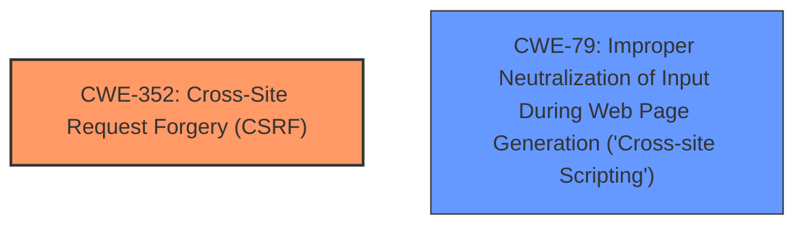

# Enhanced Analysis for CVE-2024-51636

# Summary
| CWE ID | CWE Name | Confidence | CWE Abstraction Level | CWE Vulnerability Mapping Label | CWE-Vulnerability Mapping Notes |
|---|---|---|---|---|---|
| CWE-352 | Cross-Site Request Forgery (CSRF) | 1.0 | Compound | Primary | Allowed |
| CWE-79 | Improper Neutralization of Input During Web Page Generation ('Cross-site Scripting') | 1.0 | Base | Secondary | Allowed |

## Evidence and Confidence

*   **Confidence Score:** 1.0
*   **Evidence Strength:** HIGH

## Relationship Analysis
The primary vulnerability is **CWE-352: Cross-Site Request Forgery (CSRF)**. The secondary vulnerability is **CWE-79: Improper Neutralization of Input During Web Page Generation ('Cross-site Scripting')**. There isn't a direct relationship between these two, but CSRF can be used to trigger XSS in some cases. Both are at appropriate levels of abstraction given the information.



## Vulnerability Chain
The vulnerability chain starts with the **CWE-352: Cross-Site Request Forgery (CSRF)**, which allows an attacker to force a user to perform actions they did not intend. This can then lead to **CWE-79: Improper Neutralization of Input During Web Page Generation ('Cross-site Scripting')** if the forced action involves injecting malicious scripts. The CSRF is the root cause, and the XSS is the impact.

## Summary of Analysis
The primary issue is **CWE-352: Cross-Site Request Forgery (CSRF)**, as indicated by the vulnerability description and CVE reference summary. The GMO Social Connection Plugin for WordPress versions <= 1.2 is vulnerable to CSRF, allowing a malicious actor to force higher privileged users to execute unwanted actions. The description also mentions **Cross-Site Scripting (XSS)**.

The evidence for **CWE-352** is:
*   "**rootcause:** **Cross-Site Request Forgery (CSRF)**"
*   "**Weaknesses/vulnerabilities present:** CSRF vulnerability."
*   "The GMO Social Connection Plugin for WordPress versions <= 1.2 is vulnerable to Cross-Site Request Forgery (CSRF)."

The evidence for **CWE-79** is:
*   "**weakness:** **Cross-Site Scripting**"
*   "Cross-Site Scripting (XSS)"

Other CWEs were considered, but they did not fit as well as **CWE-352** and **CWE-79**. For example, **CWE-89: Improper Neutralization of Special Elements used in an SQL Command ('SQL Injection')** and **CWE-918: Server-Side Request Forgery (SSRF)** were considered due to their presence in the Retriever Results, but they are not directly related to the vulnerability description.

The selection of **CWE-352** as the primary CWE and **CWE-79** as a secondary CWE is based on the provided evidence and their relevance to the vulnerability description. They are at the appropriate level of specificity (Compound and Base, respectively) and accurately represent the weaknesses present.

Relevant CWE Information:
*   **CWE-352: Cross-Site Request Forgery (CSRF)**: The web application does not, or cannot, sufficiently verify whether a well-formed, valid, consistent request was intentionally provided by the user who submitted the request. This aligns with the description of the CSRF vulnerability in the GMO Social Connection plugin.
*   **CWE-79: Improper Neutralization of Input During Web Page Generation ('Cross-site Scripting')**: The product does not neutralize or incorrectly neutralizes user-controllable input before it is placed in output that is used as a web page that is served to other users. This aligns with the description of the XSS vulnerability in the GMO Social Connection plugin.


## CWE Relationship Analysis

Current CWEs represent these abstraction levels: .


### Vulnerability Chain Analysis

**Chain starting from CWE-352:**
- 352 (Cross-Site Request Forgery (CSRF)) - ROOT


**Chain starting from CWE-79:**
- 79 (Improper Neutralization of Input During Web Page Generation ('Cross-site Scripting')) - ROOT


### CWE Relationship Diagram

```mermaid
graph TD
    classDef primary fill:#f96,stroke:#333,stroke-width:2px
    classDef secondary fill:#69f,stroke:#333
    classDef tertiary fill:#9e9,stroke:#333
```