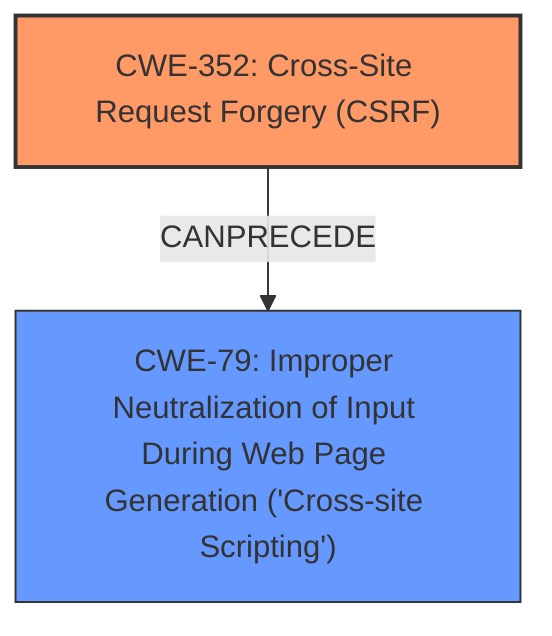

# Analysis for CVE-2024-51638

# Summary

| CWE ID  | CWE Name                                                                                    | Confidence | CWE Abstraction Level | CWE Vulnerability Mapping Label | CWE-Vulnerability Mapping Notes |
| :-------- | :------------------------------------------------------------------------------------------ | :--------- | :---------------------- | :------------------------------ | :------------------------------ |
| CWE-352   | Cross-Site Request Forgery (CSRF)                                                          | 1          | Compound                | Primary                         | Allowed                       |
| CWE-79    | Improper Neutralization of Input During Web Page Generation ('Cross-site Scripting')        | 0.9        | Base                    | Secondary                       | Allowed                       |

## Evidence and Confidence

*   **Confidence Score:** 0.95
*   **Evidence Strength:** HIGH

## Relationship Analysis

The primary weakness is the **lack of CSRF protection**, which allows for Stored **XSS**. The **CWE-352** (Cross-Site Request Forgery (CSRF)) is the root cause. The **CWE-79** (Improper Neutralization of Input During Web Page Generation ('Cross-site Scripting')) is a result of the **lack of CSRF protection** that allows an attacker to inject malicious script. **CWE-352** can lead to **CWE-79** when a user is tricked into performing actions that inject malicious scripts into the web application.

## Vulnerability Chain

The vulnerability chain starts with the **lack of CSRF protection** (**CWE-352**), which then leads to Stored **XSS** (**CWE-79**).
- **CWE-352**: The application **lacks CSRF protection**, allowing unauthorized requests.
- **CWE-79**: Due to the **lack of CSRF protection**, an attacker can inject malicious scripts, leading to **XSS**.

## Summary of Analysis

The primary weakness is the **lack of CSRF protection**, which leads to Stored **XSS**. The vulnerability description explicitly mentions "Cross-Site Request Forgery (CSRF) vulnerability" and "Stored **XSS**." The keyphrase analysis reinforces this, with **CWE-352** being the top recommendation for the **ROOTCAUSE** 'lack of CSRF protection', and **CWE-79** being a top recommendation for the **WEAKNESS** '**XSS**'.
**CWE-352** is the root cause because the **lack of CSRF protection** allows the **XSS** to occur. If **CSRF protection** was present, the **XSS** injection would be prevented.

Other CWEs like **CWE-116** (Improper Encoding or Escaping of Output) were considered but not selected as primary because the root cause is the **lack of CSRF protection**. The **XSS** is a consequence of this **lack of protection**.

Relevant CWE Information:
- **CWE-352**: Cross-Site Request Forgery (CSRF) - This is the root cause of the vulnerability, as the **lack of CSRF protection** allows unauthorized requests to be made.
- **CWE-79**: Improper Neutralization of Input During Web Page Generation ('Cross-site Scripting') - This is a secondary weakness, as the **lack of CSRF protection** allows an attacker to inject malicious scripts.

**CWE-80** (Improper Neutralization of Script-Related HTML Tags in a Web Page (Basic XSS)) was considered because the vulnerability is Stored **XSS**. However, **CWE-79** is more appropriate because it describes the general case of improper neutralization of input during web page generation, whereas **CWE-80** focuses specifically on script-related HTML tags. The description doesn't give enough evidence to make that distinction.

Final Conclusion:
The primary CWE is **CWE-352**, and the secondary CWE is **CWE-79**. This combination accurately reflects the root cause and the resulting impact of the vulnerability.