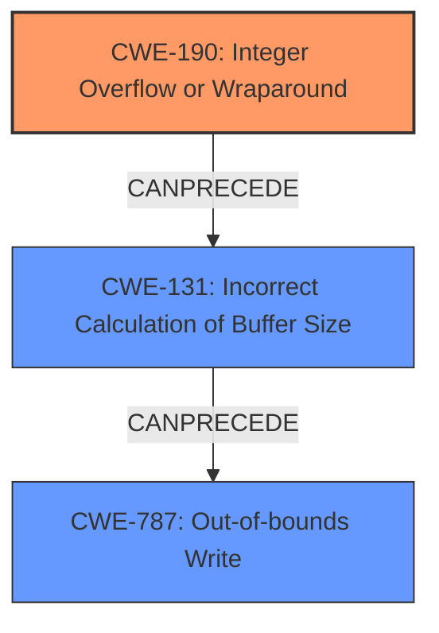

# Analysis Report for CVE-2024-5171

# Vulnerability Analysis Report: CVE-2024-5171

## Description

**Integer overflow** in libaom internal function img_alloc_helper can lead to **heap buffer overflow**. This function can be reached via 3 callers * Calling aom_img_alloc() with a large value of the d_w, d_h, or align parameter may result in **integer overflow**s in the calculations of buffer sizes and offsets and some fields of the returned aom_image_t struct may be invalid. * Calling aom_img_wrap() with a large value of the d_w, d_h, or align parameter may result in **integer overflow**s in the calculations of buffer sizes and offsets and some fields of the returned aom_image_t struct may be invalid. * Calling aom_img_alloc_with_border() with a large value of the d_w, d_h, align, size_align, or border parameter may result in **integer overflow**s in the calculations of buffer sizes and offsets and some fields of the returned aom_image_t struct may be invalid.

## Vulnerability Description Key Phrases

- **Rootcause:** integer overflow
- **Weakness:** ['Integer overflow', 'heap buffer overflow']
- **Product:** libaom
- **Component:** img_alloc_helper

## Analysis (with Relationship Data)

# Summary
| CWE ID  | CWE Name                                          | Confidence | CWE Abstraction Level | CWE Vulnerability Mapping Label | CWE-Vulnerability Mapping Notes |
| :-------- | :------------------------------------------------ | :--------- | :-------------------- | :------------------------------ | :-------------------------------- |
| CWE-190 | Integer Overflow or Wraparound                    | 0.95       | Base                  | Primary                         | Allowed                           |
| CWE-787 | Out-of-bounds Write                              | 0.85       | Base                  | Secondary                       | Allowed                           |
| CWE-131 | Incorrect Calculation of Buffer Size             | 0.75       | Base                  | Secondary                       | Allowed                           |

## Evidence and Confidence

*   **Confidence Score:** 0.9
*   **Evidence Strength:** HIGH

## Relationship Analysis

The primary weakness is **CWE-190**: Integer Overflow or Wraparound, which occurs during the calculation of buffer sizes. This can lead to **CWE-131**: Incorrect Calculation of Buffer Size, as the overflowed value is then used in the buffer size calculation. The incorrect buffer size can then lead to **CWE-787**: Out-of-bounds Write when data is written to the buffer based on the incorrect size.



## Vulnerability Chain

The vulnerability chain starts with an **integer overflow** (**CWE-190**) during the calculation of buffer sizes and offsets. This leads to an **incorrect calculation of the buffer size** (**CWE-131**), which then results in a **heap buffer overflow** (**CWE-787**) when data is written to the undersized buffer.

**CWE-190** (Integer Overflow) -> **CWE-131** (Incorrect Buffer Size Calculation) -> **CWE-787** (Out-of-bounds Write)

## Summary of Analysis

The initial analysis correctly identified **CWE-190** as a strong candidate due to the presence of "**integer overflow**" in the vulnerability description. Further analysis revealed that the integer overflow leads to an incorrect calculation of the buffer size (**CWE-131**), ultimately resulting in a **heap buffer overflow** (**CWE-787**).

The evidence strongly supports the selection of **CWE-190** as the primary root cause, as indicated by the description: "**Integer overflow** in libaom internal function img_alloc_helper can lead to **heap buffer overflow**."

**CWE-131** is included as the integer overflow results in the buffer size being calculated incorrectly, which in turn leads to a buffer overflow when a write occurs.

**CWE-787** is included as the **heap buffer overflow** that is the result of the **integer overflow**.

The selected CWEs are at the optimal level of specificity, representing the distinct stages of the vulnerability chain. **CWE-190** is the root cause, **CWE-131** represents the consequence of that root cause, and **CWE-787** represents the ultimate impact.

**CWE-1284**: Improper Validation of Specified Quantity in Input, **CWE-1285**: Improper Validation of Specified Index, Position, or Offset in Input, **CWE-195**: Signed to Unsigned Conversion Error, **CWE-191**: Integer Underflow (Wrap or Wraparound), **CWE-125**: Out-of-bounds Read, and **CWE-823**: Use of Out-of-range Pointer Offset were considered. However, they are less relevant as the core issue is the integer overflow during size calculation, not the validation of input quantities or out-of-bounds access directly, although the integer overflow leads to an out-of-bounds write.


## CWE Relationship Analysis

Current CWEs represent these abstraction levels: .


### Vulnerability Chain Analysis

**Chain starting from CWE-1284:**
- 1284 (Improper Validation of Specified Quantity in Input) - ROOT


**Chain starting from CWE-823:**
- 823 (Use of Out-of-range Pointer Offset) - ROOT


### CWE Relationship Diagram

```mermaid
graph TD
    classDef primary fill:#f96,stroke:#333,stroke-width:2px
    classDef secondary fill:#69f,stroke:#333
    classDef tertiary fill:#9e9,stroke:#333
```


*Report generated on 2025-07-13 20:54:33*
