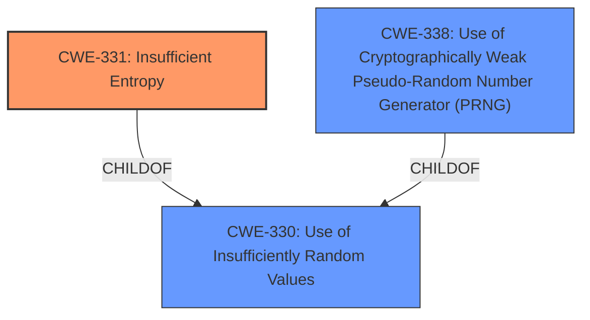

# Enhanced Analysis for CVE-2024-51720

# Summary
| CWE ID | CWE Name | Confidence | CWE Abstraction Level | CWE Vulnerability Mapping Label | CWE-Vulnerability Mapping Notes |
|---|---|---|---|---|---|
| CWE-331 | Insufficient Entropy | 1.0 | Base | Allowed | Primary CWE |
| CWE-330 | Use of Insufficiently Random Values | 0.7 | Class | Discouraged | Secondary Candidate |
| CWE-338 | Use of Cryptographically Weak Pseudo-Random Number Generator (PRNG) | 0.6 | Base | Allowed | Secondary Candidate |

## Evidence and Confidence

*   **Confidence Score:** 0.9
*   **Evidence Strength:** HIGH

## Relationship Analysis
The primary CWE selected is CWE-331 (Insufficient Entropy), which is a base-level CWE. CWE-330 (Use of Insufficiently Random Values) is a class-level CWE and a parent of CWE-331 and CWE-338. CWE-338 (Use of Cryptographically Weak Pseudo-Random Number Generator (PRNG)) is also related as it can result from insufficient entropy. The relationship is that insufficient entropy (CWE-331) can lead to the use of insufficiently random values (CWE-330), potentially through a weak PRNG (CWE-338).



## Vulnerability Chain
The vulnerability chain starts with **insufficient entropy** (CWE-331), which leads to the possibility of predictable or insufficiently random values being used. This, in turn, allows an attacker to enroll an attacker-controlled device to the victim's account and telephone number.

## Summary of Analysis
The analysis is primarily based on the vulnerability description, which explicitly mentions "**insufficient entropy**" as the root cause. The retriever results also support this, with CWE-331 being the top result.

The selection of CWE-331 is justified because the vulnerability description directly states that the **insufficient entropy** allows an attacker to enroll a device. This aligns precisely with the description of CWE-331.

CWE-330 was considered as a broader class, but CWE-331 is more specific and accurately reflects the **root cause** as mentioned in the description. CWE-338 was considered as a possible weakness that can result from CWE-331.

The provided evidence is strong, and the confidence level is high due to the direct mention of "**insufficient entropy**" in the vulnerability description.

Relevant CWE Information:

# Enhanced Context (25 CWEs)
The following CWEs were identified as potentially relevant to this vulnerability:

## CWE-331: Insufficient Entropy
**Abstraction Level**: Base
**Similarity Score**: 0.80
**Source**: dense

**Description**:
The product uses an algorithm or scheme that produces insufficient entropy, leaving patterns or clusters of values that are more likely to occur than others.

**Mapping Guidance**:
- Usage: Allowed
- Rationale: This CWE entry is at the Base level of abstraction, which is a preferred level of abstraction for mapping to the root causes of vulnerabilities.

## CWE-330: Use of Insufficiently Random Values
**Abstraction Level**: Class
**Similarity Score**: 0.78
**Source**: dense

**Description**:
The product uses insufficiently random numbers or values in a security context that depends on unpredictable numbers.

**Mapping Guidance**:
- Usage: Discouraged
- Rationale: This CWE entry is a level-1 Class (i.e., a child of a Pillar). It might have lower-level children that would be more appropriate

## CWE-338: Use of Cryptographically Weak Pseudo-Random Number Generator (PRNG)
**Abstraction Level**: base
**Similarity Score**: 2.47
**Source**: graph

**Description**:
CWE-338: Use of Cryptographically Weak Pseudo-Random Number Generator (PRNG)

**Mapping Guidance**:
- Usage: Allowed
- Rationale: This CWE entry is at the Base level of abstraction, which is a preferred level of abstraction for mapping to the root causes of vulnerabilities.

**Relationships**:
- CHILDOF -> CWE-330
- CHILDOF -> CWE-330
- PARENTOF -> CWE-338


## CWE Relationship Analysis

Current CWEs represent these abstraction levels: .


### Vulnerability Chain Analysis

**Chain starting from CWE-331:**
- 331 (Insufficient Entropy) - ROOT


**Chain starting from CWE-338:**
- 338 (Use of Cryptographically Weak Pseudo-Random Number Generator (PRNG)) - ROOT


### CWE Relationship Diagram

```mermaid
graph TD
    classDef primary fill:#f96,stroke:#333,stroke-width:2px
    classDef secondary fill:#69f,stroke:#333
    classDef tertiary fill:#9e9,stroke:#333
```