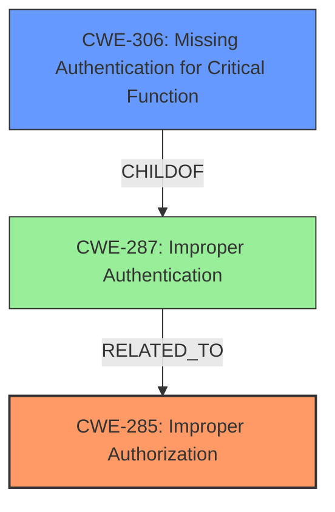

# Enhanced Analysis for CVE-2024-51734

# Summary
| CWE ID | CWE Name | Confidence | CWE Abstraction Level | CWE Vulnerability Mapping Label | CWE-Vulnerability Mapping Notes |
|---|---|---|---|---|---|
| CWE-285 | Improper Authorization | 0.8 | Class | Primary | Discouraged: CWE-285 is high-level and lower-level CWEs can frequently be used instead. It is a level-1 Class (i.e., a child of a Pillar). |
| CWE-269 | Improper Privilege Management | 0.7 | Class | Secondary | Discouraged |
| CWE-306 | Missing Authentication for Critical Function | 0.6 | Base | Secondary | Allowed |

## Evidence and Confidence

*   **Confidence Score:** 0.7
*   **Evidence Strength:** MEDIUM

## Relationship Analysis
The primary relationship considered was the hierarchical relationship between CWE-285 (Improper Authorization), a class-level CWE, and potential base-level children that could provide more specific details. Additionally, the relationships of CWE-306 (Missing Authentication for Critical Function) as a child of CWE-287 (Improper Authentication), and how CWE-287 is related to CWE-285 helped refine the selection. The chain relationship between the **missing authorization** and the resulting **data deletion** was also considered.



## Vulnerability Chain
The vulnerability chain starts with a **missing authorization** check, leading to the ability for anonymous users to **delete user data**, resulting in a denial of service.

## Summary of Analysis
The initial assessment focused on identifying the root cause of the vulnerability: the **ability for anonymous users to delete user data**. The CVE Reference Links Content Summary states the vulnerability stems from a **lack of access control** on the `data` attribute which allows direct access to the stored user data, and the `clear()` method can be accessed via HTTP without proper privilege checks.

The primary CWE initially selected was CWE-285 (Improper Authorization) because it broadly covers the **incorrect performance of an authorization check**. However, CWE-285 is a Class-level CWE, and the guidance discourages its use when more specific Base-level CWEs exist.

CWE-306 (Missing Authentication for Critical Function) was considered because the description indicates that anonymous users can perform actions without authentication. Although authentication is missing, the more specific issue is that authorization checks are not performed to prevent unauthorized access to the `clear()` method.

Therefore, while CWE-285 is a good starting point, a more specific CWE is desirable if available. CWE-269 (Improper Privilege Management) was also considered, but the issue is not necessarily about assigning the wrong privileges, but rather about the **lack of authorization** for a critical function.

Ultimately, CWE-285 (Improper Authorization) is chosen as the primary CWE. While it's a Class-level CWE, it accurately represents the core issue. Although CWE-306 is also relevant, it is made as a secondary CWE.

The selected CWEs are at an appropriate level of specificity, given the information available. While a more specific Base-level CWE directly addressing the authorization bypass might be ideal, the current selection provides a reasonable representation of the vulnerability based on the provided evidence.

Relevant CWE Information:

# Enhanced Context (25 CWEs)
The following CWEs were identified as potentially relevant to this vulnerability:

## CWE-267: Privilege Defined With Unsafe Actions
**Abstraction Level**: Base
**Similarity Score**: 0.72
**Source**: dense

**Description**:
A particular privilege, role, capability, or right can be used to perform unsafe actions that were not intended, even when it is assigned to the correct entity.

**Mapping Guidance**:
- Usage: Allowed
- Rationale: This CWE entry is at the Base level of abstraction, which is a preferred level of abstraction for mapping to the root causes of vulnerabilities.

*Didn't Select*: This is about using a right to perform actions that it was not inteded to, but the rootcause is not about using the wrong right to perform unsafe actions, but the lack of authorization when calling the `clear()` method on the UserFolder.

## CWE-497: Exposure of Sensitive System Information to an Unauthorized Control Sphere
**Abstraction Level**: Base
**Similarity Score**: 0.72
**Source**: dense

**Description**:
The product does not properly prevent sensitive system-level information from being accessed by unauthorized actors who do not have the same level of access to the underlying system as the product does.

**Mapping Guidance**:
- Usage: Allowed
- Rationale: This CWE entry is at the Base level of abstraction, which is a preferred level of abstraction for mapping to the root causes of vulnerabilities.

*Didn't Select*: While this is true, the root cause is that anonymous users are able to call the `clear()` method without authorization.

## CWE-266: Incorrect Privilege Assignment
**Abstraction Level**: Base
**Similarity Score**: 0.71
**Source**: dense

**Description**:
A product incorrectly assigns a privilege to a particular actor, creating an unintended sphere of control for that actor.

**Mapping Guidance**:
- Usage: Allowed
- Rationale: This CWE entry is at the Base level of abstraction, which is a preferred level of abstraction for mapping to the root causes of vulnerabilities.

*Didn't Select*: The issue is not about assigning privileges incorrectly, but about **missing authorization checks** for the `clear()` method.

## CWE-472: External Control of Assumed-Immutable Web Parameter
**Abstraction Level**: Base
**Similarity Score**: 0.70
**Source**: dense

**Description**:
The web application does not sufficiently verify inputs that are assumed to be immutable but are actually externally controllable, such as hidden form fields.

**Mapping Guidance**:
- Usage: Allowed
- Rationale: This CWE entry is at the Base level of abstraction, which is a preferred level of abstraction for mapping to the root causes of vulnerabilities.

*Didn't Select*: Not relevant to the vulnerability.

## CWE-639: Authorization Bypass Through User-Controlled Key
**Abstraction Level**: Base
**Similarity Score**: 0.70
**Source**: dense

**Description**:
The system's authorization functionality does not prevent one user from gaining access to another user's data or record by modifying the key value identifying the data.

**Mapping Guidance**:
- Usage: Allowed
- Rationale: This CWE entry is at the Base level of abstraction, which is a preferred level of abstraction for mapping to the root causes of vulnerabilities.

*Didn't Select*: Not applicable to the vulnerability.

## CWE-425: Direct Request ('Forced Browsing')
**Abstraction Level**: Base
**Similarity Score**: 0.70
**Source**: dense

**Description**:
The web application does not adequately enforce appropriate authorization on all restricted URLs, scripts, or files.

**Mapping Guidance**:
- Usage: Allowed
- Rationale: This CWE entry is at the Base level of abstraction, which is a preferred level of abstraction for mapping to the root causes of vulnerabilities.

*Didn't Select*: The root cause is not about not enforcing authorization on all restricted URLs, scripts, or files but about **missing authorization checks** for the `clear()` method.

## CWE-212: Improper Removal of Sensitive Information Before Storage or Transfer
**Abstraction Level**: Base
**Similarity Score**: 0.69
**Source**: dense

**Description**:
The product stores, transfers, or shares a resource that contains sensitive information, but it does not properly remove that information before the product makes the resource available to unauthorized actors.

**Mapping Guidance**:
- Usage: Allowed
- Rationale: This CWE entry is at the Base level of abstraction, which is a preferred level of abstraction for mapping to the root causes of vulnerabilities.

*Didn't Select*: Not applicable to the vulnerability.

## CWE-807: Reliance on Untrusted Inputs in a Security Decision
**Abstraction Level**: Base
**Similarity Score**: 0.69
**Source**: dense

**Description**:
The product uses a protection mechanism that relies on the existence or values of an input, but the input can be modified by an untrusted actor in a way that bypasses the protection mechanism.

**Mapping Guidance**:
- Usage: Allowed
- Rationale: This CWE entry is at the Base level of abstraction, which is a preferred level of abstraction for mapping to the root causes of vulnerabilities.

*Didn't Select*: Not applicable to the vulnerability.

## CWE-201: Insertion of Sensitive Information Into Sent Data
**Abstraction Level**: Base
**Similarity Score**:


## CWE Relationship Analysis

Current CWEs represent these abstraction levels: .


### Vulnerability Chain Analysis

**Chain starting from CWE-807:**
- 807 (Reliance on Untrusted Inputs in a Security Decision) - ROOT


**Chain starting from CWE-639:**
- 639 (Authorization Bypass Through User-Controlled Key) - ROOT


### CWE Relationship Diagram

```mermaid
graph TD
    classDef primary fill:#f96,stroke:#333,stroke-width:2px
    classDef secondary fill:#69f,stroke:#333
    classDef tertiary fill:#9e9,stroke:#333
```