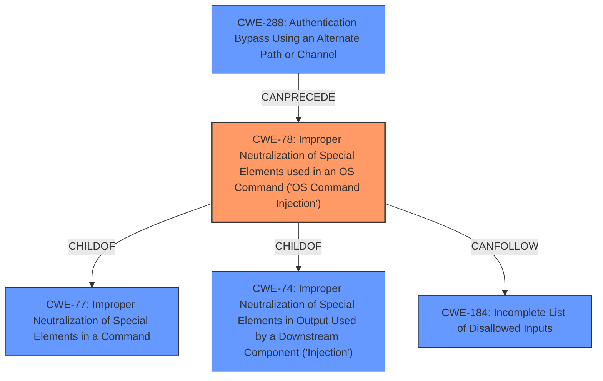

# Analysis for CVE-2024-51772

# Summary
| CWE ID | CWE Name | Confidence | CWE Abstraction Level | CWE Vulnerability Mapping Label | CWE-Vulnerability Mapping Notes |
|---|---|---|---|---|---|
| CWE-78 | Improper Neutralization of Special Elements used in an OS Command ('OS Command Injection') | 0.7 | Base | Allowed | Primary CWE. The vulnerability allows remote authenticated users to run arbitrary commands on the underlying host due to improper neutralization of special elements used in an OS command.|
| CWE-288 | Authentication Bypass Using an Alternate Path or Channel | 0.4 | Base | Allowed | Secondary CWE. Although the vulnerability description states an authenticated user, there could have been an Authentication Bypass that allowed the authenticated user into the system. |

## Evidence and Confidence

*   **Confidence Score:** 0.7
*   **Evidence Strength:** LOW

## Relationship Analysis
The primary focus is on CWE-78, which is a base-level CWE. The relationship analysis includes:
  - CWE-78 is a child of CWE-77 (Improper Neutralization of Special Elements in a Command) and CWE-74 (Improper Neutralization of Special Elements in Output Used by a Downstream Component ('Injection')).
  - CWE-78 can follow CWE-184 (Incomplete List of Disallowed Inputs).
  - CWE-288 (Authentication Bypass Using an Alternate Path or Channel) is considered as a possible weakness that could precede the RCE.

## Vulnerability Chain
The vulnerability chain starts with the **improper neutralization** of special elements in an OS command (CWE-78), potentially preceded by an authentication bypass(CWE-288), leading to remote code execution.
  - Root Cause: CWE-78 (**Improper Neutralization of Special Elements used in an OS Command ('OS Command Injection')**)
  - Impact: Remote Code Execution

## Summary of Analysis
The primary assessment is based on the description indicating an authenticated RCE vulnerability due to the **improper neutralization** of special elements used in an OS command. The "Retriever Results" also shows that CWE-78 is the highest-rated CWE and should be considered.
Given the limited information, the selection of CWE-78 is at the optimal level of specificity. While other CWEs like CWE-20 (Improper Input Validation) could be related, they are less specific than CWE-78.

Relevant CWE Information:
- The vulnerability description explicitly states that the **authenticated RCE vulnerability** in the ClearPass Policy Manager web-based management interface allows remote authenticated users to run arbitrary commands on the underlying host.
- The vulnerability's details match the CWE-78 characteristics as it involves the **improper neutralization** of special elements used in an OS command, which allows the attacker to run arbitrary commands.
- There is limited evidence to support other CWEs, however, it is possible that an Authentication Bypass may have taken place.