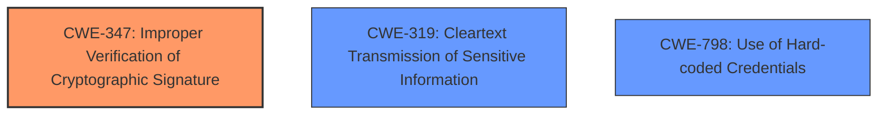

# Analysis Report for CVE-2024-51997

# Vulnerability Analysis Report: CVE-2024-51997

## Description

Trustee is a set of tools and components for attesting confidential guests and providing secrets to them. The ART (**Attestation Results Token**) token, generated by AS, could be manipulated by MITM attacker, but the verifier (CoCo Verification Demander like KBS) could still verify it successfully. In the payload of ART token, the jwk could be replaced by attacker with his own pub key. Then attacker can use his own corresponding private key to sign the crafted ART token. Based on current code implementation (v0.8.0), such replacement and modification can not be detected. This issue has been addressed in version 0.8.2 and all users are advised to upgrade. There are no known workarounds for this vulnerability.

## Vulnerability Description Key Phrases

- **Weakness:** ART token manipulation
- **Impact:** execute arbitrary code
- **Vector:** MITM attack
- **Attacker:** attacker
- **Product:** Trustee
- **Version:** v0.8.0
- **Component:** ART token

## Analysis (with Relationship Data)

# Summary

| CWE ID    | CWE Name                                                                    | Confidence | CWE Abstraction Level | CWE Vulnerability Mapping Label | CWE-Vulnerability Mapping Notes |
| --------- | --------------------------------------------------------------------------- | ---------- | --------------------- | ------------------------------- | ------------------------------- |
| CWE-347   | Improper Verification of Cryptographic Signature                           | 0.9        | Base                  | Primary                         | Allowed                       |
| CWE-319   | Cleartext Transmission of Sensitive Information                           | 0.6        | Base                  | Secondary                       | Allowed                       |
| CWE-798   | Use of Hard-coded Credentials                                              | 0.5        | Base                  | Secondary                       | Allowed                       |

## Evidence and Confidence

*   **Confidence Score:** 0.9
*   **Evidence Strength:** MEDIUM

## Relationship Analysis

The primary weakness identified is **CWE-347 (Improper Verification of Cryptographic Signature)**, as the vulnerability stems from the verifier's failure to properly validate the cryptographic signature of the ART token after the **jwk** field has been maliciously modified. This indicates a flaw in the cryptographic verification process. **CWE-319 (Cleartext Transmission of Sensitive Information)** could be a secondary concern if the token itself contains sensitive data that is not encrypted, exacerbating the impact of the manipulated token. **CWE-798 (Use of Hard-coded Credentials)** is included as a secondary CWE candidate because the **jwk** replacement could potentially lead to the use of hard-coded credentials.



## Vulnerability Chain

The vulnerability chain begins with the MITM attacker's ability to manipulate the ART token by replacing the **jwk** field. The core weakness lies in the **improper verification of the cryptographic signature (CWE-347)** by the verifier, which fails to detect this manipulation. This leads to a compromised ART token, potentially enabling further exploitation if the token is used to establish secure channels or encrypt sensitive information.

## Summary of Analysis

The primary classification, **CWE-347 (Improper Verification of Cryptographic Signature)**, is supported by the CVE Reference Links Content Summary, which states the **root cause** is that the verifier fails to detect the replacement of the 'jwk' field due to a lack of proper verification. This aligns directly with the definition of **CWE-347**, as the cryptographic signature is not correctly validated. **CWE-319** is included as a secondary CWE candidate because the token itself contains sensitive data that is not encrypted, exacerbating the impact of the manipulated token. **CWE-798** is included as a secondary CWE candidate because the **jwk** replacement could potentially lead to the use of hard-coded credentials.

Relevant Evidence:
- "Root cause of vulnerability: The Attestation Results Token (ART), generated by the AS, can be manipulated by a Man-in-the-Middle (MITM) attacker. Specifically, the 'jwk' field within the token's payload can be replaced with the attacker's public key. The attacker can then sign the modified ART token using their corresponding private key. The verifier, like KBS, fails to detect this replacement due to the current code implementation."

**CWEs Considered but Not Used:**

*   **CWE-201 (Insertion of Sensitive Information Into Sent Data)**: While sensitive information might be present in the ART token, the core issue isn't the insertion of this information but rather the failure to verify the token's integrity after manipulation.
*   **CWE-1390 (Weak Authentication)** & **CWE-287 (Improper Authentication)**: These relate to authentication failures. While the ART token is related to authentication, the vulnerability is the bypassed integrity check of the token itself, not the initial authentication process.
*   **CWE-321 (Use of Hard-coded Cryptographic Key)** & **CWE-259 (Use of Hard-coded Password)**: These suggest the direct use of hardcoded credentials. However, the vulnerability involves manipulating the `jwk` rather than directly exploiting a hardcoded key/password. Although the manipulated `jwk` *could* be a hardcoded credential from the attacker, the primary issue is still the **improper verification** not the use of a hardcoded credential.
*   **CWE-639 (Authorization Bypass Through User-Controlled Key)**: While the attacker is using a user-controlled key (their own), the vulnerability is not simply an authorization bypass.
*   **CWE-79 (Improper Neutralization of Input During Web Page Generation ('Cross-site Scripting'))**: This is specific to web page generation and XSS, and not relevant to the ART token manipulation.
*   **CWE-1270 (Generation of Incorrect Security Tokens)**: This is related, but the more specific problem is the failure to verify the cryptographic signature, not the general incorrectness of the token generation.
*   **CWE-863 (Incorrect Authorization)**: The vulnerability is not directly related to incorrect authorization decisions, but rather to the lack of proper verification of the cryptographic signature.


## CWE Relationship Analysis

Current CWEs represent these abstraction levels: .


### Vulnerability Chain Analysis

**Chain starting from CWE-1390:**
- 1390 (Weak Authentication) - ROOT


**Chain starting from CWE-321:**
- 321 (Use of Hard-coded Cryptographic Key) - ROOT


### CWE Relationship Diagram

```mermaid
graph TD
    classDef primary fill:#f96,stroke:#333,stroke-width:2px
    classDef secondary fill:#69f,stroke:#333
    classDef tertiary fill:#9e9,stroke:#333
```


*Report generated on 2025-07-13 21:00:38*
