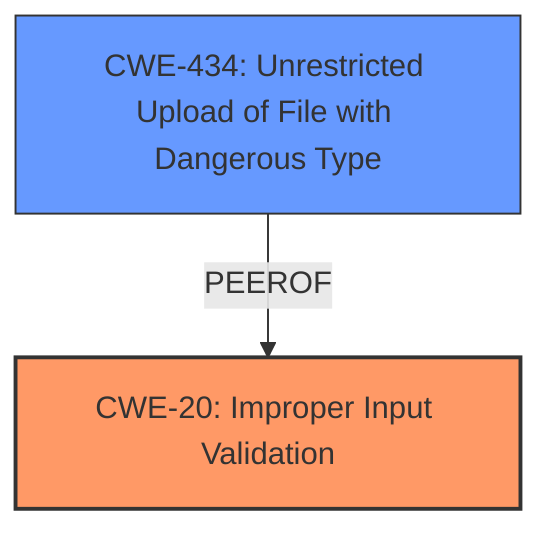

# Analysis for CVE-2024-52004

# Summary
| CWE ID | CWE Name | Confidence | CWE Abstraction Level | CWE Vulnerability Mapping Label | CWE-Vulnerability Mapping Notes |
|---|---|---|---|---|---|
| CWE-20 | Improper Input Validation | 0.75 | Class | Allowed | The vulnerability stems from **insufficient input validation** during media content uploads, which can lead to remote code execution. |
| CWE-434 | Unrestricted Upload of File with Dangerous Type | 0.6 | Base | Allowed | As a secondary weakness, the vulnerability involves uploading media content, which might include dangerous file types that are not properly restricted. |

## Evidence and Confidence

*   **Confidence Score:** 0.7
*   **Evidence Strength:** MEDIUM

## Relationship Analysis
The primary relationship influencing the CWE selection is the parent-child relationship. CWE-20 is a class-level weakness, while CWE-434 is a base-level weakness. While the description mentions **insufficient input validation**, which aligns with CWE-20, the act of "uploading media content" points to CWE-434. The initial assessment is that CWE-20 is the more appropriate root cause, with CWE-434 as a contributing factor or a potential exploitation vector.

## Vulnerability Chain
The vulnerability chain starts with **insufficient input validation** (CWE-20). This lack of validation allows for the potential upload of malicious media content (CWE-434), which can then lead to remote code execution.

## Summary of Analysis
The initial assessment focuses on identifying the root cause of the vulnerability. The description explicitly states that the vulnerability is related to **insufficient input validation** while uploading media content.

The retriever results list CWE-20 as a candidate, but with a "Discouraged" usage. The rationale is that "CWE-20 is commonly misused in low-information vulnerability reports when lower-level CWEs could be used instead". However, in this case, the vulnerability description does not provide enough detail to identify a more specific CWE.

CWE-434, "Unrestricted Upload of File with Dangerous Type", is also listed. This CWE is relevant because the vulnerability involves uploading media content, which could include dangerous file types. However, the root cause is the **lack of validation** of the uploaded content, rather than the unrestricted upload itself.

Given the available information, the primary CWE is CWE-20, "Improper Input Validation," due to the explicit mention of **insufficient input validation**. A secondary CWE is CWE-434, "Unrestricted Upload of File with Dangerous Type," as the upload functionality is the vector for the vulnerability. These selections are at the appropriate level of specificity, considering the information provided.

Relevant CWE Information:

# Enhanced Context (25 CWEs)
The following CWEs were identified as potentially relevant to this vulnerability:

## CWE-434: Unrestricted Upload of File with Dangerous Type
**Abstraction Level**: Base
**Similarity Score**: 0.77
**Source**: dense

**Description**:
The product allows the upload or transfer of dangerous file types that are automatically processed within its environment.

**Mapping Guidance**:
- Usage: Allowed
- Rationale: This CWE entry is at the Base level of abstraction, which is a preferred level of abstraction for mapping to the root causes of vulnerabilities.

## CWE-20: Improper Input Validation
**Abstraction Level**: class
**Similarity Score**: 2.55
**Source**: graph

**Description**:
CWE-20: Improper Input Validation

**Mapping Guidance**:
- Usage: Discouraged
- Rationale: CWE-20 is commonly misused in low-information vulnerability reports when lower-level CWEs could be used instead, or when more details about the vulnerability are available [REF-1287]. It is not useful for trend analysis. It is also a level-1 Class (i.e., a child of a Pillar).