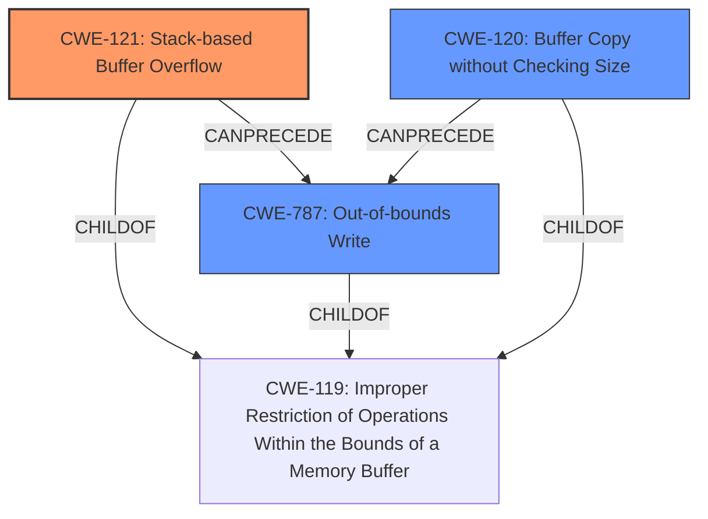

# Enhanced Analysis for CVE-2024-52024

# Summary
| CWE ID | CWE Name | Confidence | CWE Abstraction Level | CWE Vulnerability Mapping Label | CWE-Vulnerability Mapping Notes |
|---|---|---|---|---|---|
| CWE-121 | Stack-based Buffer Overflow | 0.9 | Variant | Primary | Allowed |
| CWE-787 | Out-of-bounds Write | 0.6 | Base | Secondary | Allowed |
| CWE-120 | Buffer Copy without Checking Size of Input ('Classic Buffer Overflow') | 0.5 | Base | Secondary | Allowed-with-Review |

## Evidence and Confidence

*   **Confidence Score:** 0.9
*   **Evidence Strength:** MEDIUM

## Relationship Analysis
The primary CWE is CWE-121, a variant of buffer overflow that occurs on the stack. CWE-787 represents the out-of-bounds write condition which is a common result of buffer overflows. CWE-120 is a more general case of buffer overflow, but the description specifically mentions a stack overflow, making CWE-121 more appropriate.



## Vulnerability Chain
The vulnerability chain starts with a **stack overflow** (CWE-121) due to a crafted POST request. This leads to an out-of-bounds write (CWE-787), which allows attackers to cause a Denial of Service (DoS).

## Summary of Analysis
The primary weakness is clearly identified as a **stack overflow** in the vulnerability description. The retriever results and CWE specifications strongly support CWE-121 as the most appropriate mapping. While CWE-120 is a relevant parent, CWE-121 provides more specificity aligning with the provided evidence. CWE-787 is included as a secondary weakness since a buffer overflow leads to an out-of-bounds write. The final decision is based on the explicit mention of a stack overflow and the supporting retriever results, providing a high confidence in the mapping.

Relevant CWE Information:

# Enhanced Context (25 CWEs)
The following CWEs were identified as potentially relevant to this vulnerability:

## CWE-121: Stack-based Buffer Overflow
**Abstraction Level**: Variant
**Similarity Score**: 0.74
**Source**: dense

**Description**:
A stack-based buffer overflow condition is a condition where the buffer being overwritten is allocated on the stack (i.e., is a local variable or, rarely, a parameter to a function).

**Mapping Guidance**:
- Usage: Allowed
- Rationale: This CWE entry is at the Variant level of abstraction, which is a preferred level of abstraction for mapping to the root causes of vulnerabilities.

**Why this CWE was selected:** The vulnerability description states "stack overflow" as the **weakness**. This is a variant level CWE.

## CWE-787: Out-of-bounds Write
**Abstraction Level**: base
**Similarity Score**: 3.89
**Source**: graph

**Description**:
CWE-787: Out-of-bounds Write

**Mapping Guidance**:
- Usage: Allowed
- Rationale: This CWE entry is at the Base level of abstraction, which is a preferred level of abstraction for mapping to the root causes of vulnerabilities.

**Relationships**:
- CANFOLLOW -> CWE-825
- CANFOLLOW -> CWE-824
- CANFOLLOW -> CWE-823
- CANFOLLOW -> CWE-822
- PARENTOF -> CWE-124

**Why this CWE was selected:** A stack buffer overflow (CWE-121) leads to an out-of-bounds write. This is a base level CWE.

## CWE-120: Buffer Copy without Checking Size of Input ('Classic Buffer Overflow')
**Abstraction Level**: base
**Similarity Score**: 2.40
**Source**: graph

**Description**:
CWE-120: Buffer Copy without Checking Size of Input ('Classic Buffer Overflow')

**Mapping Guidance**:
- Usage: Allowed-with-Review
- Rationale: There are some indications that this CWE ID might be misused and selected simply because it mentions "buffer overflow" - an increasingly vague term. This CWE entry is only appropriate for "Buffer Copy" operations (not buffer reads), in which where there is no "Checking [the] Size of Input", and (by implication of the copy) writing past the end of the buffer.

**Relationships**:
- PARENTOF -> CWE-785
- CANFOLLOW -> CWE-456
- CANFOLLOW -> CWE-416
- CANFOLLOW -> CWE-231
- CANFOLLOW -> CWE-170

**Why this CWE was considered:** This is a general buffer overflow, but the description specifies that it is a Stack-Based Buffer Overflow (CWE-121) so this is less specific.

## Other CWEs Considered and Rejected:
- CWE-190: Integer Overflow or Wraparound - While present in retriever results, it does not align with the stated vulnerability.
- CWE-77: Improper Neutralization of Special Elements used in a Command ('Command Injection') - Not related to the buffer overflow issue.
- CWE-78: Improper Neutralization of Special Elements used in an OS Command ('OS Command Injection') - Not related to the buffer overflow issue.
- CWE-125: Out-of-bounds Read - The vulnerability description indicates an out-of-bounds write, not read.
- CWE-770: Allocation of Resources Without Limits or Throttling - Does not fit the buffer overflow scenario.
- CWE-1284: Improper Validation of Specified Quantity in Input - Not related to the core issue of a buffer overflow.


## CWE Relationship Analysis

Current CWEs represent these abstraction levels: .


### Vulnerability Chain Analysis

**Chain starting from CWE-416:**
- 416 (Use After Free) - ROOT


**Chain starting from CWE-770:**
- 770 (Allocation of Resources Without Limits or Throttling) - ROOT


### CWE Relationship Diagram

```mermaid
graph TD
    classDef primary fill:#f96,stroke:#333,stroke-width:2px
    classDef secondary fill:#69f,stroke:#333
    classDef tertiary fill:#9e9,stroke:#333
```