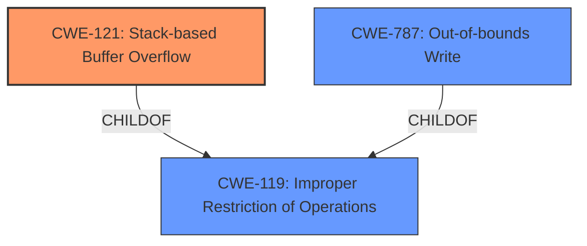

# Analysis for CVE-2024-52026

# Summary
| CWE ID | CWE Name | Confidence | CWE Abstraction Level | CWE Vulnerability Mapping Label | CWE-Vulnerability Mapping Notes |
|---|---|---|---|---|---|
| CWE-121 | Stack-based Buffer Overflow | 0.9 | Variant | Primary CWE | Allowed |
| CWE-787 | Out-of-bounds Write | 0.5 | Base | Secondary Candidate | Allowed |
| CWE-119 | Improper Restriction of Operations within the Bounds of a Memory Buffer | 0.4 | Class | Secondary Candidate | Discouraged |

## Evidence and Confidence

*   **Confidence Score:** 0.8
*   **Evidence Strength:** MEDIUM

## Relationship Analysis
The primary CWE is CWE-121 Stack-based Buffer Overflow, a variant of CWE-119 Improper Restriction of Operations within the Bounds of a Memory Buffer. CWE-121 is a more specific type of buffer overflow, where the buffer is allocated on the stack. CWE-787 Out-of-bounds Write can be a result of a buffer overflow, but it is a more general case.

## Vulnerability Chain
The vulnerability chain starts with a crafted POST request that contains a **stack overflow** in the pppoe_localip parameter at bsw_pppoe.cgi. This leads to an **out-of-bounds write** which results in a Denial of Service (DoS).

## Summary of Analysis
The vulnerability is a **stack overflow** caused by a crafted POST request to bsw_pppoe.cgi. The primary weakness is CWE-121 Stack-based Buffer Overflow, as it accurately describes the root cause. CWE-787 Out-of-bounds Write is a potential consequence of the overflow, but less specific. The evidence for this is the phrase "**stack overflow** via the pppoe_localip parameter at bsw_pppoe.cgi". The "CWE for similar CVE Descriptions" section lists CWE-120 as the primary match and top CWE, which is a parent of CWE-121. However, CWE-121 is more specific since it is a stack-based overflow. The retriever results listed CWE-121 with a high score.

Relevant CWE Information:

# Enhanced Context (25 CWEs)
The following CWEs were identified as potentially relevant to this vulnerability:

## CWE-121: Stack-based Buffer Overflow
**Abstraction Level**: Variant
**Similarity Score**: 0.75
**Source**: dense

**Description**:
A stack-based buffer overflow condition is a condition where the buffer being overwritten is allocated on the stack (i.e., is a local variable or, rarely, a parameter to a function).

**Mapping Guidance**:
- Usage: Allowed
- Rationale: This CWE entry is at the Variant level of abstraction, which is a preferred level of abstraction for mapping to the root causes of vulnerabilities.

## CWE-787: Out-of-bounds Write
**Abstraction Level**: base
**Similarity Score**: 3.89
**Source**: graph

**Description**:
CWE-787: Out-of-bounds Write

**Mapping Guidance**:
- Usage: Allowed
- Rationale: This CWE entry is at the Base level of abstraction, which is a preferred level of abstraction for mapping to the root causes of vulnerabilities.

## CWE-119: Improper Restriction of Operations within the Bounds of a Memory Buffer
**Abstraction Level**: Class
**Similarity Score**: 0.71
**Source**: dense

**Description**:
The product performs operations on a memory buffer, but it reads from or writes to a memory location outside the buffer's intended boundary. This may result in read or write operations on unexpected memory locations that could be linked to other variables, data structures, or internal program data.

**Mapping Guidance**:
- Usage: Discouraged
- Rationale: CWE-119 is commonly misused in low-information vulnerability reports when lower-level CWEs could be used instead, or when more details about the vulnerability are available.

The other CWEs listed in the Retriever Results, such as CWE-190, CWE-77, CWE-674, CWE-125, CWE-122, CWE-770, CWE-1284, and CWE-78, were not selected because they did not align with the specific details of the vulnerability description, which clearly indicates a **stack overflow**.